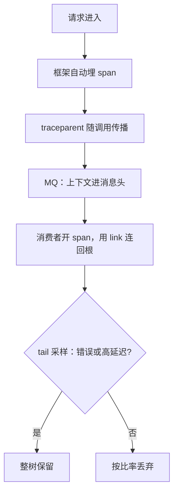
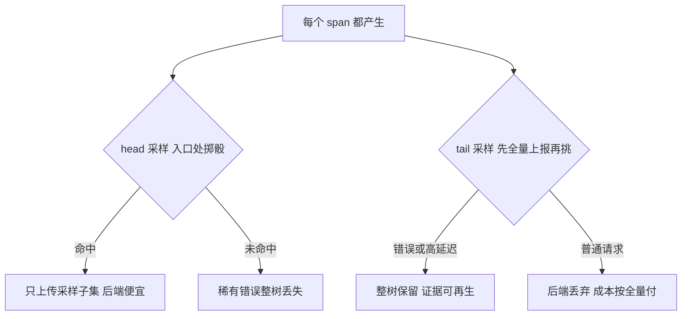

# 分布式追踪

追踪的工程难点不在画树，在让上下文无损地穿过每一跳：RPC、消息队列、线程池、批量任务，每一处都是断链的机会。

<footer>—— 据 Sigelman et al., Dapper, Google 技术报告 2010；W3C Trace Context；OpenTelemetry 规范整理</footer>

[上一课](/cs/obs-memory-debugging)把工具组收在单机：进程内的错误找到了第一现场。下一层的问题跨进程：一次用户请求穿过十几个服务，慢与错发生在哪一跳。Dapper 式追踪的树——trace id、span、head 与 tail 采样——[分布式追踪](/cs/distributed-tracing)基线课已钉。本课补的是工程差：埋点谁来写、上下文怎么过异步边界、采样策略怎么定、开销谁付、语义约定谁管。这五笔账决定追踪是「 demos 上很美」还是「生产里可用」。后课 SLO 工程默认已读完本课。

## 问题

基线课的树长在理想系统里，工程现实处处打折。其一，埋点不齐：一个团队漏埋，树的分支缺一截，缺口只能靠时间戳猜——追追踪首先追的是埋点覆盖率。其二，异步与批处理：线程池提交、消息队列、定时任务里没有「请求」的概念，上下文一到边界就断。其三，采样之争：head-based 便宜但漏掉稀有错误，tail-based 全收再挑，后端成本按全量付——而全量正是当初不敢采的原因。其四，属性基数：span attribute 里塞 user id，追踪后端立刻重演指标课讲过的叉积爆炸，查询热到没人敢查。四条都是决策，不是配置项。

术语翻译：span 就是「一段有起止时间的工作记录」——一次 RPC 调用、一次数据库查询各占一段；每段记着父段编号，顺着父子关系串起来，就是这次请求的完整履历，整棵树叫 trace。

### 传播是合同，不是约定俗成

跨进程拼接的唯一依据是随请求走的上下文。W3C Trace Context 把它定成 `traceparent` 头：trace id、span id、采样标志，跨语言跨厂商可互认。有了合同，A 团队用 Java、B 团队用 Go，树照样拼得上；没有合同，每个框架各带一套头，网关成了翻译所，翻译错一处树就断。

上下文常被实现成线程局部量：线程池复用线程时不显式传递，消费者拿到的可能是上一个任务的残迹——把不相关请求连成一棵假树。错比缺更难发现。

## 方法

埋点分两层：自动埋点在框架层做——RPC 桩、HTTP 客户端、队列客户端统一取放上下文，业务代码零改动；手动 span 只标业务关键段，防止树被无关细节淹没。异步边界的操作纪律：任务连同上下文一起包装提交；批处理用一个 span 处理一批上游请求，用 span link 记录「处理了哪些请求」，因为扇入大于一时它不是树是图。采样工程折中：常态 head-based 低比率，错误与高延迟标记后补交或走 tail 保留，按服务分配后端预算。属性管理照搬指标课的基数纪律：标准属性名（协议、方法、状态码）保证跨团队可查，高基数字段只进日志。SDK 侧异步批导出，导出失败就丢弃——观测永远不走请求线程的同步路径，这是开销红线。

直觉类比：trace id 像快递单号——包裹每过一站（服务）就扫一次码登记（span），事后凭同一个单号就能把全程路线拼回来；包裹中途换车、换人（换线程、换进程）都不换单号。

## 机制

为什么断链集中在隐式并发处：上下文的默认载体是线程局部存储，语言级异步、线程池、回调都换线程；换线程不换上下文，树就断或接错。传播要过的每一跳都要显式处理，这是「显式网络」在观测里的回声。为什么 tail 采样贵：全量 span 都要过网络与落盘，最后只留百分之几——付十分的钱留一分的货；换来的好处是错误树不可再生。时钟偏斜为什么不影响拼树：span 的起止取各机本地墙钟，跨机比较会倒序；树的边靠传播的父子关系，画甘特图前才按已知偏斜校正（[时钟漂移](/cs/clock-drift) 口径），完备偏序不是它的目标（[向量时钟](/cs/vector-clocks) 另有专课）。开销怎么验：全链路埋点的 CPU 与延迟税要 A/B 实测，把「没感觉到」换成数字——这正是 perf 一课的纪律在观测系统自身上的应用。

常见误区：初学者容易以为有了追踪就不用看指标。追踪是单次请求的样本，回答「这一次发生了什么」；「服务整体够不够好」要靠聚合指标和 SLO。拿万分之一采样率的追踪去回答总量问题，等于用一个人的体检报告说全城健康。

## 边界

本课不重写 Dapper 原文的采样定理，不比较可观测性平台产品，不把追踪当安全审计——审计原文要的是 [SIEM](/cs/siem-logging) 的合规链路。追踪回答「这一次请求发生了什么」，是单样本证据；「服务整体对用户够不够好」是聚合问题，需要指标与预算。下一课把视角从单次请求升到全体流量：SLO 工程。

## 小结

- 埋点覆盖率先于一切分析：缺一跳，树靠猜。
- 传播是跨团队合同：W3C Trace Context 的 traceparent 让异构可拼。
- 异步与批处理要显式传递或用 span link，线程局部量默认会断。
- 采样折中：常态低比率，错误高延迟走 tail 或补交。
- 导出异步批处理且可丢弃；span 属性同样吃基数预算。
- 出处：Sigelman et al., Dapper, 2010；W3C Trace Context；OpenTelemetry 规范口径。
