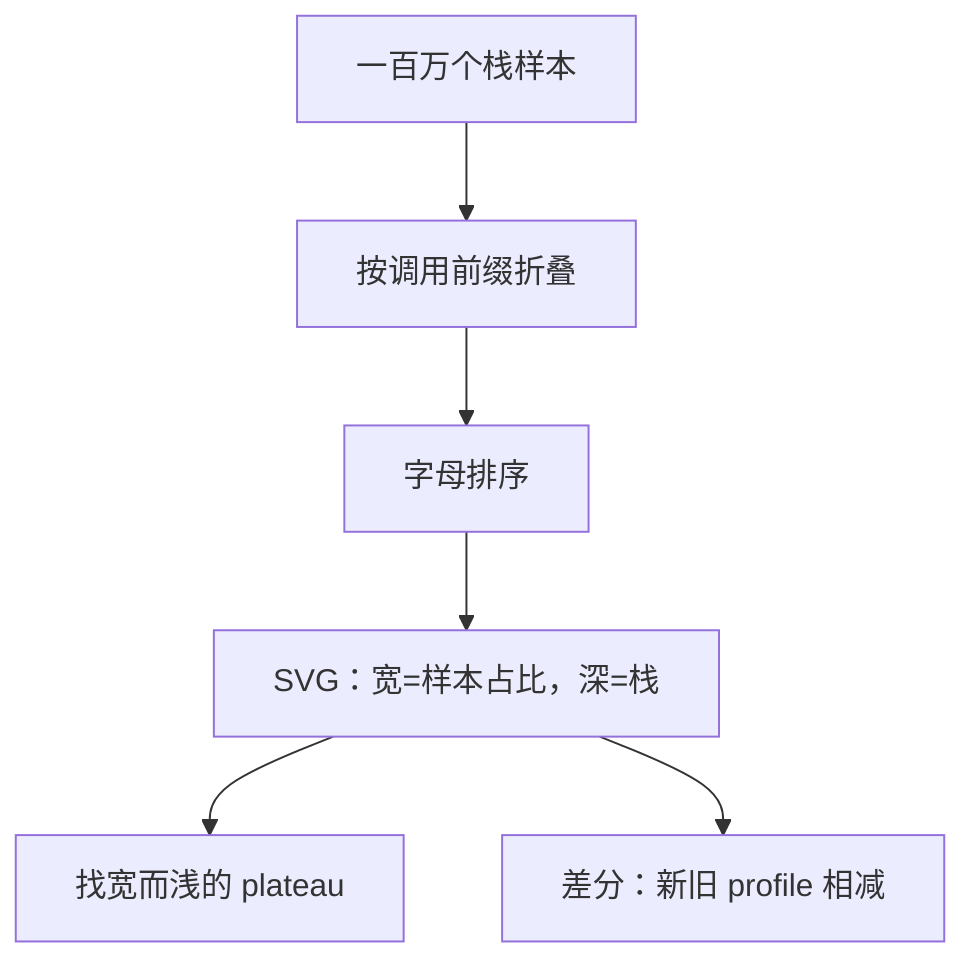
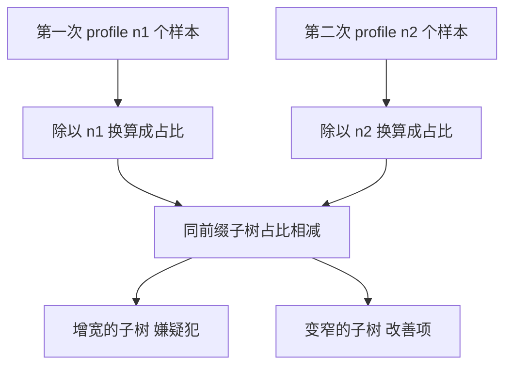

# 火焰图

火焰图把上百万个栈样本折成一张图：宽是时间占比，深是调用路径，字母排序不为好看，为的是让相同前缀咬合成整齐的火焰。

<footer>—— 据 Gregg, "The Flame Graph", Communications of the ACM, 2016；perf 栈折叠工具链实践整理</footer>

[上一课](/cs/obs-perf-deep)把测量学钉完：分型、分组、两条采样线、栈的三种取法。产出是动辄几十万行的 `perf script` 文本——没有读者。缺口是展示：按函数排序的自耗时表丢了「在谁的调用路径上」，含子调用的 inclusive 又把同一份时间重复计入多层；调用栈的森林肉眼读不动。火焰图是 CPU 采样的最后一公里：一种有损、但严格保持样本比例的展示。本课钉做图管线、读法纪律与差分。默认已读完本课程此前的课。

## 问题

线性 profile 为什么没用：函数 A 自耗时 2%，单独一行毫无意义——它可能是十条不同路径上各占 0.2% 的公共工具，也可能是一条致命路径的咽喉。诊断需要的是路径信息，而路径的组合空间是指数的，全列必爆。缺口因此是一个投影：把一百万条「根到叶的栈」按公共前缀折叠聚合，得到一棵矩形树——每个矩形占的横向宽度正比于落在它子树里的样本数。信息有损（样本顺序、绝对时间没了），比例无损（宽度即频率估计），恰好是热点诊断要的。

### 管线三步

第一步 record：采样工具导出原始栈。第二步折叠：把各家格式归一成 `root;frame;leaf 计数` 的行，相同前缀的栈合并计数——这是火焰图的全部数学，没有更多。第三步成图：矩形按字母序排，生成可点击的 SVG。折叠是纯文本处理，与采样工具解耦：perf、eBPF、各语言剖析器只要能吐栈，都能进同一条管线。

排序不变的量只有宽度：字母排序只挪位置不改占比。它把同前缀的矩形拼齐，消除锯齿噪声，人扫一眼的效率天差地别。

直觉类比：火焰图像把一百万张「行程记录卡」按路线归类——开头相同（调用前缀相同）的路线摞成一摞，摞得越宽说明走这条路的车越多；摞的高度只是这条路线经过的站数，与堵不堵车无关。

## 方法

读法三条。其一，宽是占比：矩形横向宽度正比于含它的样本比例，采样下是频率估计而非真值。其二，顶不是瓶颈：火焰顶端的叶子说明「调用到此为止」，要找的是宽而浅的 plateau——那是一个函数连同它整个子树吃掉的份额，优化它才有收益。其三，高是深度：层数只说明调用链长，不说明慢。两个常用变体：icicle 倒置成从入口往下生长，看「从 main 出发谁最宽」更顺；off-CPU 火焰图把上一课调度事件的等待时间替换 on-CPU 时间做宽度，同一套管线回答另一根轴的问题。回归诊断用差分火焰图：两次 profile 相减，红色增宽的子树就是嫌疑犯。

常见误区：初学者容易盯着火焰顶端最高的叶子说「这就是瓶颈」。顶端叶子只说明调用到此结束，可能又窄又快；真正的嫌疑人是一整块「宽而浅」的 plateau，因为它连同整棵子树一起吃掉了可观的 CPU 份额。

## 机制

为什么火焰图忠实于采样而非真值：每样本权重均等，宽度是频率的蒙特卡洛估计。标准误约为 $\sqrt{p(1-p)/n}$：一万个样本时，占比 0.5% 的函数期望只有 50 个样本，相对波动约 14%——宽度差 10% 的两块矩形未必真的不同，小差异要回[上一课](/cs/obs-perf-deep)的样本量纪律去验。为什么点击放大而总量守恒：折叠只合并相同前缀，子矩形宽度之和恒等于父矩形，图内部自洽，交叉验证只需要一个减法。为什么差分必须先归一：两次采样总数不同时，直接相减把「第二次跑得更久」当成「这段代码变慢」；先按各自总数换算成占比再减。为什么栈断了图会撒谎：frame pointer 缺失时回溯停在中间或接上错误的名字，时间被记到错误的祖先头上——补编译选项或换 DWARF 栈，是读图之前的事。

数字实例：第一次采了 1 万个样本、第二次采了 2 万个，直接相减会让每个矩形都「多出一倍」——看起来全线变慢。先各自除以总数变成占比再比，才是「这次代码变快还是变慢」的公平算法。

## 边界

火焰图不是因果：宽只说明「在」，不说明「所以慢」；归因要回计数与分型，图只负责把嫌疑范围收窄到人眼尺度。它也不是唯一投影：延迟诊断常要看直方图与 off-CPU 变体，内存分配有各自的堆火焰图，别用一张图讲不同维度。采样数过小时窄矩形被显示阈值吞掉，「看不见」不等于「不存在」。工具组至此走完：埋点、动态观测、测量学、展示；还有一类问题不慢但坏——下一课内存调试，从「哪里慢」转到「哪里错了」。

## 小结

- 火焰图是栈样本的有损投影：比例保真、路径保留、细节丢弃。
- 管线：record、折叠、排序成图；折叠是全部数学。
- 读法：宽是占比，高是深度，找宽而浅的 plateau，顶不是结论。
- 差分先按总数归一，否则把跑得久当成变慢。
- 断栈会让时间记到错误的祖先，读图前先保证栈完整。
- 出处：Gregg, "The Flame Graph", Communications of the ACM, 2016；perf 与 stackcollapse/flamegraph 工具链口径。
