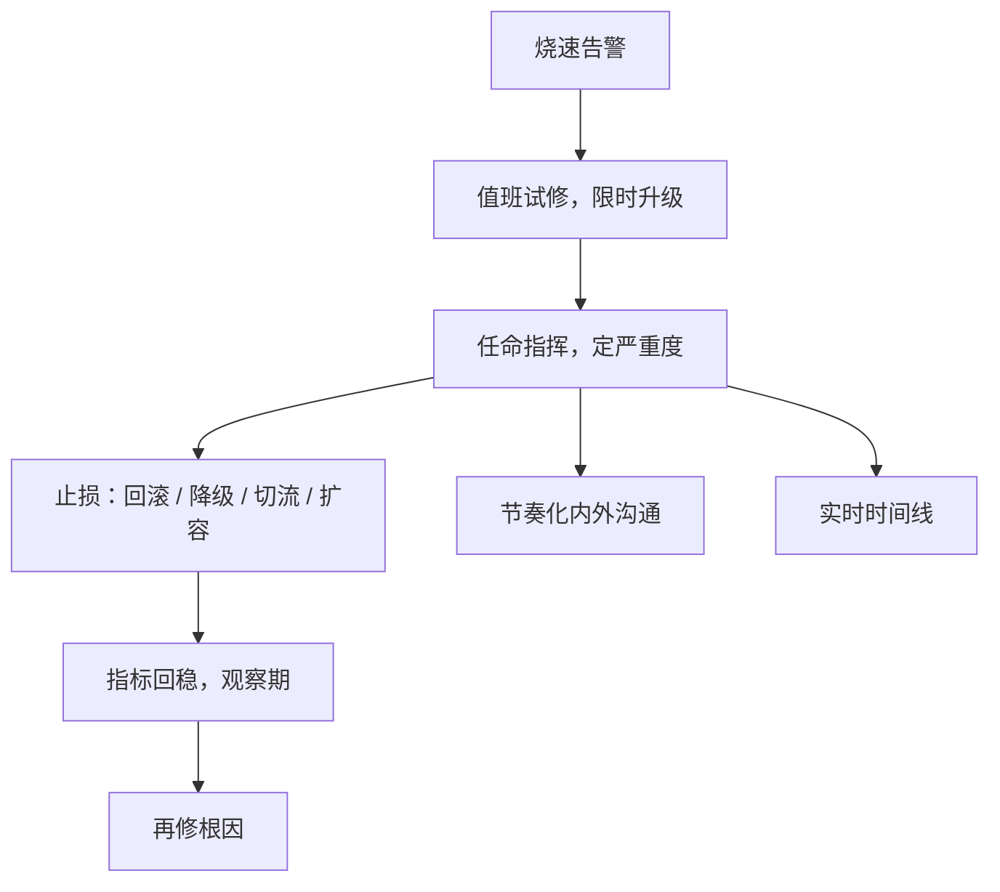
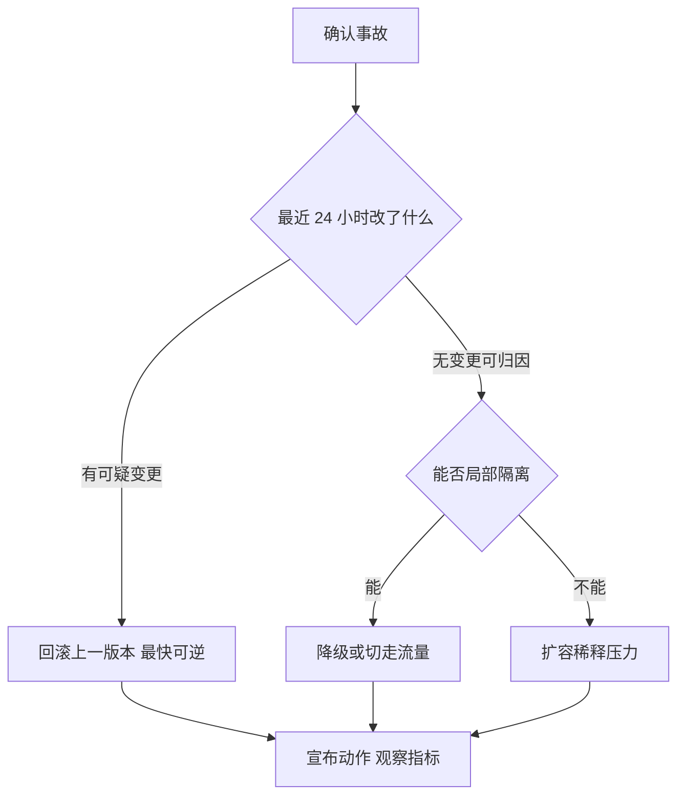

# 事故指挥

事故里最稀缺的不是算力是注意力：指挥的存在，是让修机器的人不必同时回答老板、用户和律师。

<footer>—— 据 Google SRE 书第 14 章 Managing Incidents；事故指挥体系（ICS）源于野火消防的分层指挥整理</footer>

[上一课](/cs/obs-slo-engineering)的烧速告警响了：预算在以十四倍速消耗，呼人策略已经触发。缺口是告警之后的组织行为——谁决策、谁动手、谁沟通、谁记录。安全事件有 [事件响应](/cs/incident-response)的生命周期，那是安全口径，证据保全优先。本课写可用性事故的指挥结构：角色分离、严重度分级、止损决策、沟通节奏。它与[混沌工程](/cs/chaos-engineering)共享 SLO 测量面，只是混沌主动注入、事故被动到来。后课复盘默认已读完本课。

## 问题

没有指挥结构的事故现场是固定剧目：最懂系统的工程师埋头修，单点知识被锁在键盘前；事后没人说得清时间线。指挥要回答的工程问题只有一个：在不完全信息下，如何分配修复、沟通、记录三种注意力，使止损最快且不制造新事故。严重度分级是响应配置的选择器：SEV1 唤醒整个指挥结构加对外沟通，SEV3 一张工单即可——级别不是事故的固有属性，是「投入多少注意力」的决策，而决策标准来自上一课的影响面与预算消耗。

### 角色分离

指挥（IC）不操作，只决策与协调：比较止损方案、宣布状态、砍掉「再试五分钟」、决定升级。操作负责人动手：回滚、切流量、扩容。沟通负责人按固定节奏向内外发更新。记录者实时写时间线，为下一课复盘供料。小团队可以把角色合并到两个人，但「决策、操作、沟通」三种注意力必须有人在管——合并的是人头，不是职能。

大多数事故往前数 24 小时内能找到变更：部署、配置、流量结构。止损的第一反应不是推理，是回看变更列表——「最近改了什么」比「为什么坏」便宜得多。

常见误区：初学者容易以为严重度是事故的固有属性——「这事故本身就是 SEV1」。实际上级别是对「投入多少响应注意力」的决策：同一次故障，发生在周五晚高峰和周二凌晨，定级可以完全不同。

## 方法

升级路径先钉死：值班操作员试修，限时——比如十五分钟无进展就拉指挥，指挥视影响面升级严重度并唤醒角色。止损优先于根因：四个标准止损钮按可逆性与速度排——回滚到上一版本、降级关闭非核心功能、切走流量、扩容稀释压力；先按最快可逆的那个，bug 的根因分析在止血之后。指挥的决策纪律：两个假设都未证实时，选止损覆盖面大的；止损动作必须可宣布、可撤销，避免用新事故盖旧事故。沟通的模板四件套：现状、影响面、下一步、下次更新时间，按固定间隔发，哪怕内容是「仍在调查」——沉默比坏消息贵。记录与操作并行：时间线要记的不是事件流水，是每一步「当时知道什么、据此做了什么」。

数字实例：「限时升级」就是给沉没成本划死线：14:00 告警、14:15 无进展就拉指挥——不论操作员「马上就要修好了」的感觉多强烈。没有这条死线，「再试五分钟」可以吃掉一整晚。

直觉类比：事故指挥像急诊室——IC 是值班主治医生，不亲自缝合伤口，只决定先救谁、用哪个方案；护士动手，家属谈话专人负责。让医生边缝合边答家属问，两头都会砸。

## 机制

为什么指挥不操作：操作占满工作记忆，决策与操作同一人时，沉没成本没人砍，「再试五分钟」会吃掉整晚；IC 的产出是让止损方案在最短时间内被摆上桌、被比较、被选择。为什么节奏化沟通有效：利益相关者的打断频率与沟通频率成反比——更新发得准点，冲进来问「好了没」的人就少。为什么时间线要实时记：事后回忆会把「我们当时以为」改写成「我们当时知道」，复盘需要的是决策时的信息状态，这是记录者独立于操作者的理由。为什么止损优先：每分钟宕机的损失通常远大于根因提前一小时的收益，而可逆的止损风险低——这条偏好要有组织背书，否则操作员会被「查清再动」的文化捆住手脚。

## 边界

本课不重写安全事件的生命周期：证据链、法律保留、反制禁区是事件响应课的口径，两套流程在「准备」阶段就该分开写预案。值班排班、补偿与团队规模是组织课题，不展开。指挥结构不是规模上的普适：小事故两个人也能跑完角色职能；系统与团队变大时，把职能并进同一个人头才是要避免的。止损成功不是终点——事故此刻还只是损失，下一课把它变成组织资产。

## 小结

- 事故指挥分配三种注意力：修复、沟通、记录，职能可并人头不可并。
- 严重度是响应配置的选择器，标准来自影响面与预算消耗。
- 止损优先于根因：回滚、降级、切流、扩容，先按最快可逆的钮。
- 固定节奏加四件套模板，沉默比坏消息贵。
- 时间线实时记决策时的信息状态，为复盘供料。
- 出处：Google SRE 书第 14 章；ICS 源于野火消防的分层指挥；安全口径见 NIST SP 800-61 与事件响应课。
