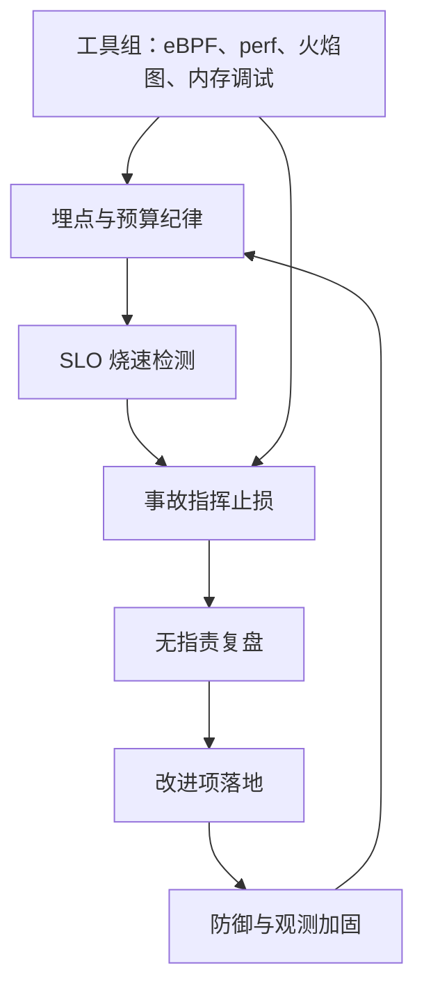
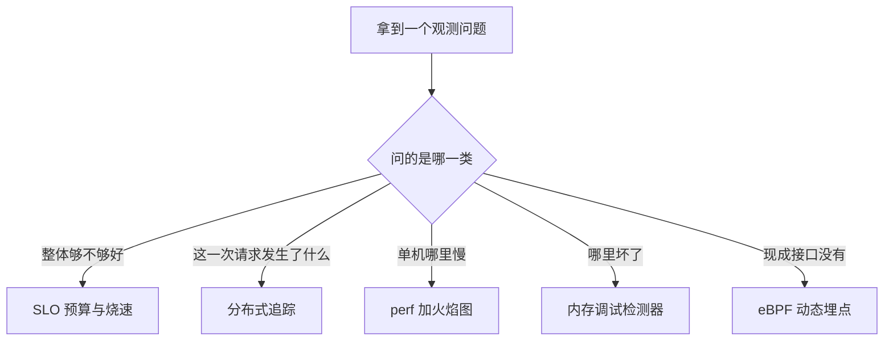

# 可观测性收束

观测不是为了看清系统，是为了让关于系统的争论变成可以测量的命题；测不准的地方，剩下的只有资历与嗓门。

<footer>—— 据 Gregg, <em>Systems Performance</em>, 2nd ed., 2018 与 <em>BPF Performance Tools</em>, 2019；Google SRE 书整理</footer>

[上一课](/cs/obs-postmortem-culture)把事故变成组织资产：改进项带着负责人与期限落进系统。本课程到此收束。九课走过的路可以钉成一条闭环：第一课立下三笔工程账——基数、成本、采样——给所有信号定了预算纪律；工具组四课补足应用代码之外的眼睛，eBPF 动态埋点、perf 的测量学、火焰图的展示、内存调试的正确性；工程组四课把单机证据升到组织行为，分布式追踪管一次请求、SLO 管全体流量、事故指挥管当下、复盘管以后。本课不引入新机制，只验一遍闭环闭合，并把全课程的边界收清。

## 问题

零散学过九课之后，缺口是「它们为什么是这个顺序」。答案是一条证据链：改进项要落地，必须知道同类事故会不会再发生，这需要 SLO 的预算账本；账本要准，SLI 的分母不能错，这需要指标基数与直方图纪律；定位到具体请求要追踪的传播合同；定位到单机函数要 perf 与火焰图的测量学与展示；连「错误」本身的捕获都要内存调试的检测器。抽掉任何一环，环上别处都会退化：没有预算纪律的追踪是存储黑洞，没有复盘的指挥是重复事故，没有测量学的火焰图是随机形状。闭环的检验标准只有一条：下一次同类事故，损失更小、发现更早、恢复更快。

术语翻译：SLI 是「实际测到的成绩单」，比如 99.2% 的请求在 300 毫秒内返回；SLO 是「给自己定的及格线」，比如 99%。错误预算就是允许不及格的份额——1% 的请求可以慢或失败，花完就得停下来修质量。

这条闭环与[混沌工程](/cs/chaos-engineering)相接：混沌是把同一个回路反向跑一遍——主动注入故障，用同一套 SLO 测量面检验防御，赶在事故之前让闭环转一圈。

## 方法

收束成三句口诀。其一，预算先行：指标吃基数预算，追踪吃存储预算，系统吃错误预算——可观测性的一切设计都是稀缺资源上的分配，先登记后消费。其二，证据分层：单机与跨机、单请求与全流量、慢与坏，各自的工具链不同，不要用一张图回答所有问题——火焰图不回答因果，追踪不回答聚合，SLO 不回答单次诊断。其三，回路闭合：检测、止损、复盘、加固，任何一环不落地，观测系统就退化为报表工厂。落地与否的判据是机器可查的：闸门在流水线里、改进项有期限、防御进了测试。

直觉类比：三支柱像一次体检——指标是体温血压那几行数字，便宜、好比对，但不会讲故事；日志是病历本，每件事都记但翻起来费劲；追踪是这次就诊的完整流程单，挂号、检查、取药每步耗时一目了然。

## 机制

深钻层与主干的关系也在此说清。主干课钉机制：[可观测三支柱](/cs/observability-pillars)钉信号分工，[分布式追踪](/cs/distributed-tracing)钉树与采样，[eBPF 观测](/cs/ebpf-observability)钉核内聚合，[perf 采样](/cs/perf-sampling)钉采样路径；本课程钉的是把机制变成生产纪律的工程决策——工具怎么选、预算怎么分、组织怎么动。两层合起来才是完整的可观测性：只有机制，工具是 demo；只有纪律，决策没有根据。闭环为什么成立：复盘改进的防御改变故障分布，分布变化由 SLO 账本度量，度量反过来指明下一处观测投入——这是一个能自我校准的反馈系统，而不是一份静态清单。

## 边界

全课程的边界一次收清。可观测性不是性能优化：它提供证据，优化是拿着证据做决策的另一门手艺。它不是安全审计：合规原文与证据链是 [SIEM](/cs/siem-logging) 与[事件响应](/cs/incident-response)的口径，观测平面假设操作者是合法的。它不是测试：混沌工程从主动侧检验同一套 SLO 面，缺陷要在开发阶段抓的归测试。它也有自己的失效模式：观测系统自身故障时你最需要它——独立通道与合成探测是硬要求；观测数据成为考核指标时，数据会开始说谎。本课程到此收束：从显式网络上的三笔账，到证据链闭成的回路，测得准的系统才谈得上管得好。

常见误区：初学者以为观测系统装好就一劳永逸。观测系统自己也会故障、也占预算，而你最需要它的时刻往往正是它挂掉的时刻——这就是独立通道与合成探测（定时模拟用户访问）是硬要求的原因。

## 小结

- 九课是一条闭环：埋点、检测、止损、复盘、加固，回到埋点。
- 预算先行、证据分层、回路闭合，三句口诀各管一类错误。
- 主干钉机制，深钻钉工程纪律，两层缺一不可。
- 可观测性不是优化、不是审计、不是测试；边界即分工。
- 观测平面自身会故障也会说谎，要独立通道、要防指标考核化。
- 出处：Gregg, *Systems Performance* 与 *BPF Performance Tools*；Google SRE 书；主干课三支柱、追踪、eBPF、perf 的口径。
