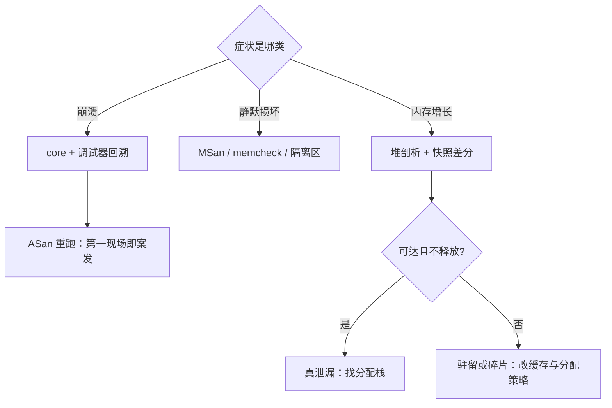

# 内存调试

内存错误的特点是第一现场与案发现场分离：溢出写在 A 处，崩溃爆在 B 处；调试的全部工作是让这两点重新接上因果。

<footer>—— 据 Nethercote and Seward, Valgrind, PLDI 2007；Serebryany et al., AddressSanitizer, USENIX ATC 2012 整理</footer>

[上一课](/cs/obs-flamegraphs)回答了「哪里慢」。本课回答「哪里坏了」。影子内存与红区的机制，[ASan 的机制](/cs/asan-mechanism)已钉；[堆 UAF](/cs/heap-uaf) 的形态、[OOM killer](/cs/oom-killer) 的行为也各有专课。剩下的缺口是工作流：从一个症状出发——崩溃、静默损坏、内存持续增长——选哪个工具、付什么代价、能下什么结论、不能下什么结论。这是工具组的最后一课。

## 问题

三类症状是三条路。其一，崩溃：段错误把进程打断，但栈回溯只告诉你崩在哪，不告诉你谁写的——越界写踩坏了别人的对象，崩在无辜的代码里，第一现场早已撤离。其二，静默损坏：未初始化读、use-after-free 读、数据竞争，程序不崩，输出偶尔错，复现概率像掷骰子。其三，内存增长：RSS 一路爬，是泄漏、是缓存驻留、还是分配器碎片，光看监控曲线分不开。每条路的检测器、开销与结论强度都不同，选错路浪费的是天而不是小时。

### 按症状选工具

崩溃路：core dump 加[调试器与断点](/cs/debugger-breakpoint)回溯栈，[DWARF](/cs/dwarf-debug-info) 给出行号；但这一步只回答「死在哪」。把「死在哪」升级成「谁干的」，要用 ASan 重跑：影子内存把检查提前到每一次访问，越界第一次发生就被拦下，第一现场与案发现场合一。静默损坏路：未初始化读找 MSan 或 Valgrind memcheck——后者不用重编译，代价是解释执行；use-after-free 靠 ASan 的隔离区延迟复用。增长路：先分型再动手——看[匿名页对文件页](/cs/anon-vs-file-page)的构成，做堆分配剖析拿分配栈，对两个时间点的堆快照做差。

Valgrind memcheck 的代价是解释执行：常见口径慢 10 到 50 倍。它能就地诊断一个不会崩的静默错误，但不该挂在持续运行的测试里过夜跑全量。

## 方法

全量插桩留给测试环境：ASan 约 2 倍 CPU 与约 2 倍内存的税（1/8 影子加每对象红区），换来「首次越界即报」的结论强度；CI 与压测里常开。生产环境反过来：采样型分配剖析——按分配抽样记栈——开销压到可常开，代价是小对象可能漏采；先用它定位可疑的分配点，再回测试环境用 ASan 定罪。增长路的关键判据：真泄漏是「不可达且不释放」——需要保留分配栈与调用图才能下结论；可达但不用是缓存驻留，要改淘汰策略；释放了但 RSS 不降是 [brk 与堆](/cs/brk-heap)的碎片，罪在分配器不在业务。内核侧的内存压力先读 OOM 日志的进程账单（[OOM killer](/cs/oom-killer) 口径），别在用户态瞎猜。

## 机制

为什么崩在哪不等于谁干的：内存是共享命名空间，踩踏的效果延迟显现，破坏者与受害者只在时间上相邻、在因果上很远。检测器的共同思路是把检查点前移到访问时刻——影子内存一次查表判读写合法性，红区把越界变成确定性的撞墙——于是第一次错误就是最后一次机会。为什么 MSan 与数据竞争检测要求全量重编译：半插桩的程序里，未经标注的值会被当作干净传播，漏报比崩溃更危险；工具链的边界就是结论的边界。为什么泄漏难下定义：分配器不向操作系统归还内存是常态（arena、对齐、碎片），RSS 涨不等于泄漏；判据必须落在「不可达且不释放」上，而判定不可达需要调用图。这也是堆剖析比「看 RSS 曲线」强的原因。

## 边界

本课不重讲影子内存的位级设计——那是 ASan 机制课的；不展开并发错误的检测，数据竞争有自己的工具与理论，混讲会稀释两边。检测器给出的是证据强度不同的话：memcheck 的未初始化报告可靠，采样剖析只是线索。长期解是把这类错误类整体消灭——[内存安全语言迁移](/cs/memory-safe-languages)改变的是错误分布，不是调试技巧。工具组五课到此收口：下一课进工程单元，把观测从单机搬到跨服务，从「这台机器」到「这次请求的一生」。

## 小结

- 三症状三路：崩溃找第一现场，静默损坏靠插桩或解释执行，增长先分型。
- 崩溃栈只答「死在哪」；ASan 把检查前移到访问点，让首错即现。
- 泄漏的判据是「不可达且不释放」；RSS 涨可能是驻留或碎片。
- 测试环境全量插桩，生产环境采样剖析，结论强度与开销配套。
- 检测器要求全量重编译时，半插桩的漏报不可信。
- 出处：Valgrind（PLDI 2007）；ASan（USENIX ATC 2012）；主干课 ASan 机制、OOM killer 的口径。
