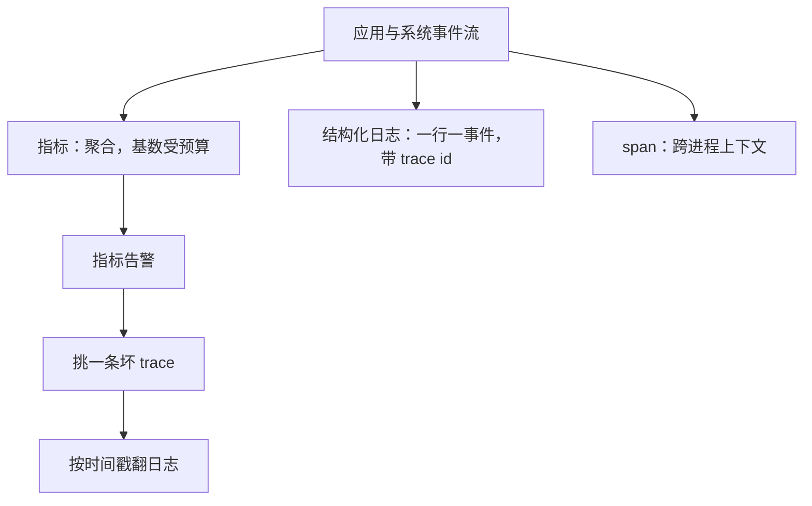

# 指标、日志与追踪

每一种遥测信号都在为一种提问方式付存储与延迟的账；先定你要问什么，再选柱子，而不是先把三根柱子都立满再找问题。

<footer>—— 据 Gregg, <em>Systems Performance</em>, 2nd ed., 2018；Google SRE 书中的监控章节整理</footer>

[上一课](/cs/virt-case-map)给「虚拟化与容器深入」收束：租户互信、密度目标、负载路径三问定机制，五个案例钉在一根「共享内核到复制机器」的轴上——隔离与开销同向移动，没有免费的边界。边界之外的系统跑起来之后，先得能被看见。显式的系统更要显式的观测——编排出的一百个进程谁慢、谁错了，内核不会自己报上来。本课程「可观测性与调试」深钻由此起笔。三支柱的分工与关联，主干课[可观测三支柱](/cs/observability-pillars)已钉过：指标聚合、日志细节、追踪请求图，用 id 关联，控制基数。本课不重讲口号，写把柱子立进生产时的三笔工程账：基数、成本与采样。后课默认已经读完本课。

## 问题

支柱分工是名词，工程账是动词。第一笔是基数：指标的一个标签组合就是一条时间序列，序列数是各标签基数的叉积 $|L_1|\times\cdots\times|L_k|$。把 user id 放进指标标签，序列数立刻是用户数乘端点数乘实例数——写入还撑得住，索引与慢查询先把时序库拖垮。第二笔是日志的形态：非结构化文本 grep 得了一台机器，聚不得一片集群；无字段的日志没法回答「哪些用户受了影响」。第三笔是追踪全量不可行：全采的存储与网络开销按请求量线性走，而丢掉的采样里恰恰藏着最稀有的错误。三笔账共同回答一个问题：在预算之内，让哪类问题变得可答。

### 三种信号，三种聚合粒度

指标是预聚合：常开、便宜，但只有你预先定义过的维度。日志是事件级：每个细节都在，但检索与存储都贵。追踪是请求级：span 把一次调用串成因果树，回答「这一次发生了什么」。信号从应用与系统事件流里分岔：可聚合、低基数的进指标；带细节、带 trace id 的进结构化日志；跨进程边界的上下文进 span。

单实例时序库的活跃序列到数百万量级就是现实上限，靠标签纪律省钱，不是靠加机器。一张失控的直方图标签能在一夜里烧掉整月预算。

## 方法

类型纪律先行：gauge 记瞬时值，counter 只单调递增并在消费端求速率，histogram 存分布并在消费端取分位数。错误率永远写成 $\Delta\mathrm{errors}/\Delta\mathrm{total}$ 的 counter 比值，不写平均值嵌平均值。日志结构化：一行一个事件，字段名跨服务稳定，级别有语义约定——ERROR 是会吵醒人的，WARN 是该看的，DEBUG 是不该在生产开的。trace id 写进每条与请求相关的日志。追踪采样默认 head-based 低比率加错误强制采样，具体策略留给追踪工程课。基数预算用登记制执行：新标签先过预算评审，高基数字段只进日志与追踪，不进无限扩张的指标标签。

## 机制

基数为什么会爆炸：叉积里每加一个十值标签，序列数乘十；内存与索引随序列数线性涨，慢查询互相挤占，最后观测系统自己成为故障源——观测平面失效时你恰好最需要它。日志为什么必须结构化：字段即索引，稳定字段名才让「按用户、按错误码聚合」从翻文本变成一次查询。采样为什么按树决策：head-based 在根上决定整棵树采不采，采半棵树拼不出因果边，比不采更误导。直方图桶是分辨率与成本的折中：桶太疏，分位数失真，SLO 的分母还没算就错了。最后，观测本身有开销——序列化、出核、采样都在消耗被测系统的资源，这个 probe effect 到 perf 一课会再算。

## 边界

本课不写具体后端的查询语言与部署形态，不写安全日志的合规保留——那是[SIEM](/cs/siem-logging)的口径。剖析（profile）常被称作第四根柱子，本课只点名：工具组后四课——[eBPF](/cs/ebpf-observability) 的动态埋点、perf 的测量学、火焰图的展示、内存的正确性调试——都长在它上面。单机单请求的答案不等于系统答案：服务整体好不好，是工程组 SLO 一课的问题。下一课写不动应用代码就能把埋点挂进事件流的 eBPF。

## 小结

- 指标聚合、日志细节、追踪请求图；选信号就是选提问方式。
- 指标吃基数预算：登记制、高基数字段不进指标标签。
- 日志结构化、字段名稳定、trace id 关联三柱。
- 采样按树决策，错误路径强制保留。
- 观测有 probe effect，观测平面自身要被监控。
- 出处：Gregg, *Systems Performance*, 2nd ed., 2018；Google SRE 书监控章节；OpenTelemetry 对 signals 的划分口径。
