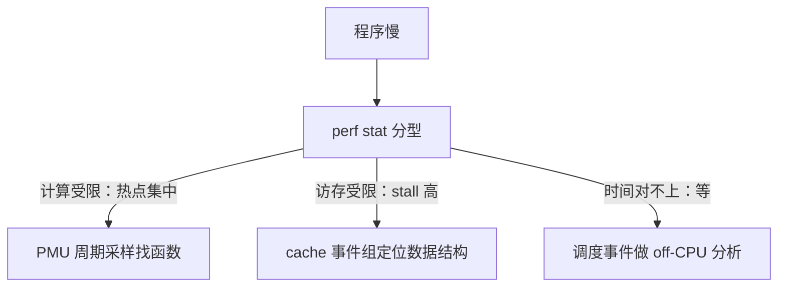
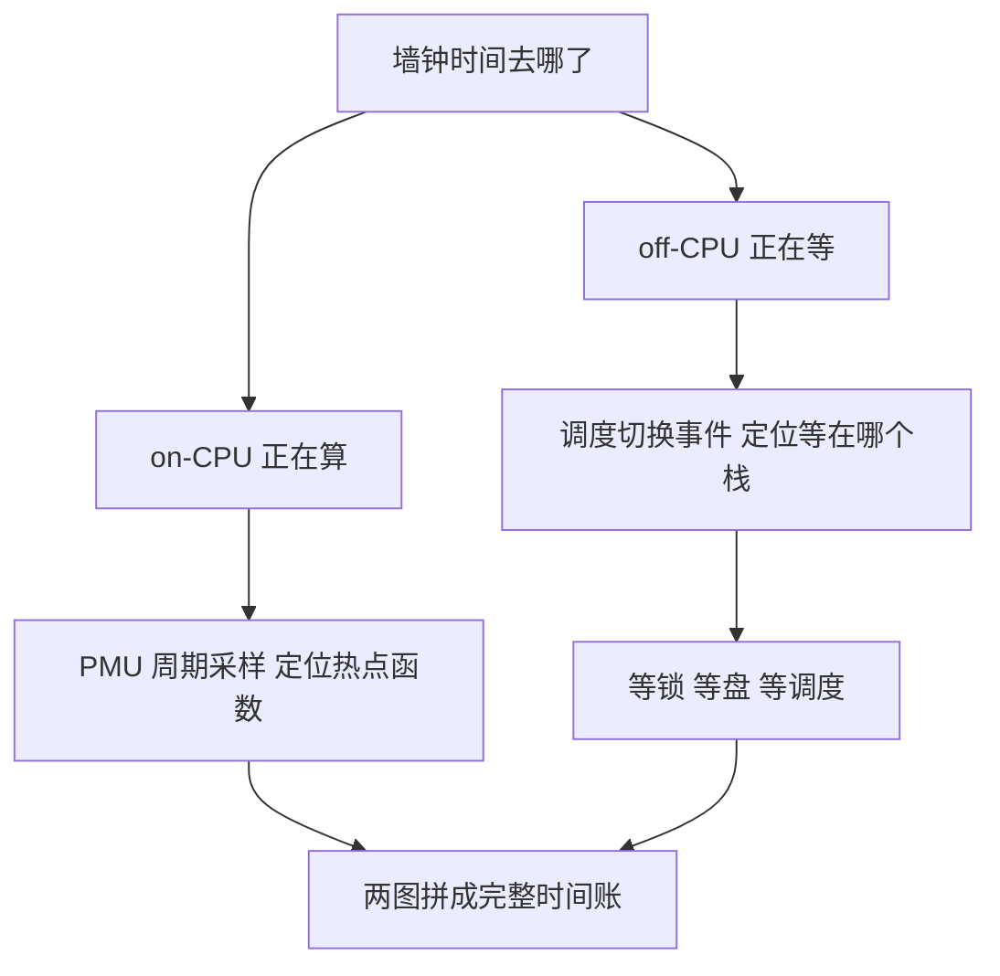

# perf 的深化

PMU 是厂商埋进芯片里的诚实之人：它数的是真实发生的事件，不是你希望发生的模型。

<footer>—— 据 Gregg, <em>Systems Performance</em>, 2nd ed., 2018；Intel/ARM PMU 手册；Yasin 的自顶向下分析方法, ISPASS 2014</footer>

[上一课](/cs/obs-ebpf)把动态埋点接到 tracepoint 与 kprobe：事件发生在挂钩处，语义在内核源码里。缺口是 CPU 微观行为——cache 未中、分支预测失败、每指令平均周期数——这些事件没有语义挂钩点，只有 [PMU 计数器](/cs/perf-sampling)数得到。基线课已钉 perf_events 的采样路径：溢出中断、mmap 环、skid。本课把它深化成一套测量学：计数与采样的分工、多路复用的误差、调用栈的取法、off-CPU 的盲区、统计纪律。后课的火焰图只是本课样本的展示层，默认已读完本课。

## 问题

「程序为什么慢」有两个分支：它在算，还是在等。算的问题问 PMU：哪个函数吃掉了周期、周期浪费在前端还是后端。等的问题 PMU 看不见：等磁盘、等锁、等调度，CPU 空转计数毫无动静——on-CPU 采样对等待时间全盲。基线课只铺了第一个分支的机制。缺口有四个：其一，PMU 计数器比事件少，多数事件靠时间片轮转复用，读出来的绝对数是缩放估计；其二，样本数不够时把噪声当信号，两次运行结论相反；其三，off-CPU 时间没有专门的采样通道，要借调度事件；其四，频率在变，cycle 数失去可比性——升频后同样的工作量 cycle 变少，像是优化了。

### 计数先行，采样随后

先 `perf stat` 分型：IPC、每指令 cache 未中、前端与后端 stall 占比，把负载归入计算受限、访存受限或前端受限——自顶向下方法（Yasin, ISPASS 2014）把这条归因树做成了系统化流程。知道是哪一类，再去采样找具体函数。直接采样的风险是把「哪里热」当成「为什么慢」：热点函数本身可能只是替别人背锅。

现代 x86 每核通用可编程计数器通常只有个位数，而可定义事件上千——复用不是实现瑕疵，是硬件预算。故同组测量才可靠：比率型指标的两个事件必须进同一个组。

术语翻译：IPC 就是「平均每个时钟周期干完几条指令」，像流水线上每人每分钟装几个盒子。IPC 明显低于预期，通常不是人偷懒，是流水线在停摆等待——最常见的是等内存数据送到。

## 方法

计数用事件组：把要算比率的分子分母放进一个 group，内核保证它们在同一调度片里测，复用缩放在分子分母上同向抵消。采样分两条线：on-CPU 用周期事件采样 IP 与栈，找计算热点；off-CPU 用调度切换事件记录「这个线程在哪个栈上睡了多久」，聚成等待直方图。栈的取法三选一：frame pointer 最便宜，但要求编译加 `-fno-omit-frame-pointer`；DWARF 最全，回溯要解 [调试信息 DWARF](/cs/dwarf-debug-info)，采样开销更大；LBR 是硬件最后分支记录，深而准但入口有限。统计纪律四条：跑多次取中位数与极差；报告样本量；测量期间锁频锁核，消掉 turbo 与迁移；改动对照要用同一台机器同一组核。

常见误区：初学者升频后看到「同样代码 cycle 数变少」就以为优化生效了。cycle 随频率缩放，工作量不变时升频本身就让 cycle 变少；跨频比较要换用与频率无关的基准事件（如 constant TSC），或干脆锁频再测。

## 机制

复用的数学：内核把 $N$ 个事件轮转装进每核数个计数器，读数按启用时间占比缩放。绝对数因此是估计，误差随复用率涨；比率若分子分母同组则近似无偏——这就是「先算比率再看绝对值」的原因。IPC 的解读要配分型：$\mathrm{IPC}\lt 1$ 不必然坏，可能是访存等待；$\mathrm{IPC}\gt 4$ 也不必然好，可能循环高度规则只是没活干。off-CPU 为什么要新通道：调度切换时被切下的是等待者，把切换事件与栈配对，等待时间才第一次有归属；它与 on-CPU 剖面互补，两张图拼起来才是墙钟时间的完整账。锁频为什么改变结论：PMU 的 cycle 数随频率缩放，只有参考周期（constant TSC 一类）跨频稳定；跨频比较要用不变基准事件。

数字实例：某事件只在四分之一的时间里占着计数器，读出 100 万次，按启用占比缩放，实际估计约 400 万次——这就是绝对数「是缩放估计」的含义；而同组同测的两个事件做比率，缩放同向抵消，近似无偏。

## 边界

本课不把 PMU 事件当词典查——事件名随微架构变，查手册；云上虚拟机里 PMU 常被裁剪或半虚拟化，测不到要怀疑平台而不是工具。GPU 的计数体系在[性能计数与 profiling](/cs/gpu-profiling)，别混进 CPU 叙事。skid 与精准采样的机制是基线课口径，不再展开。本课给的是证据：哪个函数、哪类受限、等多久；把成千上万个样本变成人能读的形状，是下一课火焰图的事。

## 小结

- 先 perf stat 分型再采样：计算受限、访存受限、在等待，三条路不同。
- 计数器复用使绝对数是缩放估计；同组测量保比率可靠。
- on-CPU 找热点，off-CPU 用调度事件找等待，两图合看才是全部时间。
- 栈三法：frame pointer、DWARF、LBR，按精度与开销选。
- 统计纪律：多样本、锁频、报样本量，否则结论是噪声。
- 出处：Gregg, *Systems Performance*, 2nd ed., 2018；Intel/ARM PMU 手册；Yasin, ISPASS 2014。
