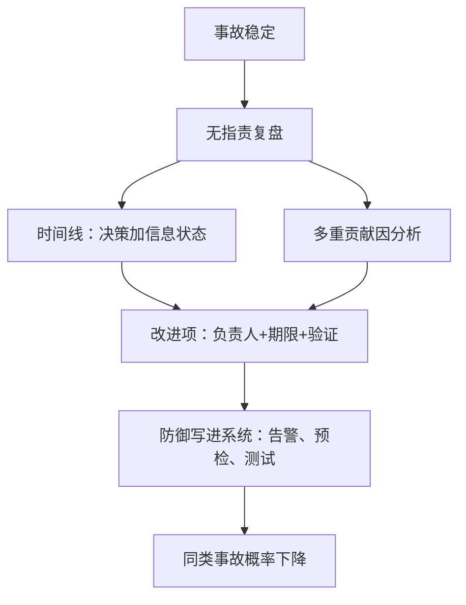
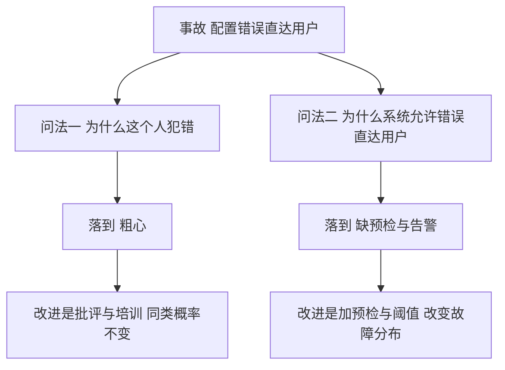

# postmortem 文化与案例

复盘的目的不是找出谁犯错，是找出系统哪里让聪明人合理地犯了错；一旦写复盘等于定罪，下一个操作员会学会瞒报。

<footer>—— 据 Google SRE 书第 15 章 Postmortem Culture；Allspaw 的 Just Culture 实践（Etsy，2012）整理</footer>

[上一课](/cs/obs-incident-command)的记录者写下了时间线，事故稳定、服务恢复。缺口在此时打开：事故此刻仍只是一笔损失；只有写成复盘、落地改进项，它才变成组织的资产。本课写复盘的模板与模板之上的文化：无指责为什么是技术前提而非道德姿态，各栏为什么长成那样，以及复盘文化常见的死法。本课程倒数第二课，后课收束默认已读完本课。

## 问题

复盘有四个工程缺口。其一，时间线是决策序列，不是事件流水：每一步要写「当时知道什么、据此做了什么判断」，只写「15:42 重启了实例」的读者只剩指责可做。其二，根因的单因谬误：生产事故几乎总是多重巧合——一个变更、一处缺失的防御、一条迟到的告警、一位当夜的值班——复盘只写「根因：配置错误」，其余防线的改进机会全部流失。其三，改进项不落地：没有负责人、没有期限、没有验证方式，与功能发布抢优先级必输，复盘退化成文比赛。其四，也是最致命的：指责文化。写复盘的人被问责，下一次事故的第一反应就是掩盖——数据的完整性从源头损坏，所有下游分析全部失真。

### 无指责是信息论要求

把复盘想成一次测量：它测的是「决策时组织拥有什么信息」。若记录者预期被追责，测量值会系统性向「我按流程做了」偏移；而事故的漏洞恰恰常在流程外。所以无指责不是温情，是保证测量不被污染的技术条件——损失的不是礼貌，是数据。

5 Whys 源自丰田生产方式。它停在哪决定改进空间：追「为什么人犯错」五层常落到「粗心」；追「为什么系统允许这个错误直达用户」才落到设计。同一个事故，落点不同，改进项完全不同。

直觉类比：无指责复盘像航空业的黑匣子调查——目的不是惩罚飞行员，是找出让合格飞行员也会犯错的系统漏洞。一旦调查等于定罪，驾驶舱里的话就再也不会被如实说出，黑匣子从此只录套话。

## 方法

模板五栏。影响面：用户数、时长、收入口径，直接引用 SLO 预算账本的消耗数——上一课的严重度分级用的就是这份账。时间线：检测、响应、恢复三段，带决策与信息状态。原因分析：写多重贡献因，可以追问但要止步于系统。改进项：每条四件——负责人、期限、验证方式、以及它防的是哪一类事故而不是哪一次。教训：写进 runbook、告警阈值、测试与预检的具体条目。流程上再钉两条：评审把单点事故升维成系统清单——同一服务第三次出同类事故，说明上一轮改进项没防住「类」，要回炉；复盘归档要可检索，负结果可检索，组织才没有幸存者偏差。做得对的动作同样入档：止损成功的路径要固化成 runbook，只记失败会让语料只剩负样本。

常见误区：初学者把复盘写成「根因：配置错误」一行就收工。生产事故几乎都是多重巧合——一个变更、一处缺失的防御、一条迟到的告警；单因叙事让链上每个环节的改进机会全部流失，同类事故换个马甲再来一次。

## 机制

为什么改进项要防「类」不防「次」：重启那台机器不改变下次的概率，断路器、预检、阈值才改变分布——成效最终反映在错误预算消耗率的下降上，这是复盘与 SLO 工程的闭环。为什么单因叙事流行而有害：「根因」给管理者一个可交付的句子，代价是链上每个环节都被放走；多层防御要求每一层单独回答为什么没拦住。为什么复盘要写「当时知道什么」：同一个动作在信息完备与否两种状态下是两个决策；复盘读者若用后见之明评分，学到的是虚假教训。为什么文化比模板先决：模板可以被照抄，如实记录不能——它依赖「说真话无代价」的信誉积累，一次因复盘追责就会清零。

为什么重要：改进项没有负责人、期限和验证方式，就只是一句愿望——与功能发布抢排期必输，通常永远排不上。有负责人有期限的「加预检」才会在下个迭代真落地，把同类事故概率往下压。

## 边界

本课不引用具体公司的未公开事故，公开案例只取其复盘文本的口径；不写安全事件的复盘差异——法律与保密约束让那类复盘有自己的规则，归事件响应课。复盘也不是万能工具：若组织用复盘数量做考核，会催生为写而写的事故；文化指标与数量指标必须分开。事故到资产的路到此走完——下一课把整门课程收束成一张地图。

## 小结

- 复盘的产出是资产还是损失，取决于改进项是否落地。
- 无指责是测量学要求：预期被追责的记录会系统性失真。
- 时间线记决策与信息状态，根因写多重贡献因，拒绝单因叙事。
- 改进项四件套：负责人、期限、验证方式、防的是类不是次。
- 成效回到错误预算消耗率；做得对的路径同样要固化。
- 出处：Google SRE 书第 15 章；Allspaw 的 Just Culture 实践（Etsy，2012）；5 Whys 源自丰田生产方式。
