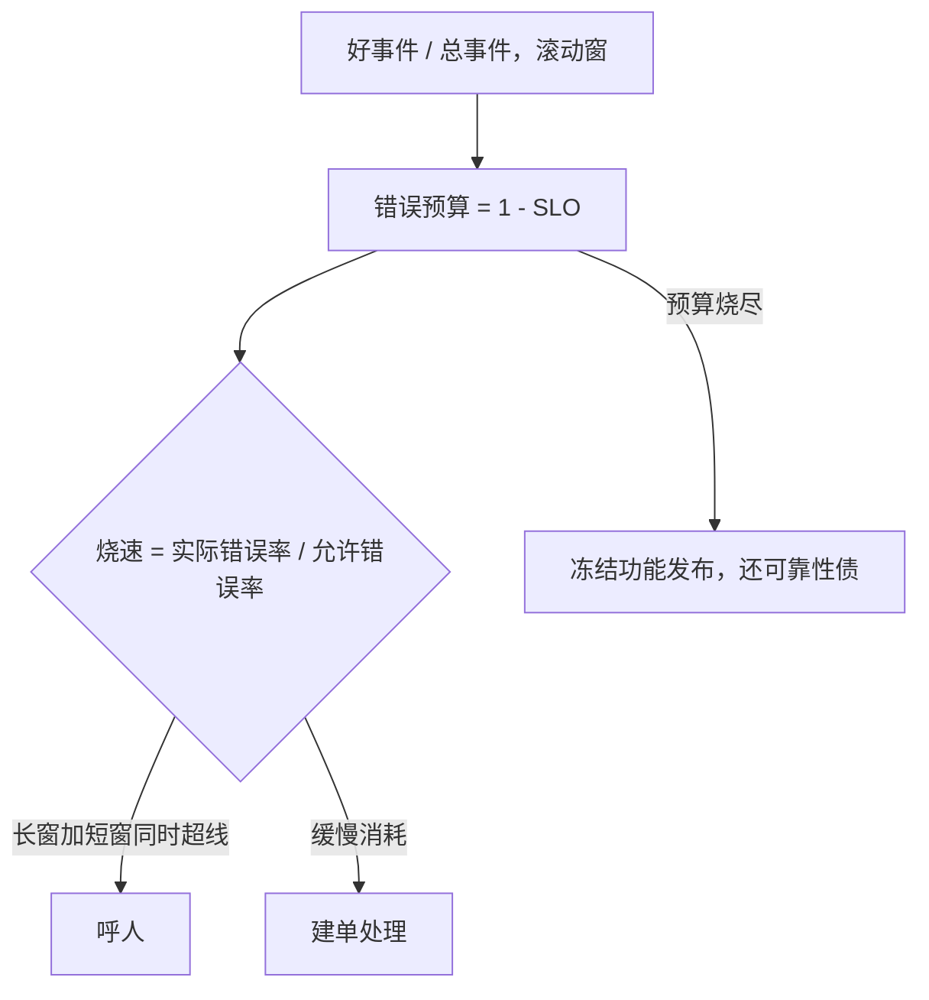

# SLO 工程

SLO 不是承诺接近百分之百，是选择在哪里主动花掉不完美：错误预算把「可靠」从愿望变成一笔可以花的钱。

<footer>—— 据 Google SRE 书（Beyer et al., 2016）第 3-4 章与 SRE Workbook（2018）第 5-6 章整理</footer>

[上一课](/cs/obs-distributed-tracing)给了单次请求的完整树：这一次哪里慢、哪里错。缺口在聚合层：全体流量对用户够不够好，以及不够好时，组织该把工程时间投给新功能还是可靠性债。[可观测三支柱](/cs/observability-pillars)只用一句话带过「SLO 用指标定义错误预算」；本课把它展开成工程：SLI 的选法、预算的算法、烧速告警的数学、预算政策怎么长出牙齿。后课事故指挥默认已读完本课。

## 问题

一条「月均可用性 99.9%」为什么不够：平均掩盖长尾——一部分用户可以永远处在坏的那 0.1% 里，均值却达标；日历月窗口让月初躺平、月末狂修；没有配套政策的 SLO 只是墙上的标语，超了也没人停手。工程缺口四件：SLI 要从用户旅程出发——「请求成功且在 300 毫秒内返回」，而不是「CPU 低于 80%」这类机器舒服、用户遭罪的代理指标；窗口要用滚动的，让预算每天等速补回；错误预算 $1-\mathrm{SLO}$ 要有明确的账本，谁在花、花了多少；预算烧完要有自动后果，否则不是 SLO 是许愿。

### 从 SLI 到预算

SLI 定义为好事件除以总事件，在滚动窗口上聚合；延迟分位数用第一课钉过的直方图纪律取，桶太疏分位数就失真。测量点离用户越近越真：前端实测优于服务端代理，服务端代理优于 SLA 报表。错误预算就是允许的坏：SLO 99.9% 等于 28 天窗口里允许 0.1% 的请求失败——这笔钱要么花在故障上，要么主动花在激进发布上，总之要记账。

SRE Workbook 的经典烧速配置：14.4 倍烧速叠 1 小时加 5 分钟双窗，1 小时内烧掉 2% 的月预算；6 倍烧速叠 6 小时加 30 分钟，6 小时烧掉 5%。长窗保「值得叫醒人」，短窗保「发现得早」。

## 方法

告警不用静态阈值而用烧速：burn rate 定义为实际错误率对允许错误率之比，等于 1 表示预算恰好 28 天烧完。多窗双确认——长窗加短窗同时超线才呼人——单短窗对毛刺过敏，单长窗迟到一小时；两个独立窗口同时过线，滤掉绝大多数单点抖动。政策写出牙齿：预算烧尽自动冻结功能发布进流水线闸门，优先还可靠性债；预算充裕则允许激进发布。没有闸门的政策会退化成报表，因为「冻结」落在人的自觉上时，发布压力总能赢。依赖链要摊预算：上游 99.9% 串下游 99.9%，端到端约 99.8%——预算按依赖树分配，别把整笔钱留给最外层。

## 机制

为什么烧速在数学上优于阈值：恒定 0.05% 的错误率在 0.1% 预算下永不超阈值也不该呼人（预算正好撑满窗口），静态阈值要么对此误报要么对尖峰漏报；烧速把「预算消耗速度」本身变成信号，低速率天然安静，高速率天然响。为什么双窗能降噪：把毛刺同时骗过两个时间尺度，概率是单窗误报率的乘积量级。为什么预算冻结可执行：发布走流水线，闸门查预算余量是机器能做的判断，与「指标吃基数预算」同构——预算制的本质是把稀缺资源变成先登记后消费。为什么分位数延迟要用直方图而不是平均：平均响应达标而第 99 百分位翻倍的服务，用户体验已经坏掉，SLO 的分母错一半。

## 边界

本课不写 SLA 的法务与赔偿条款，那是商务合同；不展开数据新鲜度、正确性这类非延迟非可用性的 SLO 变体，只点名它们同构。也不重讲指标基数与直方图实现——第一课的账直接复用。SLO 把「什么时候该呼人」变成了数学，但呼了之后人在肾上腺素里怎么协作，数学不管——下一课事故指挥。

## 小结

- SLI 从用户旅程定义：好事件/总事件，滚动窗聚合。
- 错误预算 $1-\mathrm{SLO}$ 是可花的钱，要有账本与政策。
- 告警用烧速加多窗双确认，长窗定性、短窗及时。
- 预算烧尽的后果要落在流水线闸门上，不是口头纪律。
- 依赖链串行吃预算，按依赖树摊配。
- 出处：Google SRE 书（2016）第 3-4 章；SRE Workbook（2018）第 5-6 章的烧速告警口径。
