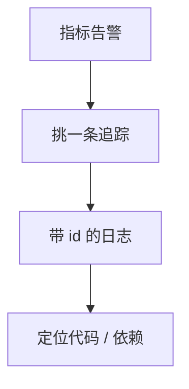

# 可观测三支柱

指标告诉你「有多糟、多少」，日志告诉你「这条记录说什么」，追踪告诉你「这次请求走了哪」。三根柱子互补，不是三个品牌。

<footer>—— 据 Dapper；Google SRE 书中的监控；OpenTelemetry 对 traces/metrics/logs 的划分整理</footer>

上一课[追踪](/cs/distributed-tracing)只覆盖采样到的请求树。缺口是**系统级与事件级**：QPS、错误率、饱和度没有 trace 也对；审计与异常细节在日志里。本课钉三者分工与关联（同一 trace id）。后课混沌工程用它们当实验的测量。

## 问题

指标：聚合、便宜、低基数；高基数会爆炸。日志：高基数、贵、要检索；无结构则不可聚合。追踪：中基数、看一次调用的边。缺口：只用日志 grep 无法得 SLO；只用指标不知道是哪次用户；只用追踪看不见未采样与非请求路径（磁盘满）。

关联：日志打 trace id；指标用 exemplar 挂 trace；告警先指标后追踪再日志。

「三支柱」是教学口号。事件（span 事件）与剖析（profile）常被列为第四、第五，本课点名。

## 方法

SLO：用指标定义错误预算。排障：告警 → 相关服务红图 → 一条坏 trace → 该 span 时间戳附近的日志。基数预算：user id 进日志或追踪属性，不进无限标签的指标。

不要用追踪后端当日志仓库，也不要把每条日志当 metric 递增。

## 机制

采样不一致：指标说 1% 错误，追踪只采到成功树，会误判。错误强制采样是修补。时钟：日志时间戳墙钟漂移，关联仍靠 id 不是靠时间对齐。

本课不写 Prometheus 与 Loki 的全部算子。也不把可观测写成安全 SIEM 全文。

与[故障模型](/cs/failure-models)：观察系统自己会故障。监控分区时你看见的「全绿」可能是假的——要独立通道与合成探测。

## 边界

本课不引入混沌实验设计（下一课）。不写日志合规保留年限。后课默认：SLO 用指标；因果路径用追踪；细节用结构化日志加 id。混沌工程把故障注入，用这三根柱子读结果。

口号去掉之后，留下的是三种不同聚合粒度的数据。缺一种就有一类问题看不见。

## 小结

- 指标聚合、日志细节、追踪请求图。
- 用 id 关联；控制指标基数。
- 观察平面自己也会分区，要合成探测。
- 出处：Dapper；SRE 监控实践。
