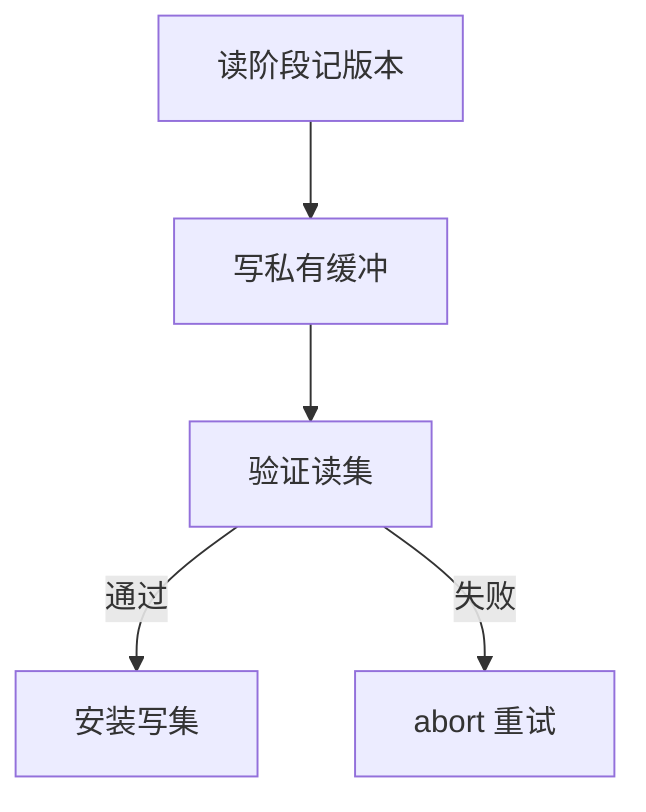

# OCC

乐观并发：工作阶段不锁（或极少锁），提交时比较读集版本；冲突则 abort。低争用时吞吐高，高争用时重试打满 CPU。

<footer>—— 据 Kung and Robinson, On Optimistic Methods for Concurrency Control, TODS 1981；Gray；Hekaton</footer>

[上一课](/cs/timestamp-ordering)在访问时按戳拒绝。本课把检查推迟到提交：乐观并发控制（OCC）。主干锁课偏悲观；进阶补乐观轴。SSI 下一课在快照上再加写偏斜检测。

## 问题

读阶段：事务拷贝或直接读已提交数据，记读集版本号。写阶段：写私有缓冲。验证：读集版本是否仍等于开始时，写集是否与并发提交冲突。完成：安装写集、分配提交戳。缺口是**验证串行化**：验证阶段通常短锁或单线程 stamp，否则验证本身乱序。

Kung-Robinson 三阶段。现代主存库（Hekaton）用 OCC+MVCC：读可见版本，提交 CAS 安装。争用高则 abort 率高，要指数退避或回退 2PL。

Kung and Robinson, TODS 1981。乐观不是「不管隔离」。丢失更新在验证失败时 abort，不会静默覆盖——除非实现漏读集。

## 方法

读集/写集粒度：行或页。粒度粗冲突多，细则记更多。只读事务可跳验证若快照不变（后课只读快照）。混合：热点行悲观，其余乐观。

与 WAL：验证通过后仍先日志再安装，steal 规则不变。OCC 不管持久，管并发。

## 机制

幻读：读集若只有行不管「范围内新插入」，会漏冲突——要谓词锁、间隙或扫描完整范围进读集。这是 OCC 的经典缝，间隙锁课再补悲观侧。

计划：OCC 不改查询计划，但长扫描读集巨大，验证贵，分析查询常不用纯 OCC。

## 边界

本课不讲 SSI 的 rw-conflict 图。也不把乐观当成无 WAL。Calvin 后课用确定性排序避免验证。

后课默认：低争用 OLTP 可用 OCC；验证必须覆盖幻象。SSI：在 SI 上检测写偏斜，接近可串行。

乐观把阻塞换成 abort。没有免费的可串行。

## 小结

- OCC 三阶段：读、验证、安装；失败重试。
- 读集必须大到能抓住幻象。
- SSI 下一课：快照隔离上的可串行补丁。
- 出处：Kung and Robinson 1981；Gray；Hekaton。
