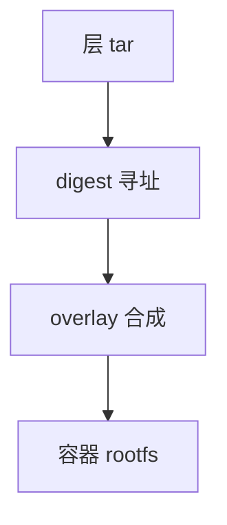

# OCI 镜像层

OCI 镜像是一叠 tar 层加配置：内容寻址，运行时用 [overlay](/cs/overlayfs) 或 fuse-overlay 合成可写视图。

<footer>—— 据 OCI Image Spec；[overlayfs](/cs/overlayfs) 为联合挂载先修</footer>

[runc](/cs/container-runtime) 需要 rootfs。缺口是 **层**：diff、digest、与 copy-up 如何对应打包。

## 问题

每层 gzip tar，hash 为 id。配置：入口、env。缺口：删除文件用 whiteout；重复层共享存储；与 [COW 快照](/cs/fs-snapshots) 不同——镜像层是 tar，不是 btrfs send 必选项。本课不把 registry 协议写完。

content store 按 digest 去重。对象是分发格式，不是 Dockerfile 语法课。

## 方法

pull → 验证 digest → snapshotter 应用层 → 可写 upper。对照 [稀疏](/cs/sparse-files)：层里可有空洞。对照 [fsck](/cs/fsck)：坏层是校验失败。对照 LVM：块层快照不是镜像层。

## 机制

镜像层把文件系统差量化成可推送的不可变对象，使「构建一次到处跑」有存储几何。安全要验签名（与 [模块签名](/cs/kabi-module-signing) 同构不同对象）。不要写成供应链产品。与 [配额](/cs/fs-quota)：upper 可写层才涨。

过大层使启动慢，与 overlay 性能有关。

实现上：同一 digest 只存一份，构建缓存靠这个。whiteout 是 overlay 的删除表示，解到非 overlay 的 FS 要解释。配置与层分开哈希，改入口不必重写层。 读法上只引用[上一课](/cs/container-runtime)的结论，不把对象换成训练推理或限价簿。

本课在操作系统进阶的「虚拟化与隔离进阶 / 容器与内核形态」课序里，对象是 **OCI 镜像层**。

- 先修只引用，不重导：上一课的结论当公理，本课只补差。
- 五栏不吞并：不把本课写成大模型训练/推理，也不写成限价簿或权重量化。
- 文献用 OSTEP、McKusick、内核文档与具名会议论文；不发明 arXiv 编号。

## 边界

本课不引入所有 media type。不保证 Windows layer。下一课用用户态内核减攻击面：gVisor。

版本字段会变，课序钉的是机制对象「OCI 镜像层」，不是某一主线内核的结构体名。
后课默认：rootfs 是内容寻址层的合成。系统调用拦截式沙箱，下一课 gVisor。

## 小结

- OCI 镜像：寻址的层 + 配置。
- 运行时用 overlay 合成；whiteout 表达删除。
- gVisor 是下一课。
- 出处：OCI image spec；overlayfs。
