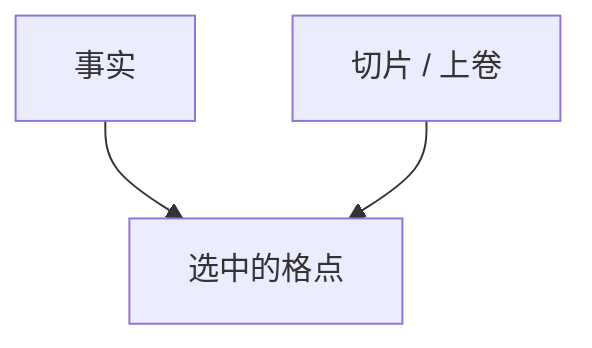

# OLAP 立方

把度量沿维的笛卡尔积预聚合，切片、切块、上卷、下钻就变成查已算好的格点，而不是每次扫事实表。

<footer>—— 据 Gray et al., Data Cube, 1996；Codd 对 OLAP 的十二条；Kimball 立方与星型对照</footer>

[上一课](/cs/star-schema)把分析查询收成窄事实加维。缺口是**反复同一合计**：每天按地区×产品×时间问 `SUM`。本课钉数据立方；湖仓下一课把表格式换成对象存储上的开放格式。不把立方写成「另一个 SQL」。

## 问题

$d$ 维、每维基数 $n_i$，完整立方格点数随 $\prod(n_i+1)$ 涨（含 ALL）。物化全部会爆；物化太少则每次仍扫事实。缺口是选哪些视图（Harinarayan 等格子上的贪心）以及 MOLAP 数组 vs ROLAP 星型上的 SQL。与 GROUPING SETS / CUBE 语法：同一代数，不同存储。

Gray 等人的 CUBE 操作符把 GROUP BY 的幂集收成一个算子。稀疏事实使多数格点为空，存储必须压零。

## 方法

选物化：按查询工作负载与空间预算。刷新：夜间批、或增量维护（与物化视图课同一机制）。查询改写：下钻走细粒度，上卷走已物化祖先。位图与列存加速剩余的即时聚合。

## 机制

每个格点是一组 GROUP BY 属性上的聚合。祖先格点可由子孙再聚合当且仅当聚合可加（`SUM` 可，`AVG` 要存 count）。不可加度量必须存细粒度。稀疏格用数组压缩或干脆 ROLAP 当另一张汇总事实。查询改写命中物化点则不再扫明细；未命中则从更细格或星型事实现算——与 [物化视图刷新](/cs/mv-refresh) 同一匹配思想。

位图与列存在切块过滤上加速剩余即时聚合。分布式构建立方时按维键 shuffle 一次，之后切片走本地。新鲜度：立方落后事实，合同写成 SLA，不要假装与 OLTP 同行可见。

## 边界

本课不把 Excel 透视表当实现，不写某 MOLAP 服务器目录。窗口函数不收缩成格点，不是立方。流上的时间窗口是未闭合的格，后课再钉。下一课湖仓：立方与明细都可以建在开放表快照上。

后课默认：热点上卷可物化立方；全格 $2^d$ 不当默认。可加性没声明就不要从细算粗。

## 小结

- 立方是维上的预聚合格；物化集合是空间与延迟的折中。
- 可加性决定能否从细算粗；稀疏必须压零。
- 湖仓与开放表格式下一课。
- 出处：Gray et al., Data Cube, 1996；Kimball；Harinarayan 等视图选择。
