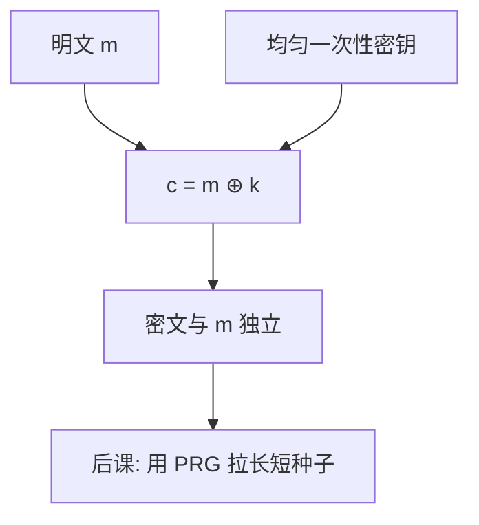

# 一次一密与完美保密

若密钥与明文等长、均匀、只用一次，密文的分布与明文无关：看见密文不改变对明文的任何先验。这是信息论极限，不是 AES 圈数能逼近的同一种对象。

<footer>—— Shannon, Communication Theory of Secrecy Systems, Bell System Technical Journal, 1949</footer>

## 定位

[上一课](/cs/tla-plus)把分布式系统收到规格与模型检测。安全进阶从这里另起：主干[对称加密](/cs/symmetric-crypto)已点名 Shannon 极限，但只收到「计算安全 + AEAD」。缺口是把**完美保密**写成定理，并说明一次一密为何几乎不能当协议原语。后课默认：完善保密 = 密文独立于明文；实践走计算不可区分。不把 TLA+ 当加密证明。

后课默认已经读完本课钉下的合同，只补差，不从该领域第一性原理重开。

## 问题

[Dolev–Yao](/cs/dolev-yao)把加密当理想锁；真实世界要问锁漏多少。[比特](/cs/bit-as-distinction)能编码消息，但窃听者看见的是密文。Shannon：完善保密当且仅当（在密钥均匀且独立于明文时）密钥空间至少与明文一样大——一次一密 $c=m\oplus k$ 达到该界。缺口不是再讲 CIA 词条，而是：**信息论安全与计算安全从此分叉**。

### 不是「更长的 AES」

把 AES-256 说成「接近一次一密」是范畴错误。分组密码在多项式敌手下不可区分于随机置换；一次一密对无界敌手成立，但密钥不能复用、不能压缩。后课 PRG 正是为了丢掉等长密钥。

Katz and Lindell 把完善保密写成：对任意 $m_0,m_1$，密文分布相同。Vernam 电报是工程形态；Shannon 给出充要条件。密钥复用使两段密文之差等于明文之差，完善性立刻消失。

## 方法

写一次一密：$k\leftarrow\{0,1\}^n$ 均匀，$c=m\oplus k$。证明：固定 $c$，每个 $m$ 对应唯一 $k$，故后验等于先验。对照：密钥短于明文则存在信息论区分。指出实践失败几乎全是密钥管理：复用、伪随机不足、同步丢失。

图中节点是本课的机制骨架；课程不把图展开成可运行的攻击步骤。

## 机制

完善保密服务无界窃听者，不服务完整性：改 $c$ 等于改 $m$，接收方无法发觉。主干 AEAD 要的是主动敌手下的计算安全，一次一密不自动给认证。密钥如何生成与分发，等长真随机几乎把问题还原成「先有一条同样宽的保密信道」。

前提写进合同之后，游戏外的误用只当失败模式点名，不在本课写成操作程序。

## 边界

本课不把量子密钥分发写成主干替换，不重推熵的公理。不要把「一次一密」印在产品页上却用短口令当 $k$。后课默认：完美保密已钉死为极限；要用短密钥加密任意长消息，必须引入计算假设下的伪随机。

## 小结

- 共识课停在 Multi-Paxos；本课用 Shannon 把保密收成信息论陈述。
- 一次一密达到完善保密，当且仅当密钥等长、均匀、不复用。
- 无完整性；密钥分发与真随机是它自己的缺口。
- 后课用 PRG/PRF 把短种子拉成看起来随机的长串。
- 出处：Shannon, 1949；Katz and Lindell, *Introduction to Modern Cryptography*；对照 Vernam。
