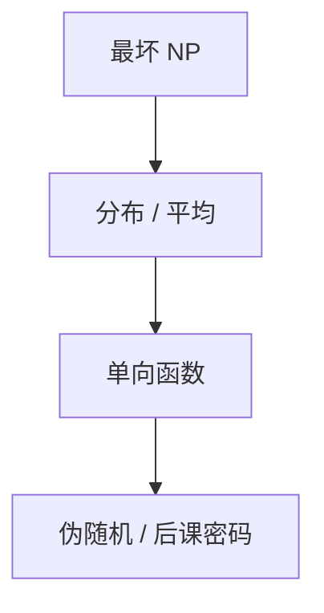

# 平均情形与单向函数

最坏 NP 完全不阻止「随机实例容易」。单向函数要求：正算易、反演在平均上难。密码学的存在性停在这一假设。

<footer>—— 据 Levin；Goldreich, Foundations of Cryptography；Arora and Barak 整理</footer>

上一课[FPT](/cs/fpt-parameterized) 仍最坏。主干 NPC 与随机算法也不等于平均。缺口是：**分布上的难**，以及单向函数（OWF）。本课不设计协议；主干公钥课用过 Diffie–Hellman，这里给复杂度语言。

## 问题

Levin 的平均 NP：对多项式时间可抽样的分布，算法须在平均多项式（允许稀有极慢）。某些 NPC 问题在自然分布上有启发式；某些（如随机 3SAT 的缝隙相变）被认为难。OWF：$f$ 多项式可算，对均匀 $x$，任意多项式对手反演 $f(x)$ 的概率可忽略。OWF 存在 $\Rightarrow P\neq NP$，但更强：难在平均、在函数反演。伪随机发生器、签名的极小假设常落到 OWF 或陷门。

单向置换、陷门置换（RSA 形状）是加结构的 OWF。本课不分析模运算——那是数论单元。

### 最坏到平均的归约稀缺

已知对某些问题（Ajtai 格、后课 LWE）最坏难 $\Rightarrow$ 平均难。一般 NPC 没有。不要写「SAT 随机实例所以密码安全」。

Levin 平均情形。Goldreich 的 OWF 定义。Håstad–Impagliazzo–Levin–Luby 从 OWF 做 PRG，点名不证。本课与 BPP 的「算法内硬币」分工：这里难的是对手面对的分布。

## 方法

写 OWF 的实验：挑战 $y=f(x)$，对手输出 $x'$，$f(x')=y$。可忽略 $= n^{-\omega(1)}$。对照 NP 证书：知道 $x$ 是短证，但证书对诚实抽样仍难找。点名：单向不蕴涵陷门；加密需要更多。

## 机制

若一切 OWF 都不存在，则许多私钥方案崩溃，且 $P=NP$ 仍可能假（最坏难、平均易）。电路课的自然证明：太强的下界会破坏 OWF。复杂性单元以此收束经典平均，下一课量子 BQP 只给直觉。

Håstad–Impagliazzo–Levin–Luby：OWF 存在则有 PRG。私钥加密的极小假设常落到这里。陷门置换额外要求「有密钥可逆」，RSA 形状；OWF 不必有陷门。Ajtai 的格给了最坏到平均的稀有例子，LWE 课再写。NPC 随机实例易，不推翻最坏完全性。

## 边界

本课不证 PRG 构造，不引入 CCA。不把哈希当 OWF（哈希是设计目标，不是已证）。后课默认：密码学平均难 $\ne$ NPC；OWF 是极小假设。下一课 BQP。

最坏 NPC 不导出平均难，更不导出 OWF。密码学要的是抽样实例上的反演失败。自然证明与电路下界的张力在此咬合：太强的组合下界会破坏伪随机。

上一课留下的缺口在本课收口；「平均情形与单向函数」进入后课词汇表后只引用。文献用来钉对象与边界，不把本课写成该主题的独立综述。

## 小结

- 平均情形要分布；最坏完全性不够。
- OWF：正算易，平均反演难；蕴涵 $P\neq NP$ 且更强。
- 最坏到平均的归约是稀有结构，不是 NPC 赠品。
- 后课格上 LWE 才给出稀有的最坏到平均。
- 出处：Levin；Goldreich；Arora and Barak。
