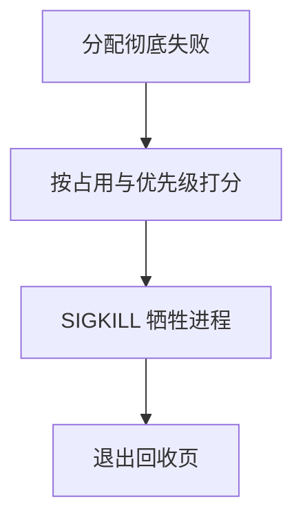

# OOM killer

内核无法再满足缺页或内核分配时，必须选一个用户进程杀掉，释放其页；否则整机锁死在分配路径上。

<footer>—— 据 Silberschatz 对内存耗尽的讨论；Linux 对 oom_kill 策略的整理</footer>

[上一课](/cs/swap-device)在槽耗尽时失败。[抖动](/cs/thrashing)可以挂起进程，挂起仍占交换与一些内核元数据。内核自己的分配（页表、缓冲）失败没有「返回 NULL 给 malloc」那么简单：可能正持有锁。[buddy](/cs/buddy-allocator) 尚未讲，但无空闲页是同一危机。缺口是**选牺牲进程**：可杀掉谁、按什么分、不能杀谁。

## 问题

若随机杀，可能杀掉 init 或正在写回的关键任务，系统无法收场。若从不杀，所有分配者睡眠等待，形成死等。缺口：打分（占用匿名页多、nice 低、不是 init）选出 victim，发送致命信号，等待其退出路径释放页表与文件。[信号](/cs/signals)课会细讲递送；这里只需「杀进程是回收帧的最后手段」。

本课不把每版 Linux `oom_score_adj` 的整数表背完。

牺牲的是进程，不是某一页。杀完可能仍不够，再选下一个。内核线程通常不可杀；预留内存给紧急路径，避免杀的过程自己再分配失败。

## 方法

分配器在回收、写回、压缩都试过后仍失败，进入 OOM。计算各进程分数，排除不可杀者，选定后投递 `SIGKILL`（不可捕获）。退出后帧回到空闲。用户也可对某作业预先调高分数，表示「宁可杀我」。不要在缺页路径上无限重试而不设上限。

## 机制

OOM 把虚存从「自动 Cache」接到进程生命周期：帧最终属于进程映像，回收映像才能保证前进。它与死锁课不同：不是锁顺序，是资源耗尽。与安全课的「杀进程」也不同：这里不是审计攻击，是保机器可运行。工作集再漂亮，Σ 承诺超过物理加 swap，仍会走到这里——承诺从哪来，下一课过度提交。

## 边界

本课不引入 cgroup 内 OOM（memcg）的全部层次，只承认可以先在一组作业内杀。不把用户空间 oomd 写成内核替代。也不讨论如何用 OOM 做对抗；只讲内核分配失败的回收。杀错进程会导致服务中断，这是运维边界，课内只要求有可解释的分数。

后课默认：最后手段是杀进程。为何 `malloc` 当时成功、稍后才爆，下一课过度提交。

## 小结

- 帧与 swap 双尽时杀进程回收，避免分配路径死等。
- 打分避开 init；`SIGKILL` 不可捕获。
- 成功分配与真正占帧之间的缺口是过度提交。
- 出处：Silberschatz et al., *OSC*；Linux mm 文档（oom）；Tanenbaum *MOS*。
