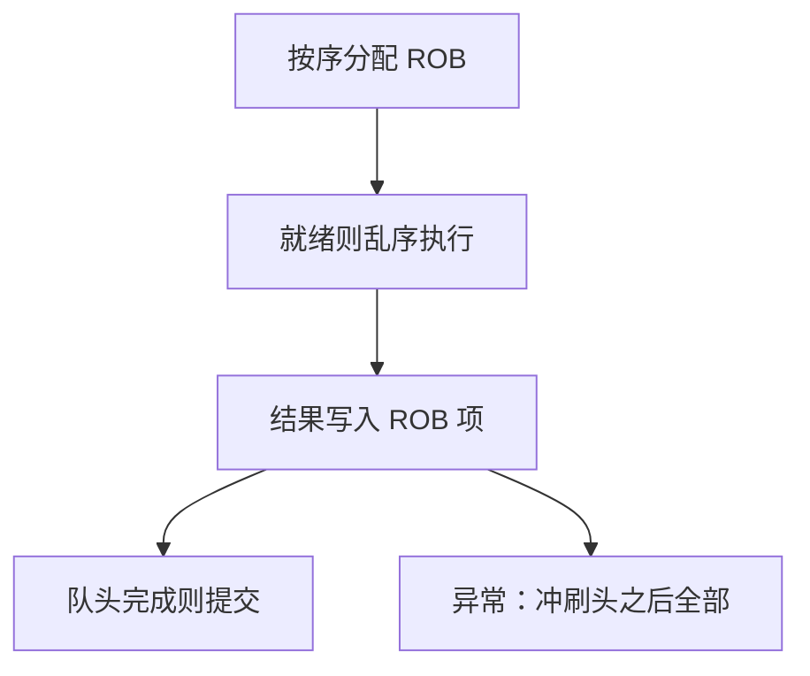

# 乱序与 ROB

执行可以按操作数就绪的次序，提交必须按程序序；重排序缓冲把尚未提交的写托住。

<footer>—— 据 Hennessy and Patterson, Computer Architecture: A Quantitative Approach 整理</footer>

[上一课](/cs/superscalar-issue)每拍可发射多条，但仍按程序序：年长指令缺数据，年轻且独立的也过不去。[流水线异常](/cs/superscalar-issue)要求提交点上架构状态精确。本课不重讲发射宽度。缺口是：长延迟 load 会堵住发射口，后面不相关的 ALU 闲着。本课只交出乱序执行与 ROB：执行乱序，提交有序。

## 问题

load 缺失要几十拍。顺序超标量让后续独立 `add` 也停。若允许 `add` 先算完，它的写回不能立刻进寄存器堆，否则精确异常会看见「未来」的 `x1`。缺口不是再加执行单元，而是**把结果停在缓冲里，按取指序提交，异常时丢弃缓冲**。

WAR/WAW 在乱序下复活：年轻指令先写同一架构寄存器。必须重命名，不能只用五级那种固定 WB。具体唤醒逻辑是下一课 Tomasulo；本课先钉 ROB 与提交纪律。

ROB 是环形队列：分配在尾，提交在头。头指令未完成则整核不能提交后面已完成的。

## 方法

取指/译码后，每条指令在 ROB 占一项，记下 PC、目标寄存器、结果槽。操作数就绪则发到功能单元，完成时写回 ROB 项，不直接写架构堆。ROB 头若已完成且无异常，把结果写入架构寄存器或让 store 对 cache 可见，然后释放该项。

store 在提交前不得让 cache 对别的核或 DMA 可见，否则无法精确收回。[一致性问题引入](/cs/coherence-intro)在这里约束提交：未提交写不是一致性协议要传播的写。

## 机制

程序员仍看见顺序 ISA。CPI 的停顿项从「相关就停发射」变成「窗口填不满、提交头堵住」。窗口大小受 ROB 项数、物理寄存器数限制。误预测仍冲刷：ROB 里预测路径上的项全部丢弃，与精确异常同一套回滚。

重命名把架构寄存器映射到 ROB 项或物理寄存器，消除 WAR/WAW，只留 RAW。映射表随提交更新，随冲刷恢复。

## 边界

本课不画保留站和公共数据总线，不比较 CDC 6600 记分牌。那是 Tomasulo 课用 1967 年的算法把唤醒说清。也不引入多核可见性：提交后的 store 才进入一致性世界。

后课默认：谈到乱序核，执行可以超前，架构状态只在 ROB 头提交时改变。精确异常 = 冲刷头之后。

## 小结

- 乱序执行，按序提交；ROB 托住未提交结果。
- 异常与误预测靠冲刷 ROB 恢复精确状态。
- 唤醒与广播的经典算法是下一课 Tomasulo。
- 出处：Hennessy and Patterson, *CA:AQA* 乱序与 ROB。
