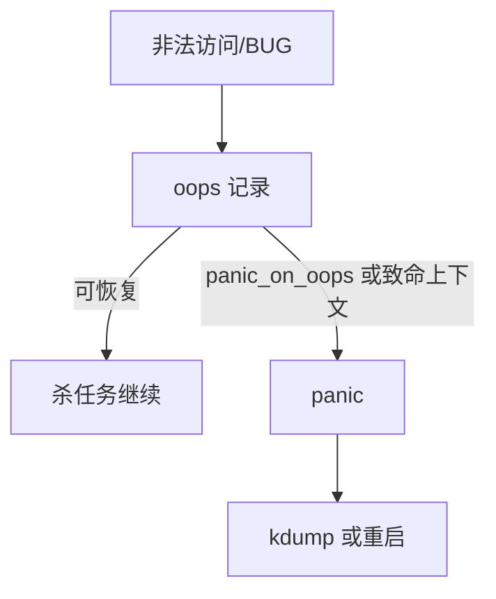

# oops 与 panic

oops 记录一次内核非法访问或 BUG，进程可能被杀而系统继续；panic 认为无法继续，停机或转 dump。

<footer>—— 据 Linux 对 oops/panic 的文档；[kdump](/cs/kdump-crash) 为转储先修</footer>

[kdump](/cs/kdump-crash) 在 panic 路径上触发。缺口是 **oops vs panic 的策略**：`panic_on_oops`、RCU stall、软锁。

## 问题

空指针在进程上下文：oops，杀该任务。中断上下文或 idle：常直接 panic。缺口：tainted 标志；连续 oops；与 [hardening](/cs/kernel-hardening) 的 BUG_ON。本课不分析具体漏洞。

sysctl `kernel.panic` 超时重启。对象是失败模式，不是调试符号安装。

## 方法

fault → `oops_begin` 打栈 → 若策略则 `panic`。对照 [ASan](/cs/asan-mechanism)：用户非法 vs 内核非法。对照 [NMI](/cs/nmi)：NMI 里 printk 受限。对照 SELinux：拒绝不是 oops。

## 机制

内核把「局部腐败」和「全局不可信」分开：oops 允许服务器继续卖服务，也允许静默损坏——故生产常 panic_on_oops。不要写成恐吓。与 [memcg](/cs/memcg) OOM：那是杀用户，不是内核 oops。

栈损坏的 oops 本身不可信。

实现上：tainted 标志告诉你是否加载了专有模块或发生过严重警告。中断上下文 oops 几乎必然 panic。连续 oops 可能已损坏到栈不可信。 读法上只引用[上一课](/cs/kdump-crash)的结论，不把对象换成训练推理或限价簿。

本课在操作系统进阶的「安全、启动与调试 / 观测与调试」课序里，对象是 **oops 与 panic**。

- 先修只引用，不重导：上一课的结论当公理，本课只补差。
- 五栏不吞并：不把本课写成大模型训练/推理，也不写成限价簿或权重量化。
- 文献用 OSTEP、McKusick、内核文档与具名会议论文；不发明 arXiv 编号。

## 边界

本课不引入所有 lockdep 警告。不保证嵌入式无 console 时的策略。下一课不停机补内核：livepatch。

版本字段会变，课序钉的是机制对象「oops 与 panic」，不是某一主线内核的结构体名。
后课默认：oops 可转 panic 以便 dump。运行时替换函数，下一课 livepatch。

## 小结

- oops 记录并可能继续；panic 停机。
- 策略决定安全性与可用性。
- livepatch 是下一课。
- 出处：Linux oops；panic sysctl；kdump。
