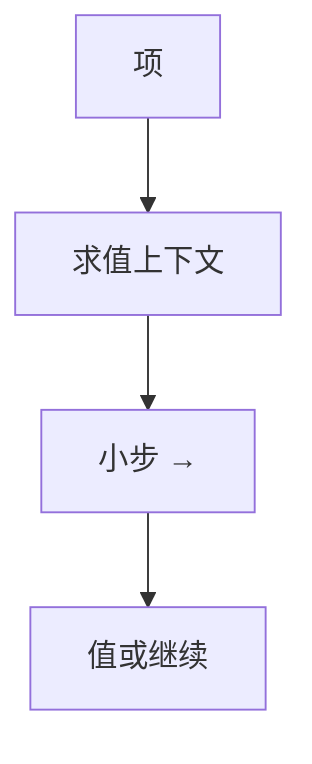

# 操作语义：进展与保持

小步：一次改写一项。大步：直接给值。上下文指出下一归约点。类型定理建立在这份关系上，而不是建立在编译器实现上。

<footer>—— 据 Plotkin, A Structural Approach to Operational Semantics；Pierce TAPL；Wright and Felleisen, 1994 整理</footer>

上一课[类型健全性](/cs/type-soundness)已经调用了「一步」与「值」。缺口是把**操作语义**写清楚：小步 SOS、求值上下文、调用约定（值调用 vs 名调用）如何改变进展陈述。不重写 λ 的 β 定义，只把它收成关系 $t \to t'$。也不写指称——下一课。

## 问题

「程序做什么」若只靠编译器，无法证保持。[λ 演算](/cs/lambda-calculus)有 β；STLC 要规定应用序还是正规序。小步：$\mathrm{E}[(\lambda x.t)\,v] \to \mathrm{E}[t[v/x]]$。大步：$\langle t,\sigma\rangle \Downarrow v$。缺口是**关系与上下文**，不是 lex。

状态：引用语言要堆 $\sigma$。进展变成：良型配置或能一步，或已是值。并发：一步是线程交错，保持更难。

### 小步不是「解释器源码」

SOS 是数学关系。定义式解释器（Reynolds）是函数，可作可执行规范，但仍要与 SOS 对齐。本课以 SOS 为主。

Plotkin SOS。Felleisen 的求值上下文。Pierce TAPL 贯穿小步。Appel 的编译器正确性用语义对齐。本课不写 CompCert 的 Clight，那在课程末尾。

## 方法

列出语法、值、一步规则。选策略：CBN/CBV 改变哪条规则。证明：同一套进展保持。实现对照：字节码解释器应仿真小步（运行时单元）。

与效应：一步可带事件标签，得带标签的转换系统，供效应类型解释。

## 机制

合流：无类型 λ 有；加状态后一般没有「同一值」的合流，只有类型保证的不卡住。不要用 Church–Rosser 当命令式语言的健全性。

大步对不终止无推导，难以谈进展；小步更适合卡住分析。大步适合证明编译器「若源停机则目标得相同值」。

## 边界

本课不写抽象机器（SECD、CEK）的全部转移。后课默认：类型定理相对 SOS。下一课指称语义：用数学对象解释项，对照操作。

也不把 CPU 流水线当操作语义。

## 小结

- 小步/大步是项（加状态）上的关系。
- 进展保持建立在小步上更自然。
- 策略（CBV/CBN）是规则选择。
- 出处：Plotkin；Felleisen；Pierce TAPL；Wright–Felleisen。
