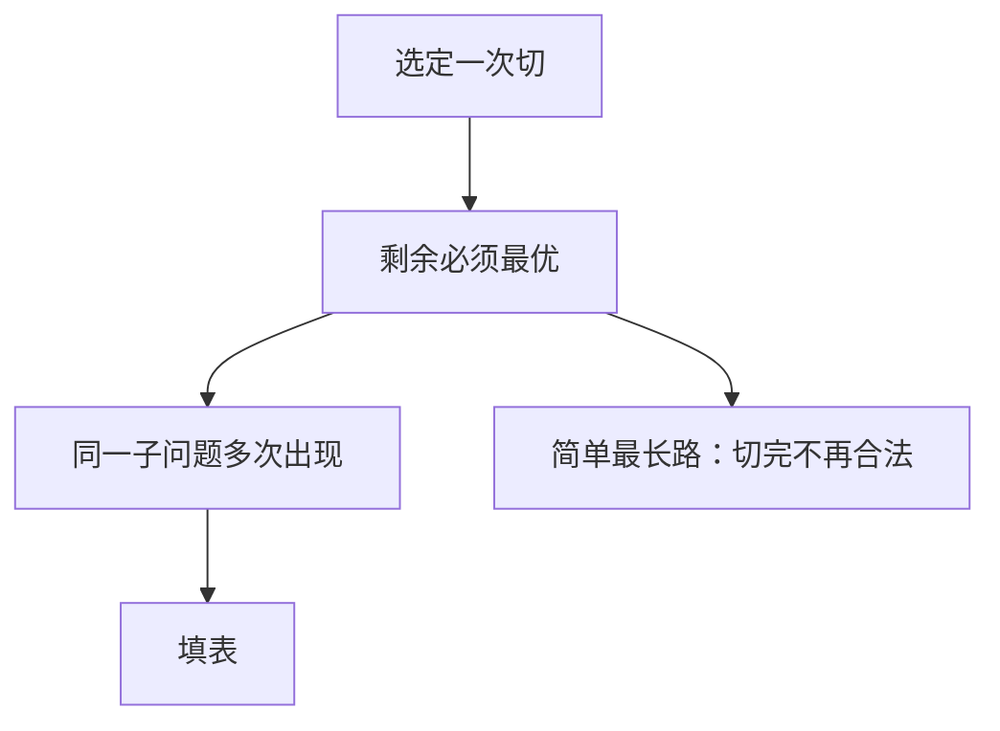

# 最优子结构与重叠

最优解含有某子问题的最优解；同一子问题在递归树里反复出现，才值得制成一张表。

<footer>—— 据 Bellman, Dynamic Programming, 1957；CLRS 第 15 章整理</footer>

上一课[动态规划](/cs/dynamic-programming)已经把状态、转移、填表说成一套。钢条与 LCS 当了骨架，背包细节留给后课。本课不重画 DAG 填表序。缺口是把两条性质拆开钉死：**最优子结构**何时成立、**重叠**与分治的不相交有何不同——没有它们，表是空的或指数仍在。后课用容量把状态写成具体的 $dp[i][w]$。

## 问题

最优子结构：原问题最优解里，对选中的那一次切分，左右（或剩余）必须是对应子问题的最优。证明通常用切割：若某块不是最优，换上更优块，原解变好，矛盾。失败典型：图上最长**简单**路——子路加边可能重复顶点，子路最优加起来不必简单，也不必全局最长。有环正权时「最优」甚至无界。缺口不是再解释 $\min/\max$，而是先问能不能切。

重叠：切法有多种，不同切法问到同一 $(i,j)$。分治归并的左右区间不相交，备忘无收益。DP 故意让区间、前缀、容量被多次引用。没有重叠，指数递归仍可能正确，只是不必填表。

### 子结构不是「能递归」

DFS、快排都递归，没有「子答案必须最优」。贪心也要子结构，但另加「只需试一种切」。本课两条都要，且默认枚举切。

Bellman 的最优化原理即子结构。CLRS 15.3 专节讲何时成立。本课把它从「DP 总则」里抽出来，避免背包课再从原理讲起。

## 方法

定义子问题族（前缀、区间、点 $v$ 的最短路）。证明：最优解选定一项转移后，剩余实例的最优可粘回。数清不同子问题个数；若多项式且每个多项式转移，则多项式。若个数指数（子集），算法可以正确但不在 P——[P 与 NP](/cs/p-vs-np) 再命名。

无重叠 → 退回[分治](/cs/divide-conquer)。无子结构 → 不要 DP。

## 机制

最短路（无负环）有子结构：最短路的子路是最短路。背包：用或不用第 $i$ 件，剩余容量上的最优。区间：最优在某处切开，两段区间最优。后课背包把「容量」写成一维；本课只要求会检查这两条。

重叠用备忘或自底向上等价：拓扑序保证每个状态在依赖之后算。

## 边界

本课不写 0-1 转移的滚动数组，不引入伪多项式这个词的完整讨论（背包课会用 $W$）。不证 NPC。后课默认：先问子结构与重叠，再开表。容量与三种背包是下一缺口。

## 小结

- 最优子结构 = 切完剩余仍最优；最长简单路是反例。
- 重叠 = 子问题重复；无重叠则不必 DP。
- 表的大小下一课用背包实例化。
- 出处：Bellman, 1957；CLRS 第 15.3 节。
