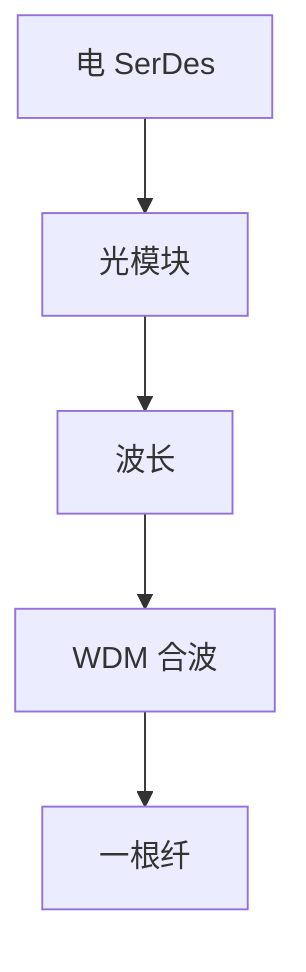

# 光模块与 WDM

可插拔模块把光电转换收成一块；波分复用让同一根玻璃同时走多个波长，容量按通道数加。

<footer>—— 据 ITU-T G.694.1 DWDM 栅格；IEEE 802.3 光口条款；SFF-8472 / CMIS 管理接口整理</footer>

[上一课](/cs/copper-fiber-media)给出光纤损伤。缺口是**如何把电符号变成光、如何共享一根纤**：[调制](/cs/modulation-symbol-rate) 在模块里完成；WDM 把 $B$ 切成波长通道。本课不把以太网速率年表写完。

## 问题

交换机 ASIC 出的是电 SerDes。SFP/QSFP 一类模块：电口标准化，光口按距离选 LR/ER/ZR。同一笼子可换灰光（一波长）或彩光（固定波长）。WDM：CWDM 间隔宽、无源便宜；DWDM 栅格密、要稳频与放大。容量近似「每波长的 $C$ × 波长数」，受滤波器串扰与非线性限制，不是无限乘法。

不要把光模块当路由器：它不查 IP，只转换一跳波形。

G.694.1 定义频率栅格。数据中心 40/100G 常用并行多纤（SR4）而非一开始就 DWDM。本课不讲相干 DSP 全部均衡器。

### 模块不转发

可插拔只做电光适配；WDM 把一根纤变成多条逻辑波长。口 down 往往先于 ICMP。波长调度是光学运营，不进 TCP。

## 方法

画：ASIC SerDes → 金手指 → 激光/调制器 → 光纤；反向 PIN/APD → CDR → 电。WDM：合波/分波器放在模块外或可调模块内。管理：I2C 读光功率、温度，供链路诊断，不是控制平面协议。

方法止于选定对象与对照；机制才说它如何嵌入已有分层与主干课。

## 机制

分层：换模块不换 MAC 地址。故障：光功率低先表现为 PCS 丢锁，再表现为口 down。主干[ICMP](/cs/icmp) 的不可达是 IP 层的；本课的 down 更早。WDM 把「一条光纤」变成多条逻辑链路，生成树与 IP 仍按逻辑口看。

灰光点到点最简单；彩光把波长当资源调度，运维进入光学，不进入 TCP。

## 边界

本课不引入 ROADMs 的全网波长路由算法。以太网速率档与编码演进是下一课。后课默认：可插拔模块 = 电光适配；WDM = 波长并行。

不要把「400G ZR 相干」写成已在接入交换机普及——距离与功耗把场景钉在 DCI。

上一课留下的缺口在本课收口；「光模块与 WDM」进入后课词汇表后只引用。文献用来钉对象与边界，不把本课写成该主题的独立综述。下一课[以太网速率演进](/cs/ethernet-speeds)。

## 小结

- 光模块标准化电接口，光侧按距离与波长选型。
- WDM 用波长并行逼近光纤的可用 $B$。
- 模块不转发；口 down 往往先于 IP 诊断。
- 后课只引用本课钉死的对象，不从该领域总问题重开。
- 出处：ITU-T G.694.1；IEEE 802.3；SFF/CMIS。
