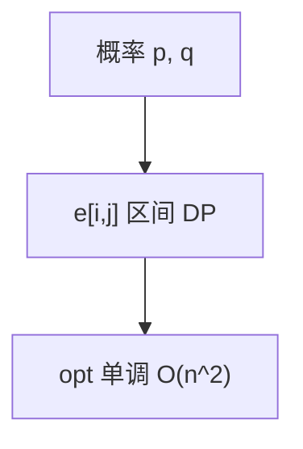

# 最优二叉搜索树

关键字概率已知时，BST 的期望比较次数由区间 DP 最小化；四边形不等式把 $O(n^3)$ 收到 $O(n^2)$。

<footer>—— 据 Knuth, Optimum Binary Search Trees, 1971；CLRS 第 15.5 节整理</footer>

上一课[序列比对](/cs/sequence-alignment)是两序列格图。本课一个有序关键字列 $k_1<\cdots<k_n$，访问概率 $p_i$、空隙 $q_i$。缺口是最优 BST：根选 $k_r$，左右子树最优。主干[区间 DP](/cs/interval-dp)已给矩阵链形状。本课把概率加权写清，Knuth 优化留一半给下一课矩阵链对照。

## 问题

$e[i,j]$ 为关键字 $i..j$ 的最优期望代价。$w[i,j]$ 为这段概率和（含空隙）。$e[i,j]=\min_r(e[i,r-1]+e[r+1,j])+w[i,j]$。朴素 $O(n^3)$。Knuth：$opt[i,j-1]\le opt[i,j]\le opt[i+1][j]$，枚举 $r$ 范围收缩，总 $O(n^2)$。

缺口是期望代价，不是 AVL 平衡（平衡不知 $p_i$）。

### 不是哈夫曼

哈夫曼是最优前缀码，字母不要求有序检索。BST 必须中序关键字有序。不要用哈夫曼当最优 BST。

Knuth 1971。CLRS 15.5。下一课矩阵链同一 Knuth 单调。Mehlhorn 近似最优 BST 点名。

## 方法

前缀和 $O(1)$ 求 $w$。按长度填 $e$、$opt$。根方案存 $root[i,j]$。

静态概率；自适应 splay 另一模型。

## 机制

期望 = 子树期望 + 每次访问都经过根（故加 $w$）。最优子结构：左右仍是最优 BST。四边形来自 $w$ 的性质。与矩阵链：切点含义不同，单调同类。

## 边界

本课不写动态最优 BST 猜想（splay 动态最优仍开）。不写熵界证明全文。后课默认：已知独立访问概率，最优 BST 区间 DP + Knuth。下一课矩阵链与 Knuth 优化收束本单元。

## 小结

- 最优 BST 是加权区间 DP。
- Knuth 单调 $O(n^2)$。
- 不是哈夫曼，也不是平衡 BST。
- 出处：Knuth, 1971；CLRS 第 15.5 节。
