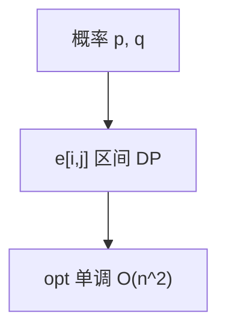

# 最优二叉搜索树

关键字概率已知时，BST 的期望比较次数由区间 DP 最小化；四边形不等式把 $O(n^3)$ 收到 $O(n^2)$。

<footer>—— 据 Knuth, Optimum Binary Search Trees, 1971；CLRS 第 15.5 节整理</footer>

上一课[序列比对](/cs/sequence-alignment)在两序列的格图上走。本课换输入：一个有序关键字列 $k_1\lt \cdots\lt k_n$，关键字访问概率 $p_i$、空隙命中概率 $q_i$。缺口是最优 BST：若根选 $k_r$，左右子树各自最优。主干[区间 DP](/cs/interval-dp)已给过矩阵链的形状；本课把概率加权写清，Knuth 优化留一半给下一课矩阵链对照。

## 问题

记 $e[i,j]$ 为关键字 $i..j$ 构成子树的最优期望比较次数，$w[i,j]$ 为这一段的概率和（含空隙）。转移：$e[i,j]=\min_r\left(e[i,r-1]+e[r+1,j]\right)+w[i,j]$——选 $k_r$ 当根，左右子树整体加深一层，增量正是整段概率和 $w$。朴素枚举 $r$，$O(n^3)$。Knuth 的观察：最优根满足 $opt[i,j-1]\le opt[i,j]\le opt[i+1,j]$，$r$ 的枚举范围随区间收缩，总代价降到 $O(n^2)$。

缺口是按已知概率最小化期望代价；AVL 那类平衡树不读 $p_i$，只保证形状平衡，两者目标不同。

### 不是哈夫曼

最容易混的是哈夫曼：那是最优前缀码，码字不要求支持有序检索。BST 必须中序关键字有序——编码最优与检索有序是两个不同约束，哈夫曼树一般不满足 BST 的中序条件，不要拿它当最优 BST。

Knuth 1971。CLRS 15.5。下一课矩阵链同一 Knuth 单调。Mehlhorn 近似最优 BST 点名。

## 方法

实现要点：概率做前缀和，$w$ 可 $O(1)$ 回答；按区间长度从小到大填 $e$ 与 $opt$；根决策存进 $root[i,j]$，重建树时按它递归展开。模型边界：这是静态概率下的静态树；访问分布会变时，是自适应 splay 的另一套模型。

```mermaid
flowchart TD
  P["概率 p, q"] --> E["e[i,j] 区间 DP"]
  E --> KNU["opt 单调 O(n^2)"]
```

## 机制

每一项都有语义：期望代价 = 子树期望 + 经过根的代价，而任何一次访问都要经过子树根，所以整段加 $w[i,j]$。最优子结构成立：整体最优时左右子树仍各自最优。Knuth 单调（四边形不等式）来自 $w$ 满足四边形不等式这一性质，不是从树形凭空来的。与矩阵链对照：切点一个是「子树根」、一个是「最后一次相乘」，含义不同，单调性同类。

## 边界

本课不写动态最优 BST 猜想——splay 的动态最优性仍是开放问题；不写熵界证明全文。后课默认：已知独立访问概率时，最优 BST 走区间 DP 加 Knuth 优化。下一课矩阵链与 Knuth 优化收束本单元。

## 小结

- 最优 BST 是概率加权的区间 DP。
- Knuth 根单调把 $O(n^3)$ 收到 $O(n^2)$。
- 它不是哈夫曼，也不是平衡 BST。
- 出处：Knuth, 1971；CLRS 第 15.5 节。
