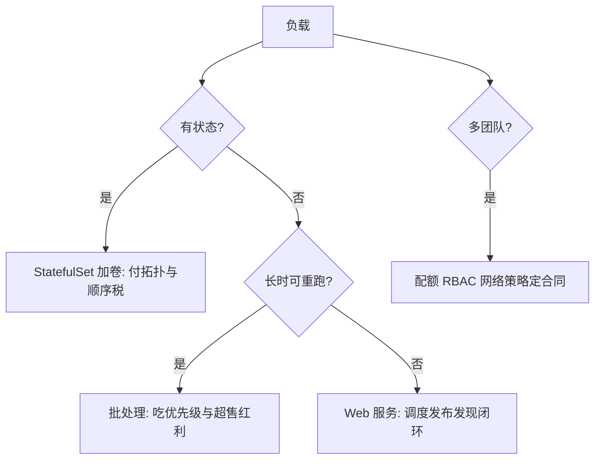

# 编排案例与收束

编排的全部机制可以压成一句话：把意图写成声明，把收敛交给循环，把预算写进每一步。

<footer>—— 据 Burns et al., Borg, Omega, and Kubernetes, CACM 2016；Verma et al., EuroSys 2015 与 Kubernetes 官方文档整理</footer>

[上一课](/cs/orch-storage-orchestration)把持久性接进调度与调和，有状态服务也进了循环。本课是「容器编排」的最后一课：先走四类真实负载，看前八课的机制如何被用满、被取舍，再把整门课程收在一根轴上。本课程到此收束。

## 问题

机制各在各的课里；缺口是怎样在一类负载上决定用哪些、付哪些代价——像虚拟化课程用三问收束一样，编排也需要一个可执行的判据，而不是「都用 Kubernetes」的一句话。判据要能回答：这负载吃哪些机制的重、哪些机制对它是纯税、不满足时错在哪一层。

## 方法

四类案例过一遍。**无状态 Web 服务**是机制的全程闭环：调度器按 request 选节点，发布用预算控制换版，发现把 readiness 翻译成流量，压力大了横向扩——四件事全是循环，人只写 spec。**批处理作业**吃的是优先级与超售的红利：任务可抢占、可重跑，request 诚实填写后，集群的超售空间（资源课的差值）由它来填——这是 Borg 从诞生起的老本行，编排对批的价值先于对服务。**有状态服务上编排**（StatefulSet 加持久卷）技术上可行，但要付卷拓扑对调度的约束、有序操作的速度税；「能上」与「该上」是两问，判据在团队对存储系统的运维能力，不在编排的功能列表。**多团队共享集群**吃的是行政合同：配额定账本、RBAC 定边界、网络策略定段内互信——技术机制之外，优先级表与配额分配是组织谈判的产物。

## 机制

四类案例摆开后，课程的骨架自己显形，**每课都是同一组动作的变奏**：声明——把意图写成 spec 与 status 的差；循环——水平触发的 reconcile 消化一切扰动；预算——收敛的速度与失败半径被显式定价。调度器是「把 pod 意图收敛到节点」的循环，预算是过滤与打分；发布是「把版本意图收敛到副本集」，预算是 surge 与 unavailable；发现是「把选择器收敛到端点集」，预算是分片与传播延迟；资源模型是把承诺编译成内核参数，预算是 request 与 limit 的差；配额是组织账本的循环，网络策略是信任边界的循环，存储是容量意图的循环。Burns 等人在 CACM 2016 把 Kubernetes 的遗产归结为这套模式的通用化：它不是一款产品赢了，是「声明式加控制循环」成了分布式系统管理的事实语法——Borg 在封闭集群里验证的写法，变成了所有人在所有集群上共用的语言。

对照收束：虚拟化课程问「互信、密度、路径」，答案在隔离轴上选点；编排课程问「意图、收敛、预算」，答案在控制循环里选参数。两门课合起来，才是一个集群的完整账本。

## 边界

编排不解决的事要逐一钉住。不解决安全边界：共享内核的信任面问题在安全课程收束过，编排给的是行政面。不解决可观测性：循环收敛得好坏要靠 [可观测性课程](/cs/obs-map) 的指标与追踪看见，编排自身只报 status。不解决应用正确性：重试幂等、背压、[限流与熔断](/cs/rate-limit-circuit-breaker)，都是应用与流量层的合同，编排只会重启死掉的容器，不会修好逻辑。也不解决容量规划：request 骗小换来的假密度，任何机制都救不回。声明式更不是万能：强顺序、跨对象、带数据迁移的变更，仍要外加流程与工具。

## 小结

- 判据三问：这负载吃哪些机制的重、哪些是纯税、不满足时错在哪层。
- 四案例各得其所：Web 走闭环、批吃超售红利、有状态付拓扑税、多团队靠行政合同。
- 全课程一根轴：声明、循环、预算三件套在每一课重复，差别只在收敛的对象与定价的参数。
- Kubernetes 的遗产是模式不是产品：「声明式加控制循环」成为集群管理的事实语法。
- 编排不解决安全边界、可观测性、应用正确性与容量规划；越界的期待都会变成事故。
- 出处：Burns et al., CACM 2016；Verma et al., EuroSys 2015；Kubernetes 官方文档；据案例实践整理。
