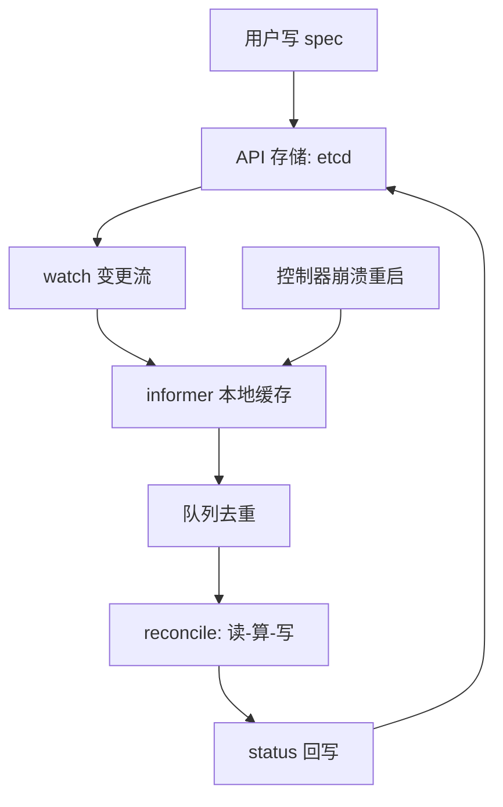
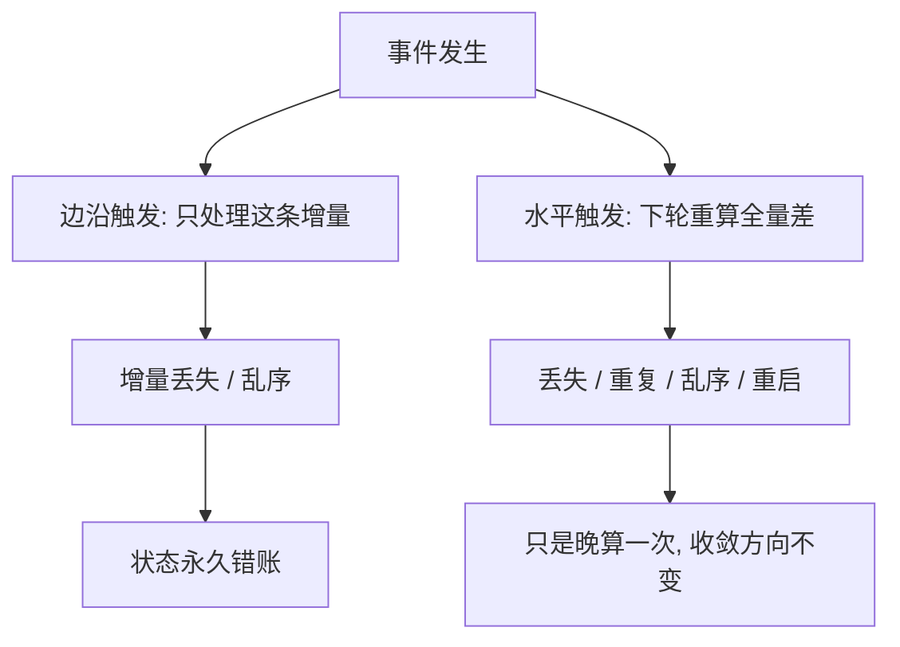

# 声明式 API 与控制循环

声明式的重点不在把命令写成 YAML，而在把「达成目标」的责任，从一次成功的调用改成无数次失败的调用也拦不住的循环。

<footer>—— 据 Burns et al., Borg, Omega, and Kubernetes, CACM 2016 与 Kubernetes API 约定整理</footer>

[上一课](/cs/orch-scheduler-arch)把落点决定拆成队列、过滤、打分、绑定；调度器只是控制面里众多自动化角色中的一个——端点、发布、配对各有自己的「机器人」。缺口在它们共同的写法：为什么这些机器人崩了重启、事件丢了，世界仍会走向目标。主干课 [Borg 与 Kubernetes](/cs/borg-kubernetes) 钉过「强一致存储加最终一致调和」的形状，本课拆调和循环本身：spec 与 status 的分工、水平触发的收敛、以及并发怎么变成版本比较。

## 问题

命令式把「达到终态」押在一次调用的成功上：进程崩在半路，状态就停在半路，没人负责补完。改成事件驱动也不够：边沿触发只对「刚才发生了什么」反应，事件丢失、重复、乱序都会造成永久失同步。缺口是把责任换成**水平触发**：每次循环都问「现在与目标差多少」，而不是「刚才发生了什么」。这样答案与历史无关，重复执行与隔一段补执行都安全——这是编排敢把几千个自动化角色放进同一个控制面的前提。

直觉类比：水平触发像「看表对时」——每次都看现在几点，而不是数「钟刚敲了几下」。漏听一声钟没关系，看一眼表就知道接下来该做什么；数增量的人漏一声，时间就永远错下去。

## 方法

对象分两半：spec 是用户写的意图，status 是控制器写的观测；用户永远不直接改 status。控制器侧的组装是固定的：watch 从 resourceVersion 续读变更推给 informer 缓存；关心的对象进入带去重的工作队列；reconcile 每次做三件事——读当前状态（从缓存）、算与 spec 的差、写动作（建、删、改 status）。所有者引用把对象串成树，级联删除只是垃圾收集控制器的一次 reconcile。CRD 把这套模式开放给任意应用：所谓 operator，就是为某个应用手写的控制器，把「运维手册」编译进循环。

术语翻译：operator 就是「为某个应用手写的控制器」——把原来贴在 wiki 上的运维手册（磁盘满了要扩容、主库挂了要提升备库）编译进 reconcile 循环，让手册自己 7×24 值班。

## 机制

水平触发为什么强：reconcile 的输入是全量当前态，事件丢失、重复、乱序、控制器重启，全部退化成「多算或晚算一次差」，不改变收敛方向；边沿触发丢一个增量就是永久错账。控制器之间的并发不靠锁，靠 resourceVersion 乐观并发：写回时版本不符即失败重试——两个控制器抢一个对象变成一次比较并交换的竞争。不这么做会错在哪：用互斥锁把循环串起来，锁的持有者一崩，全控制面跟着停；比较并交换只损失一次写。

两种触发方式对扰动的耐受差在哪：

收敛不是静止：节点宕机、磁盘坏掉，外界持续把世界推离 spec，循环持续拉回——「终态」是动态平衡，不是一次到位的静止。Burns 等人把 Borg 到 Kubernetes 的迁移论证成一件事：重试、补偿、幂等这些分布式老问题，被压成「写一个水平触发的循环」这一种模式后，工程师犯错的表面积骤减。代价也要认清：循环有排队延迟，「apply 成功」与「世界到位」之间没有时间上界。

reconcile 只能读缓存、必须幂等：在循环里凭空调外部 API 而不先读对象，队列的重复投递就放大成重复创建；用对象名当幂等键是底线。

## 边界

调和不是两阶段提交（主干课已钉），也没有跨对象事务：一个 reconcile 只对一个对象的收敛负责，跨对象的一致性要靠多个循环加约定。判断进度要看 status 而不是命令返回值——返回成功只说明对象被接受。本课不写 informer 的实现与存储的压缩细节；调度器只是这个模式的一个实例，下一课看另一个：服务发现。

常见误区：初学者把「apply 返回成功」当成「部署完成」。返回 200 只说明 etcd 收下了你的意图；镜像拉取、滚动替换可能还在半路，失败也不会报在命令行上——进度要另看 status 与事件，命令返回值只是「挂号成功」。

## 小结

- spec 与 status 分工：用户写意图，控制器写观测，谁也不越界。
- 水平触发的 reconcile 读全量当前态，事件丢失与控制器重启都只是晚算一次。
- 并发竞争用 resourceVersion 乐观并发解决，不需要锁服务。
- 终态是动态平衡：外界持续扰动，循环持续拉回，没有「完成」的静止点。
- 出处：Burns et al., Borg, Omega, and Kubernetes, CACM 2016；Kubernetes 官方 API 约定文档。
