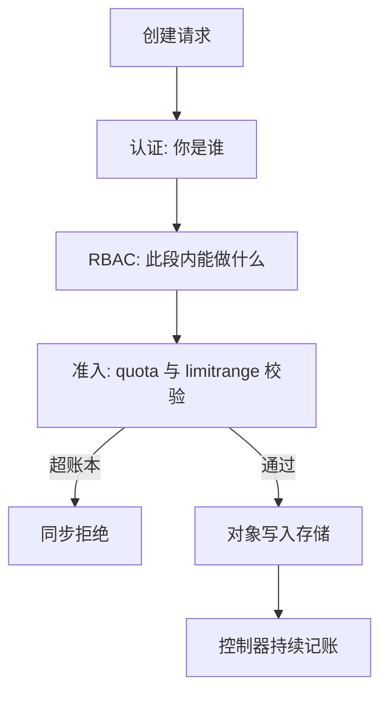

# 多租户与命名空间策略

命名空间把名字分成几段、把账本分成几本，却从不把内核分成几份；它是行政边界，别当防火墙用。

<footer>—— 据 Kubernetes 官方文档（Namespace、ResourceQuota、RBAC）整理</footer>

[上一课](/cs/orch-resource-qos)把单容器的承诺与上限编译成内核参数；本课问组织维度：几十个团队共享一个集群，谁能在哪个范围创建什么、花多少、误操作时伤多大。namespace 是这个问题的答案单位。安全边界已在 [虚拟化的安全边界](/cs/virt-security-boundary) 与 [容器逃逸](/cs/container-escape) 收束：共享内核不是隔离档，租户互打要换后端；本课只管行政面——范围、配额、授权。

## 问题

无约束的共享集群死于三件事：对象与资源总量失控（忘了删的实验负载常驻）、误删与越权（人人都拿管理员令牌）、成本不可归因（没人知道自己团队烧了多少）。缺口是把「范围」钉成一个坐标，让配额、权限、默认值都能挂上去。没有这个坐标，上一课的 request/limit 只能逐个手工填，填漏一个 BestEffort 就漏一本账。

## 方法

namespace 提供三样东西，都是**作用域**。名字的作用域：对象名段内唯一，不同团队的 `web` 互不踩。配额的作用域：ResourceQuota 给段设总量账——CPU 与内存的 request 总额、对象个数上限；校验发生在准入时，超了同步拒绝，而不是事后清理。授权的作用域：RBAC 把角色绑定到段，判定发生在 API 之前的一环——能改 Deployments 不等于能改集群级对象。补上第四件事 LimitRange：给段内没写 requests 的 pod 填默认值，否则零 request 的 pod 绕过所有记账。

## 机制

配额的本质是把集群总额在准入时做会计：允许即预扣、删除即返还，账本本身由控制器维持——又是控制循环。两层账本的张力要说清：**配额给的是「有权花」，调度给的是「有地方花」**。段内 request 总额被 quota 顶住，不保证创建的 pod 调度得进去（节点可能装不下）；反过来节点层的超售（上一课）继续存在，段 A 存了钱不等于段 B 抢不到物理容量。跨段的硬手段是优先级：PriorityClass 是集群级的，高优租户的 pod 可以驱逐低优租户的 pod——所以优先级表本身就是租户间的合同，得按组织谈判定，不是技术参数。

成本归因靠标签聚合而不是 quota：账单要的是实际用量分布，quota 只管上限。授权模型的对偶见 [DAC / MAC / RBAC](/cs/dac-mac-rbac)：编排把 RBAC 的作用域做成了树状的段，粒度到对象级要靠角色细写。

易错点：quota 只统计写进对象的数字——没填 resources 的 pod 是 BestEffort，绕过全部 request 记账；不配 LimitRange 补默认值的段，账本永远对不上实际负载。

## 边界

namespace 不隔离网络（下一课的题）也不隔离内核（安全边界课程的题）；「按团队建段就安全了」是把行政边界误当信任边界。段的数量本身有成本：过多的小段让 RBAC 与配额的组合爆炸，过少的大段让账目混淆——段的切分应跟组织与预算的边界走，不跟微服务的粒度走。多集群联邦与跨集群调度不在本课程。

## 小结

- namespace 是三重作用域：名字、配额账本、授权范围；它不是安全边界。
- quota 在准入时同步记账：允许即预扣；LimitRange 补默认值才堵住记账漏洞。
- 配额管「有权花」，调度管「有地方花」，两层账本互相不能替代。
- 优先级是集群级、可跨段驱逐的，优先级表是租户间合同，不是技术参数。
- 出处：Kubernetes 官方文档（Namespace、ResourceQuota、LimitRange、RBAC）；RBAC 模型见主干课 DAC/MAC/RBAC。
