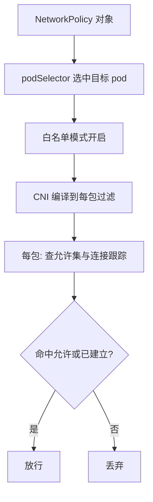

# 网络策略

容器网络的默认语义是一张无差别的全通网；写策略不是加规则，是从全通里往外抠。

<footer>—— 据 Kubernetes 官方文档（Network Policies）与数据中心 CNI 实践整理</footer>

[上一课](/cs/orch-multitenant-policy)把 namespace 钉成行政边界，并明说它不隔离网络；本课补上网络这一维。数据面的每包路径——进出命名空间、过滤链、封装——[网络虚拟化](/cs/virt-network-virtualization) 已算过每包的账；本课管语义层：一条 NetworkPolicy 声明了什么，它被谁编译到那条每包路径上，以及「选中即收紧」这套语法为什么长这样。

## 问题

平网的代价在多租户时结算：任何一个被攻破的 pod 可以横向连通段内一切服务——数据库、缓存、元数据接口全部在同一张全通网里。缺口是三层与四层的「谁可以连谁」要能声明、能编译、能审计：声明写成人能读的对象，编译成每包过滤，审计时能回答「这条流为什么被放行」。缺了中间的编译环节，策略就只是写给审计看的装饰。

## 方法

对象三件套：podSelector 决定**管谁**；ingress 与 egress 规则决定**放行什么**；对端（peer）用同段的 podSelector、跨段的 namespaceSelector 或网段（ipBlock）表达。语义一句话：**被任何策略选中的 pod 立即进入白名单模式——未被允许的一律拒绝；未被任何策略选中的 pod 保持全通**。所以「默认拒绝」要显式写：空规则的策略选中全段 pod，就把整段抠成白名单。规则之间是加法并集——两条策略各自允许的流加在一起，语言里不存在 deny 条目。编译由 CNI 承担：iptables 链或 eBPF 程序挂在每包路径上，按连接跟踪放行已建立连接的回包——策略是状态化的，不是逐包独立判。

## 机制

「选中即收紧」与「无 deny 条目」是同一个设计的两面：允许集只会单调扩张，审计因此变成可枚举的事——把所有策略按「选中集合」分组，每组的并集就是该组 pod 的全部入口。想拒绝某条流，唯一的办法是调整选择器，让这条流落出允许集；把这层语义当传统防火墙的规则序列用（指望后写的覆盖先写的），会得到与直觉相反的结果。跨段引用让上一课的行政边界获得网络含义：namespaceSelector 指向段，段内 pod 集合变了，策略跟着调和——策略与配额一样挂在 namespace 坐标上。

能力的边界钉在四层：域名（FQDN）与七层协议字段不在原生语义里，要换 CNI 的扩展对象——表达力与可移植性的交换：用了扩展，策略就绑定了那家实现。收紧 egress 的第一步几乎总是放行 DNS：命名解析是第一依赖，掐死它，所有连接超时都以「网络策略误伤」的面目出现。

易错点：空 podSelector 选中段内全部 pod——写「对某类 pod 收紧」时漏了它自己也会被别的策略选中收紧，排查时要把「谁选中了谁」逐条列出，而不是看单条规则。

## 边界

策略是意图，不是证据：真正生效的是 CNI 编译出的过滤程序，实现缺陷或 CNI 不支持时策略会被静默忽略——审计必须落到数据面验证，不能停在对象存在。ipBlock 直接放行网段会绕过段与标签的语义，混用时要单列。加密与身份（mTLS）是网格的题；本课的「允许」是地址与端口的允许，不是身份的认证。

## 小结

- 语义核心是「选中即白名单」：未被策略选中的 pod 保持全通，默认拒绝要显式写。
- 规则是加法并集，没有 deny；拒绝只能靠调整选择器让流落出允许集。
- 编译在 CNI：iptables 链或 eBPF 程序，配合连接跟踪状态化放行。
- 原生能力钉在四层；FQDN 与七层要换扩展，代价是绑定实现。
- 出处：Kubernetes 官方文档（Network Policies）；每包路径的账见网络虚拟化课。
