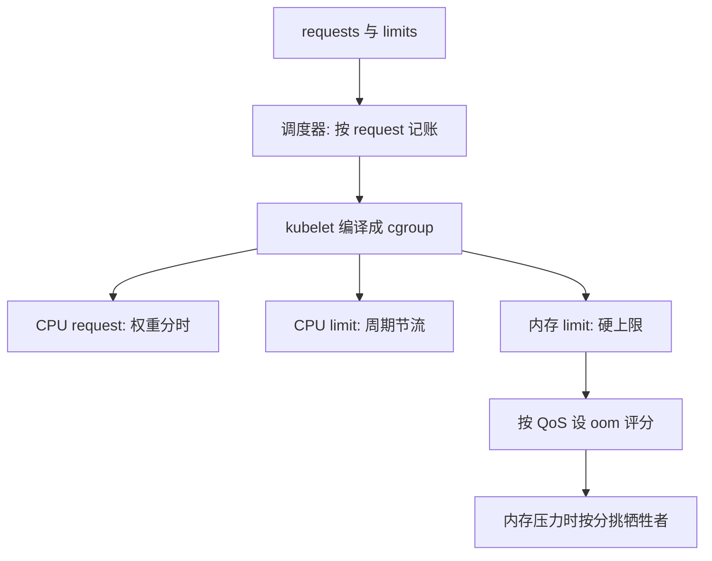
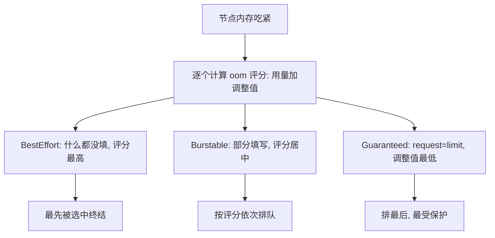

# 资源模型与 QoS

request 是给调度器看的承诺，limit 是给内核下的死命令；两者的差值就是超售，也是邻居的尾延迟。

<footer>—— 据 Kubernetes 官方文档（Pod 资源管理）与 Linux cgroup 文档整理</footer>

[上一课](/cs/orch-rolling-release)把版本切换的容量钉成预算公式；预算的对象——CPU 与内存这本账——本课来管。主干课 [cgroups](/cs/cgroups) 给过单机的记账与上限，[namespace 与 cgroup 的深化](/cs/virt-ns-cgroup-deep) 把 cgroup 定为「视图加预算」里的预算；本课拆编排层怎么把两个数字（request、limit）编译成内核参数，以及两者怎么组合出三档 QoS。

## 问题

只有一个数字（上限）时，设的人两头挨打：设小了高峰被掐，设大了平时浪费、邻居被挤。缺口是把两种语义拆开：**承诺**（我保证要这么多，调度时给我留）与**上限**（我最多用到这么多，运行时给我封顶）。承诺进调度器的账本，决定放哪；上限进内核的账本，决定跑起来怎么管。两个数字再组合出档位：全设满、设一半、全不设——QoS 不是用户声明的第三个字段，是推导出来的结论。

## 方法

每个容器填 requests 与 limits 两栏。落地是编译：CPU 的 request 变成 cgroup 的权重（idle 时按权重分时间片），CPU 的 limit 变成带宽配额（按周期节流），内存的 limit 变成硬上限（超限触发组内终止）。调度器按 request 过滤节点——上一课的过滤项之一；kubelet 按同样的数字落地——账本在两层必须同源。组合出三档：CPU 与内存都 request 等于 limit 的是 Guaranteed；都不设的是 BestEffort；其余是 Burstable。内存吃紧时按档位调整OOM 评分调整值：BestEffort 最先被选中终结。

术语翻译：request 是「占座」——进场前告诉领班需要几人桌，调度器按它安排位置；limit 是「限购」——开吃后每人最多拿这么多。占座决定你能不能进场，限购决定进场后能拿多少，两件事互不替代：只填限购不占座，领班根本不知道该给你留多大的位置。

## 机制

全部机制长在**可压缩与不可压缩**的分野上：CPU 超限只是变慢，下个周期重来；内存超限是死亡，见 [OOM killer](/cs/oom-killer)。所以 Guaranteed 才能承诺「不受邻居影响」——CPU 拿满自己的配额，内存压力的驱逐名单里排最后。这个承诺有价：request 等于 limit 意味着不参与超售，密度换隔离。反过来，request 与 limit 的差值是集群的超售空间：所有 pod 的 request 之和可以小于物理量，节点因此装得更多——代价是争用时 BestEffort 与 Burstable 的超出部分互相挤，长尾就是这笔账的利息，[Tail at Scale](/cs/tail-at-scale) 的输入之一。

常见误区：初学者容易以为「内存用到 limit 就会变慢」。实际上 CPU 超限只是变慢（下个周期重来），内存超限是直接被杀（OOM 终止），没有「用省一点」的选项；所以把内存 request 报得远低于真实用量，等于把自己排进驱逐名单的前排。

CPU limit 还有一个反直觉的面相：带宽配额按周期发放，多线程容器可能在周期开头把整段配额瞬间烧完，随后整段被冻结——平均利用率很低，尾延迟却有毛刺。不设 CPU limit、只给 request，是实践中常见的解法：让权重去争用，不让周期去截断；代价是失去「最多用多少」的封顶。

数字：CPU 带宽配额的默认周期是 100 毫秒；limit 为 2 核的多线程进程理论上几毫秒就能烧完一个周期的 200 毫秒配额，随后近一个周期被冻结——「均值漂亮、P99 抖动」的经典成因。

## 边界

编排不改变内核的隔离残缺：页缓存归谁的记账、NUMA 与中断的归属，都还是单机问题，共享内核的账见 [namespace 与 cgroup 的深化](/cs/virt-ns-cgroup-deep)。节点压力驱逐是最后一道闸：软硬阈值触发时按优先级与 QoS 挑牺牲者，它与内存 limit 的组内终止是两条不同的死法。BestEffort 不是「免费」，是「最先被驱逐」；把 request 骗小换调度成功，换来的是运行时被挤的双输。

数字实例：一台 64 核的节点放 100 个容器，各报 request 0.5 核（合计 50 核，调度放行）、各限 limit 2 核（合计 200 核）。没人超限时相安无事；高峰一起冲顶，200 核的需求挤 64 核的物理量，每个容器平均只拿到 0.64 核——limit 与 request 的差值之和就是这份「利息」的来源。

## 小结

- request 与 limit 是两个语义：调度按承诺记账，内核按上限执法。
- QoS 三档是组合的推导结论，不是第三个字段；OOM 与驱逐按档排序。
- 可压缩与不可压缩的分野决定一切：CPU 变慢，内存死亡。
- 超售空间等于差值之和：密度与尾延迟做的是同一笔交换。
- 出处：Kubernetes 官方文档（Pod 资源管理）；Linux cgroup 文档；Borg 的优先级与分配语义（Verma et al., EuroSys 2015）。
