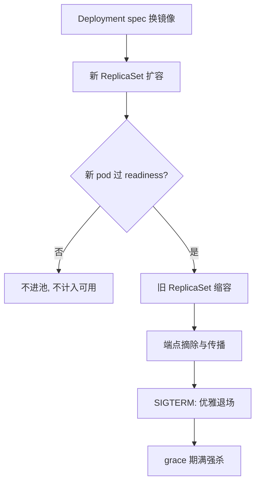

# 滚动发布

发布不是把新版本放上去，是让旧版本体面地退场；大多数发布事故死在后一半。

<footer>—— 据 Kubernetes 官方文档（Deployments）与 Google SRE 书（Beyer et al., 2016）发布实践整理</footer>

[上一课](/cs/orch-service-discovery)留下一根命脉：readiness 决定端点进不进池，端点集合随调和收敛。滚动发布正是把这根线用满的控制器：Deployment 用两个版本的 ReplicaSet，把「换版本」写成两个速率受控的扩缩容。主干课 [滚动升级](/cs/rolling-upgrade) 给过轮廓；本课深钻三件事：容量预算的公式、探针的门控、以及旧 pod 的退场合同。

## 问题

全量替换的问题是失败半径：新版本全错时没有退路，用户全量承担。朴素的逐个替换的问题是容量：新旧交替时服务能力忽高忽低，谁也没说清任意时刻最少还有几个 pod 在接流量。缺口是把切换写成有公式的受控过程：任意时刻的容量下界、失败半径上界、以及「什么算可以接流量」的判据，都要事先钉死，而不是发布当晚临时解释。

## 方法

Deployment 到 ReplicaSet 到 Pod，一版一个 ReplicaSet，留痕即历史。两个预算参数：**maxSurge** 管最多多出几个新 pod（容量上界），**maxUnavailable** 管最多少几个旧 pod（容量下界），默认各为副本数的四分之一上下。设副本数为 $n$，则任意时刻可用容量满足 $n_{\text{avail}} \ge n - \lfloor u \cdot n \rfloor$，单轮失败半径 $\le \lceil s \cdot n \rceil$，其中 $u$、$s$ 是两个预算。新 pod 过 readiness 才计入可用；旧的在缩掉前从端点池摘除。暂停与恢复支持中途观察；回滚就是「把旧 ReplicaSet 的副本数调回去」——又是调和，不是专用机制。

## 机制

readiness 的门控把「进程活着」与「能接流量」解耦：缓存未预热、连接池未建好、依赖未就绪，都发生在进程已启动之后；没有门控，新 pod 一启动就进池，用户替它的冷启动买单。退场是事故最密集的一段，合同有固定顺序：先发 SIGTERM 并执行 preStop 钩子——此刻 pod 还在池上，睡一小段等转发规则把摘除传播出去；随后端点摘除；grace 期内处理存量请求；期满强杀。两个经典错法都在顺序上：先摘端点再立刻退出，砍掉全部在途请求；依赖进程收到 SIGTERM 就瞬间退出，连接池里的请求一起陪葬。把退场当成和扩容同等重要的半边，发布的可靠性才闭合。

自动回滚需要外部判据：控制器自己不知道新版本是好是坏，错误预算的烧速是现成的裁判——见 [SLO 工程](/cs/obs-slo-engineering)。若新版本放大了对下游的失败，发布期间还要配上 [限流与熔断](/cs/rate-limit-circuit-breaker) 的既有防线，而不是指望预算参数挡住逻辑错误。

数字：优雅退场的默认预算是 30 秒——比这长的收尾必须显式改 terminationGracePeriodSeconds，否则每次发布都在制造一批被强杀的在途请求，而表象只是「错误率偶尔抖一下」。

## 边界

回滚即时的是数据面：schema 与数据不回滚，不兼容变更要走「先扩张后收缩」的双阶段，那是数据工程的合同。节点维护时的驱逐预算（PDB）与发布预算是两回事，前者管「一次意外最多拿走几个」，后者管「主动换版本的速度」。批量发布的灰度比例、按地域分批，是 Deployment 之上的编排，本课不展开。

## 小结

- 发布是速率受控的双向扩缩容：maxSurge 定容量上界，maxUnavailable 定下界。
- readiness 门控把「活着」与「能接」解耦，冷启动的代价不该由用户付。
- 退场合同有顺序：preStop 等传播、摘端点、grace 内处理存量、期满强杀。
- 回滚是调旧 ReplicaSet 的副本数；好坏要外部判据，控制器自己不判断。
- 出处：Kubernetes 官方文档（Deployments）；Google SRE 书（Beyer et al., 2016）。
