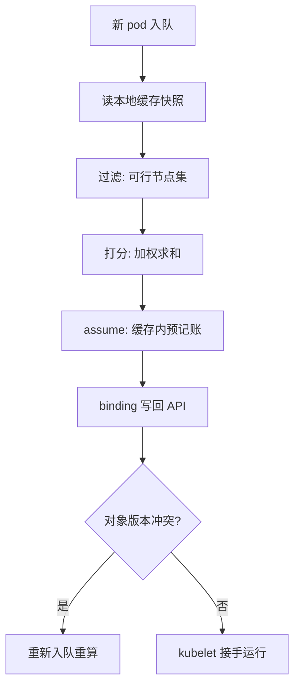
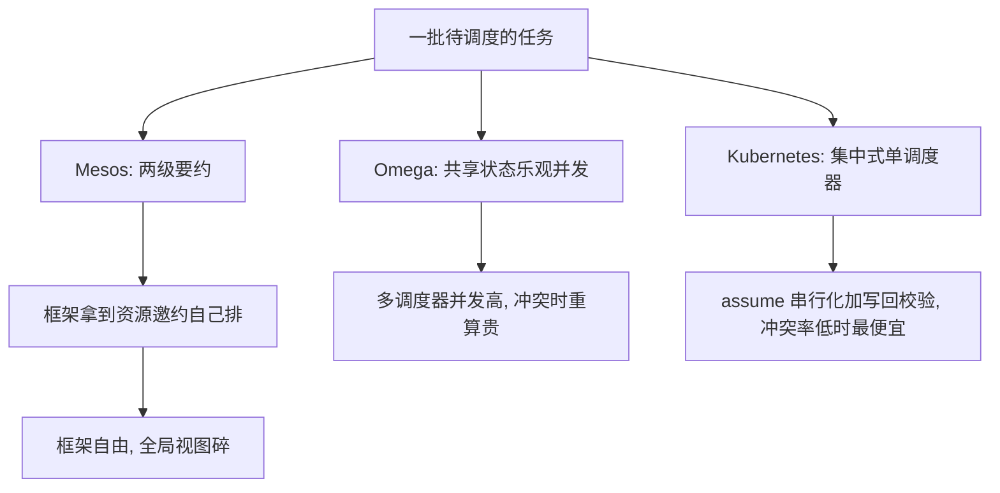

# 调度器的架构

调度器的输入不是集群的真相，是一份刚要过期的快照；它的每个决定，都在赌「读到的账」与「真实的账」之间的差值足够小。

<footer>—— 据 Verma et al., Large-scale cluster management at Google with Borg, EuroSys 2015 与 Kubernetes 调度文档整理</footer>

[上一课](/cs/npk-map)给「网络协议栈实践」收束：正向是包的旅程，逆向是排障的判定序，四条骨架跨版本成立——状态有地址、转移有动作、排队有预算、拒绝有计数。协议栈的图拼完，本课程到此接棒：单机上「怎么隔离」已有答案，编排要回答的是几千台宿主、几十万个容器时**放哪、怎么收敛、怎么记账**。本课是「容器编排」第一课，从「谁决定落点」开始。主干课 [Borg 与 Kubernetes](/cs/borg-kubernetes) 给过控制面形状——强一致的小状态加最终一致的调和，还钉过绑定要带资源版本防双绑；本课拆调度器内部：队列、过滤、打分、绑定。后课默认已经读完本课。

## 问题

集群里有两种持续变化的量：一列待安排的意图（新 pod 要 CPU、内存、拓扑位置），一张资源地图（每台节点还剩什么）。缺口不是「找一台装得下的机器」——单次匹配谁都会写，难的是高频决定下账本不重不漏：同一份资源被记到两台节点上，或者明明有节点装得下却没人被选中。Borg 的论文给了规模参照：中等规模的 cell 每分钟安排上万个任务。快与不重账，本课要拆调度器怎么同时拿到这两样。

## 方法

方法是流水线加缓存。调度器不逐次读存储，而是 watch 全量对象进本地缓存（informer）——它读的是快照，不是真相，这笔账下文算。新 pod 进调度队列，按优先级与退避排序；一个调度周期四步：**过滤**把不满足硬约束（request 装不下、端口冲突、卷拓扑）的节点剔掉，剩下可行集；**打分**在可行集上按加权策略求和，取最高分；**假设**（assume）——先在自己的缓存里把这份资源预记上；**绑定**——写 binding 对象回 API，kubelet 看到绑定才真正起容器。

术语翻译：informer 缓存就是调度器自带的「复印本」——watch 把每一次变化推过来、随时更新本地副本，查账只翻复印本、不去档案室（API 存储）排队；代价是复印与盖章之间有时间差，所以调度器读到的永远是刚要过期的快照。

## 机制

快照过期靠**假设**兜底：assume 使同一时刻一个 pod 只在一个周期里被处理，后续 pod 读到的缓存已扣掉这份资源——调度器内部的重账被串行化消灭。调度器与世界之间的竞争（别的组件恰好把节点占满）交给绑定写回时的乐观并发：对象版本对不上就失败重入队。不这么做会错在哪：没有预记账，高峰期两个周期读到同一张地图，同一台节点被超卖；没有写回校验，过时快照的决定会静默覆盖真相。

直觉类比：assume 像服务员下单后先在墙上小黑板划掉一道菜——别的服务员看一眼黑板就知道没了，不必等厨房盘点确认；小黑板（缓存）与后厨库存（真实状态）偶尔对不上，就靠出单时核对订单号（写回校验）兜底，对不上就退单重下。

硬约束与软偏好的分工是结构性的：过滤收缩可行域，打分在剩下的里面挑。把软偏好写成硬约束，可行集会空洞化（找不到任何节点）；把硬约束写成打分项，「必须满足」退化成「倾向满足」。谱系上还有两条路：Mesos 把调度拆成两级，框架拿资源要约自己排，框架自由但全局视图碎掉；Omega 让所有调度器共享状态、乐观并发，并发高但冲突重算贵。Kubernetes 选集中式悲观：冲突率低时它最便宜。Burns 等人在 CACM 2016 对照三代后的结论正是：选择取决于冲突率与视图新鲜度的权衡，不存在全赢的架构。

常见误区：初学者容易把「想让它优先去大节点」这类偏好写成硬约束（如 nodeSelector）。硬约束是门槛——不满足直接剔除，一旦可行集空了 pod 就永远 Pending；偏好应放进打分项，让它只是「倾向」而不是「资格」。

打分权重是策略不是常数：默认把「资源配比均衡」与「低占用优先」两项加权求和；权重调偏会系统性制造碎片——大作业进不来，小作业填一地。

## 边界

本课不写一组任务绑在一起调度的 gang 调度，不写 GPU 拓扑对齐，也不写节点集合本身伸缩时的行为。调度决定是**一次性的**：pod 绑定后不搬家，哪怕更合适的节点后来空出来；重排是另外的工具，不在调度循环里。快照过期的残余风险由调和兜底：绑错顶多不优，不会错账——记账的真相在 API 对象里，快照只是输入。

## 小结

- 结构是缓存快照 + 队列 + 过滤 + 打分 + 假设 + 绑定；快与不重账同时成立。
- assume 串行化调度器内部，乐观并发兜住调度器与世界之间；冲突重算即可。
- 硬约束收缩可行集、软偏好加权打分，二者不能互相冒充。
- Mesos 两级、Omega 共享、Kubernetes 集中悲观，按冲突率选择，没有全赢架构。
- 出处：Verma et al., EuroSys 2015；Burns et al., CACM 2016；Kubernetes 官方调度文档。
