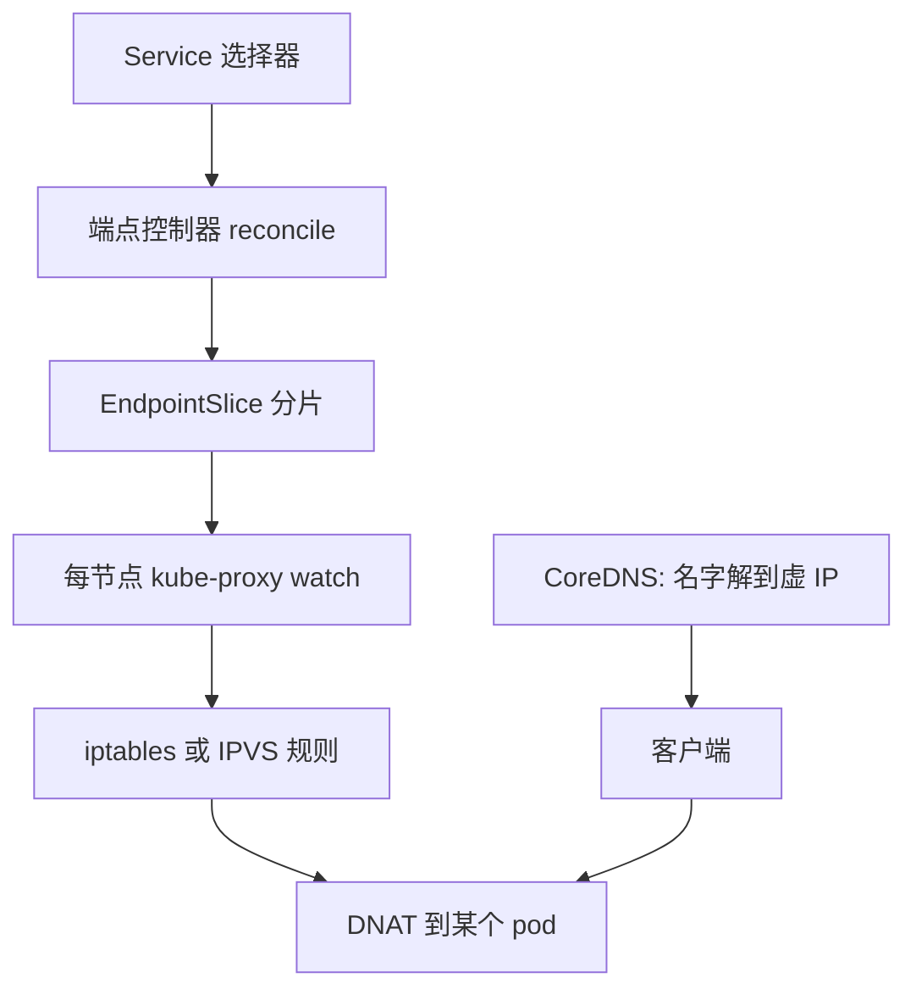
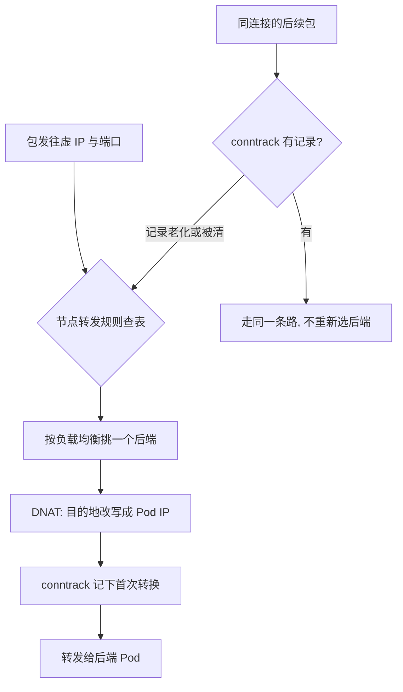

# 服务发现

ClusterIP 是一句被所有人共同维持的谎言：那个地址不在任何网卡上，它只活在每个节点的转发规则里。

<footer>—— 据 Kubernetes 官方文档（Service、EndpointSlice、kube-proxy）整理</footer>

[上一课](/cs/orch-declarative-controller)把调和循环钉成 spec/status 加水平触发，本课看它的第一个成品。主干课 [服务发现](/cs/service-discovery) 给过三条路（DNS、注册表、网格）与核心缺口——实例上下线比 DNS TTL 快；本课拆 Kubernetes 怎么把「发现」也写成控制循环：Service 的标签选择器、端点的分片、每台节点上的转发规则，谁在什么延迟内把它们对齐。

## 问题

pod 秒级生灭，IP 随生灭变化；访问方要的是一个稳定的名字与地址。Service 给了名字加一个虚 IP，加一个标签选择器。缺口在中间那段：谁把「选择器命中的 pod 集合」变成「每台节点上都生效的转发规则」，端点变更到规则生效要多久、规模大了会不会拖垮控制面。发现错了的错法很具体：流量打进已死的 pod，或者活着的 pod 一直分不到流量。

## 方法

链上有两个循环。第一个：端点控制器 watch pod 与 Service，算选择器交集，把结果写进 EndpointSlice——按量分片，默认每片百个端点上下；pod 的 readiness 决定它进不进片。第二个：每台节点上的 kube-proxy watch EndpointSlice，在本机写转发规则：iptables 模式逐条写网络地址转换规则，IPVS 模式维护哈希表。DNS（CoreDNS）把服务名解到虚 IP；无头服务跳过虚 IP，直接解到 pod IP 清单——给客户端自己做均衡的场景。

术语翻译：ClusterIP 是一段「不存在于任何网卡上的地址」——没有进程监听它，它只是每台节点转发规则里的一个匹配条件；说「连上 ClusterIP」，真实发生的事是你的包在本节点被改写了目的地。

## 机制

虚 IP 只存在于规则里：没有任何进程监听它，包到节点上被规则改写目的地——这是「共同维持的谎言」的机制化。规模的真实分水岭在查表复杂度：iptables 的规则是线性链，端点到几千个时全量规则的重放与逐条匹配都成为瓶颈；IPVS 换成哈希表，查表近常数——这是官方文档在大规模场景下推荐 IPVS 的理由，不是玄学。连接跟踪记住第一次转换的目的地，让后续包走同一条路；代价是 UDP 这类无连接协议的跟踪项有老化时间，后端换掉后旧会话仍往旧地址打——发现的正确性与会话亲和在此打架，靠超时与主动清表权衡。

数字实例：后端扩到 3000 个 pod 时，iptables 模式每条规则线性排链、加一条规则要整链重放；IPVS 用哈希表，查表仍是几次比较——同样 3000 个后端，规模分水岭就在「线性链对哈希」这一步，这也是大规模集群换 IPVS 的直接理由。

EndpointSlice 的分片让传播量有界：没有分片时一个端点抖动，全部 kube-proxy 都要重读全表；分片后只有相关分片变更。 readiness 把健康检查接进发现：探针不过的 pod 不进片——这根线是下一课滚动发布的命脉。

容器里 DNS 慢的经典来源在解析器配置：默认 ndots 为 5，短名字（点不足五个）会先补各搜索后缀轮番试错，每次失败都是一轮往返；对高频调用的服务名，这是白付的延迟。

## 边界

本课是三层的发现与转发；七层的路由、重试、熔断是服务网格的事，失败流量的治理见 [限流与熔断](/cs/rate-limit-circuit-breaker)。发现是最终一致的：端点变更到全部节点的规则生效有传播延迟，具体怎么利用这段延迟安全换版本，是下一课的题。本课不写网格与多集群。

常见误区：初学者容易以为 Service 换后端是瞬时生效。端点变更要经控制器写 EndpointSlice、再传到每台节点的 kube-proxy 重写规则，全程有秒级传播延迟；刚死掉的 pod 地址可能仍被转发几秒——这也是退场要先「摘端点、再停进程」的原因（下一课的合同）。

## 小结

- 发现被写成两个循环：选择器收敛到 EndpointSlice，EndpointSlice 收敛到节点转发规则。
- 虚 IP 只在规则里存在；查表复杂度（线性链对哈希）才是规模分水岭。
- 连接跟踪换来会话亲和，也带来 UDP 换后端的陈旧会话问题。
- 分片与 readiness 是控制面传播量与健康门控的两根杠杆。
- 出处：Kubernetes 官方文档（Service、EndpointSlice、kube-proxy）；主干课服务发现。
