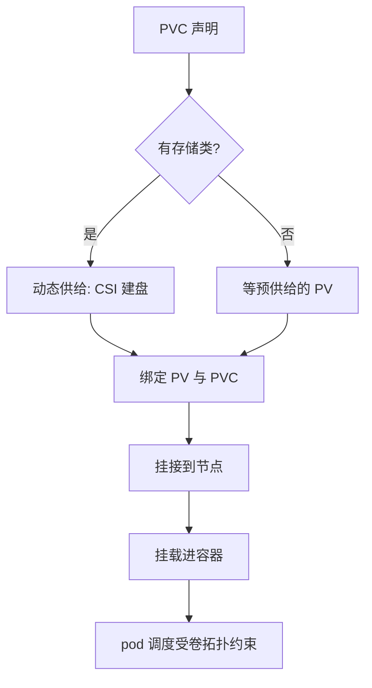

# 存储编排

无状态的心智模型在根文件系统上成立、在数据上破产；编排存储的全部复杂度，都在「pod 死了数据不能死」这一句里。

<footer>—— 据 Kubernetes 官方文档（Persistent Volumes、StatefulSets）与 CSI 规范整理</footer>

[上一课](/cs/orch-network-policy)把网络语义从全通抠成白名单；本课转向持久性。镜像层合成的可写层随容器生灭——[OCI 镜像层](/cs/oci-image-layers) 讲过它的构造——把「重建后数据还在」写进调和循环，是编排最贴地的一课：这里有盘、有节点故障、有调度器的回耦合。

## 问题

容器的本地盘是临时的：重建即丢；节点会宕机，盘不跟着 pod 走；而数据库恰恰要「重启后原样」。缺口是把「我要多大的盘、什么性能、能否多挂、丢不丢得起」写成声明，让供给、挂接、挂载全部进入控制循环——并且让调度器知道：这个 pod 与那块盘之间有了新的约束。没有这层，有状态服务只能游离在编排之外，发布与自愈的好处都轮不到它。

## 方法

对象分三层。**PVC** 是用户的声明：容量、访问模式、存储类。**PV** 是实际的盘：管理员预先供给，或由存储类触发动态供给。**CSI 驱动**是面向存储后端的接口合同：建盘、挂接、挂载、扩容、快照，都是标准化调用。PVC 与 PV 的配对本身是一次调和：配对器找容量与模式都匹配的 PV 写绑定；没有现成的就按存储类新建。卷拓扑把调度器拉回场：块卷要先挂接到节点，pod 的可行节点集因此多了「盘在哪个可用区」这条过滤——第一课的过滤器多了一项，调度与存储在这里耦合。

## 机制

访问模式是合同不是实现：ReadWriteOnce 的「一次」按**节点**计——同一节点上的多个 pod 可以共享一块 RWO 卷；把它理解成「一个容器」会误判共享行为，理解成「一个集群」会误判排他行为。供给、挂接、挂载是三段路径、三种失败：供给失败（容量不足或配额顶住）、挂接失败（后端超时、节点上残留旧挂载）、挂载失败（文件系统损坏）——排障先分段，混在一起谈「存储挂了」永远查不完。StatefulSet 把有状态收敛成可预测：稳定的名字（编号序）、每副本一块独立 PVC（由模板生成）、有序启停——上一课滚动发布的「预算与顺序」在这里变成「编号与次序」，旧副本先退、新副本不越位。

回收策略决定 PV 的来世：删除 PVC 时盘是跟着删（Delete）还是留着等人认领（Retain），是有状态服务最重要的生产参数之一——默认值的方向恰恰与直觉相反的场合不少见。

挂接是节点级动作、挂载是容器级动作：同一块 RWO 卷在同节点的第二个 pod 只补一次挂载，不重复挂接；把两段混为一谈，就会问出「为什么两个 pod 能挂同一块单读写卷」这种假问题。

## 边界

卷不解决数据正确性：复制、一致性与故障切换是存储系统自己的事（[Raft](/cs/raft) 一族），编排只负责「盘在、挂上、随 pod 重建复用」。多写者共享文件语义是另一族问题，坑在 [NFS 语义](/cs/nfs-semantics)。性能是吞吐与延时的合同，编排层不提供魔法；扩容与快照有但各有各的边界条件。本课程不写具体存储后端。

## 小结

- 三层对象：PVC 声明意图、PV 是实体、CSI 是对后端的接口合同；配对与供给都是 reconcile。
- 访问模式按节点计，不按容器计也不按集群计；读错计数单位就读错共享行为。
- 供、接、挂三段路径对应三类失败，排障先分段。
- StatefulSet 用编号、独立卷与有序启停，把有状态变成可预测的调和。
- 出处：Kubernetes 官方文档（Persistent Volumes、Storage Classes、StatefulSets）；CSI 规范。
