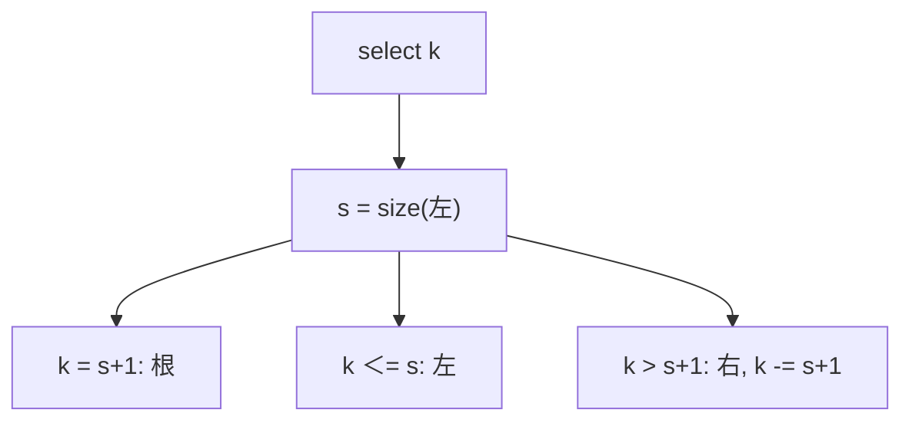

# 顺序统计树

每个节点多记一棵子树的规模，秩就是左子树大小加一；第 $k$ 小沿这条计数往下走。

<footer>—— 据 Cormen, Leiserson, Rivest and Stein, Introduction to Algorithms 第 14 章；Sedgewick and Wayne 整理</footer>

[上一课](/cs/splay-tree)与[红黑](/cs/rbtree-intuition)、[Treap](/cs/treap) 都给了有序字典，但合同只有按键。需要「第 $k$ 小的键」或「小于 $x$ 的有多少」。本课不重做 splay 势能。缺口是顺序统计树：在平衡 BST 上维护 `size`，`select`/`rank` 与增删同阶对数。

## 问题

有序数组 `select` 是下标，但插入 $\Theta(n)$。只存 BST 没有规模就不能在比较路径上跳过「左边有多少」。缺口是字段 $\mathrm{size}(u)=1+\mathrm{size}(左)+\mathrm{size}(右)$（空为 0）。$\mathrm{rank}(x)$：走查找路径，往右走时加上左子树 size 再加一。$\mathrm{select}(k)$：若 $k=\mathrm{size}(左)+1$ 则根，若更小则向左，否则向右减掉左边与根。

旋转、splay、treap 的 split 都必须更新 size，与维护平衡同一路径。

CLRS 第 14 章用红黑当底层。底层换成 AVL/Treap/Splay 只改维护点，不改秩的定义。

## 方法

插入删除先当普通 BST 再修复平衡，回溯加/减 size，或旋转时按公式重算四个节点。区间 $[L,R]$ 内第 $k$ 小：两个 rank 相减得左端前缀，再 select——这是应用，机制仍是全局序上的秩。

与 Fenwick 权值树：值域离散且可映射到下标时，树状数组也能 rank/select。顺序统计树键任意可比较，不必整数化。

## 机制

平衡保证 $h=O(\log n)$，故 rank/select 最坏或期望对数与底层一致。size 错一个节点，整棵秩全错——测试应查 `size` 与中序位置。多重键：size 计次数或拆节点，合同写明。

不要把「第 $k$ 近邻几何」混进本课；那是后课 k-d 树。

## 边界

本课不写区间树的重叠查询。并发下 size 与旋转同锁。下一课把[跳表](/cs/skip-list) 接到多线程：无根旋转，层指针 CAS。

后课默认：有序字典可以回答秩。共享内存里无锁有序集，先看并发跳表。

## 小结

- 顺序统计：BST + size，`rank`/`select` 对数。
- 旋转必须维护 size。
- 并发有序结构下一课走跳表，不旋根。
- 出处：Cormen et al. 第 14 章；Sedgewick and Wayne。
