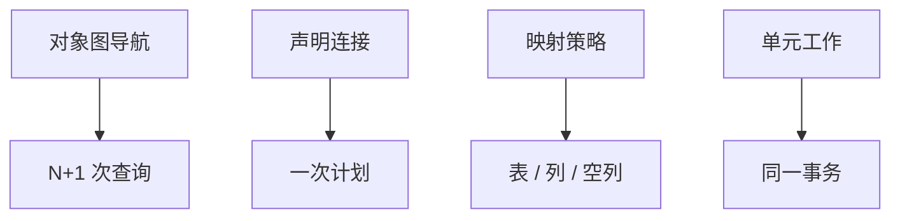

# ORM 阻抗失配

对象图有身份、继承与导航；关系有键、表与声明查询。把前者硬按进后者，不是翻译错误，是两种模型的阻抗。

<footer>—— 据 Copeland and Maier 对对象–关系；Ireland et al. 对阻抗失配；Date 对关系与对象对照</footer>

[上一课](/cs/schema-migration)把模式当版本化脚本。本课不重写 `ALTER`。缺口是应用层：对象关系映射（ORM）用类表示元组，用导航表示连接。主干坚持声明 SQL；工程上大量代码通过 ORM 发查询。阻抗失配（impedance mismatch）命名这条缝，避免把 N+1 查询当成「数据库慢」。

## 问题

对象：可变身份、嵌套集合、继承。关系：值、第一范式、集合查询。映射策略：一类一表、一类一层次一张表、具体类一表——各有空列或连接代价。缺口不是选框架，而是**查询形状**：按对象导航 `customer.orders` 若逐订单懒加载，就是对每个外键一次查询（N+1）。关系侧一句话连接能做完的，对象侧循环会拆碎。

单元工作（Unit of Work）跟踪脏对象再生成 `UPDATE`，与保存点、事务边界必须对齐。迁移工具从实体生成 DDL，常忽略 [依赖理论](/cs/normal-forms) 的分解质量。

Copeland and Maier 讨论把对象存进关系。阻抗一词借自电路：两种接口能量反射。本课不把 NoSQL 文档当「阻抗消失」——嵌套文档只是把连接预物化，下一课连接池也不解决模型缝。

## 方法

显式查询：把需要的图写成一次 JOIN 或窗口，而不是默认懒加载。投影：不要 `SELECT *` 水合整个对象图。身份映射：同一主键在同一会话不要两份对象。继承映射写进模式，让迁移课的脚本可见，而不是只在注解里。

ORM 可以发出参数化 SQL，进入后课预编译。它也可以把过程与触发器完全藏起来——调试时必须能看到最终 SQL。

## 机制

延迟加载与事务：会话关闭后再导航，连接可能已还，对象成「断开」。这与库的隔离快照不是同一层。脏检查生成的 `UPDATE` 可能覆盖列，与触发器、乐观版本列互相踩。约束仍在库侧生效；ORM 校验只是提前失败，不是完整性来源。

## 边界

本课不讲连接池尺寸公式——下一课。也不把活动记录对仓库模式的宗教争论写入主干。文档库、宽列是后课数据模型族；它们不自动消除图与集合的缝，只是换一种预连接。

后课默认：对象导航不是查询计划。看到 N+1 先改加载形状，再谈索引。连接池处理的是会话资源，不是阻抗。

关系查询的单位是语句与计划；对象的单位是身份与指针。翻译层必须显式。

## 小结

- 阻抗来自对象图对关系的结构差，不是某框架的 bug。
- N+1 是导航默认值；声明连接才是原语。
- 连接池下一课：会话昂贵，与映射无关却总被混谈。
- 出处：Copeland and Maier；Ireland 等；Date。
