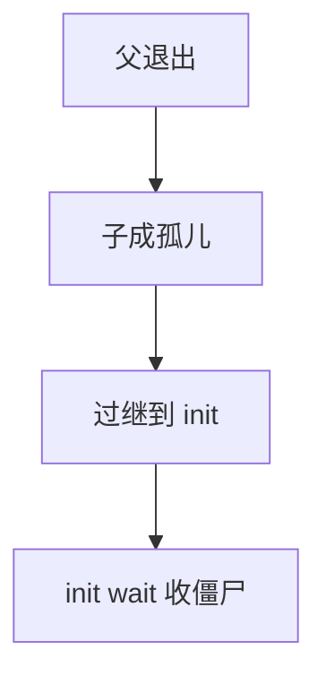

# 孤儿与 init

父进程先退出时，子进程成为孤儿，必须过继给一个始终 wait 的祖先——传统上是 PID 1 的 init。

<footer>—— 据 Tanenbaum and Bos, Modern Operating Systems；Silberschatz et al. 整理</footer>

[上一课](/cs/wait-zombie)要求父收割僵尸。缺口是：父自己可以先 `exit`。若无人再 wait，孤儿结束会变成无人收的僵尸，PID 泄漏。Unix 的规则：把孤儿的父指针改到 **init**（或现代的子重器），由它循环 wait。本课只钉过继，不写 init 的全部用户态服务。

## 问题

进程树是 PCB 上的父子指针。父退出时，内核遍历其孩子：活着的改 `ppid`，已是僵尸的也改，以便新父能 wait 到。缺口不是新的退出码格式，而是保证**系统里永远有一个愿意收尸的进程**。PID 1 不能随便杀光：它挂了，内核通常 panic，因为过继目标没了。

有的系统让最近的「子重器」而不是全局 init 来收，避免 PID 1 成为瓶颈。语义仍是：孤儿必有新父，新父会 wait。

## 方法

`exit` 路径：通知自己的父（可能把它从 wait 中唤醒），然后把孩子过继给 init。init 的用户代码循环 `wait`，把过继来的僵尸收光。会话与控制终端如何随父退出而断开，下一课进程组再收；本课只保证父指针合法。

fork 出的守护进程故意让父退出、自己过继，从而与终端脱钩——动机在进程组课，机制已在本课。

## 机制

过继维持 wait 协议的不变量：每个僵尸都有一个活父。调度与地址空间不因此改变；变的只是 PCB 上的亲缘。与[信号](/cs/signals)的交界：过继可能伴随 `SIGCHLD` 发给新父。init 必须对这条信号保持收割，不能忽略后永不 wait。

## 边界

本课不把 systemd 的服务管理写成 OS 主干，不讨论 PID 1 在容器命名空间里是「容器内的 init」。内核线程一般挂在 kthreadd 下，不走用户 init 的 wait。杀 init 的后果是策略，课内只承认它特殊。

后课默认：每个用户进程最终能被谁 wait 到。退出时内核还要拆哪些资源、以什么顺序，下一课把 `exit` 与回收写全。

## 小结

- 孤儿过继给 init（或子重器），以免僵尸无人收。
- PID 1 是 wait 协议的根。
- 退出路径上的资源释放顺序是下一课。
- 出处：Tanenbaum and Bos, *MOS*；Silberschatz et al., *OSC*。
