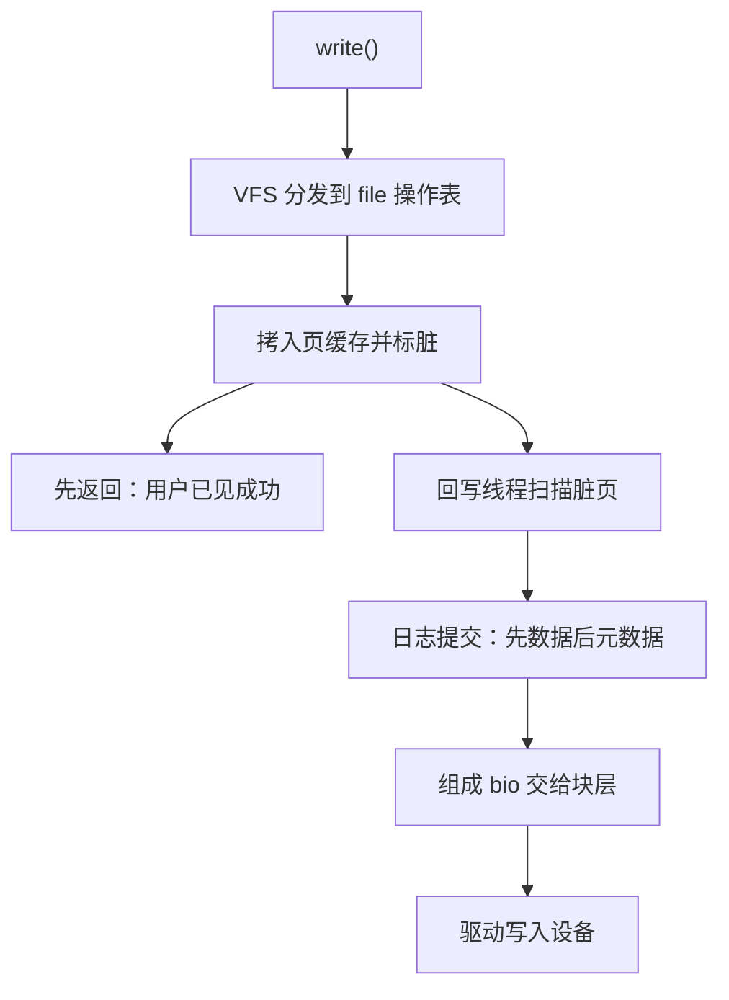
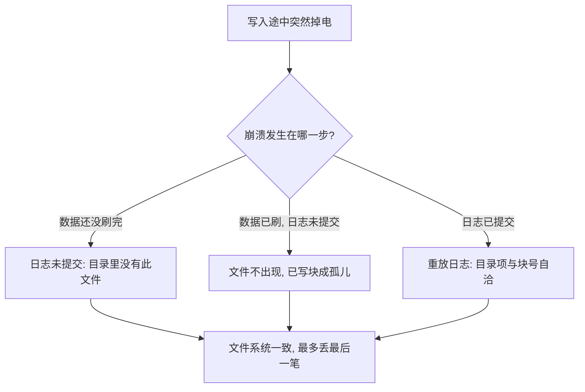

# 文件系统的实现

VFS 的全部承诺是几个内存对象加几张操作表；磁盘愿意怎么排，是每个文件系统自己的事。

<footer>—— 据 Arpaci-Dusseau, OSTEP；Tanenbaum and Bos, Modern Operating Systems 整理</footer>

[上一课](/cs/osk-vm-implementation)把文件页接进了页缓存；本课把竖着的路走完：read 与 write 从 VFS 对象一路下到块设备。主干已给平面图：[虚拟文件系统](/cs/vfs)、[dentry 缓存](/cs/dcache)与[inode 与目录](/cs/inode-dir)定了内存对象，[ext2 块组与位图](/cs/ext2-block-groups)与[FAT 与目录项](/cs/fat-filesystem)给了两种盘上布局。缺口是装配：mount 怎么把盘上布局抬成内存对象，write 又怎么从页缓存一路变成块层请求。

## 问题

同一个 write，底下可能是 ext4 的日志、FAT 的簇链，或 tmpfs 的纯内存。实现要回答：分发发生在哪个对象上；页缓存里的脏数据何时、以什么顺序落盘；崩溃之后靠什么不烂。不这么做会错在哪：让每个文件系统自带缓存与脏页管理，就得不到统一的回写节奏、限额与统计；反过来让 write 直写磁盘，缓冲的合并、复用与读改写摊销全部消失——这是当年 Unix 把缓冲缓存做成独立一层的全部理由。

## 方法

mount 时读超级块，建根 inode 与根 dentry，从此路径解析只走内存：dcache 命中时名字到 inode 一步不碰盘。每个 VFS 对象各带一张操作表：inode 表管元数据（create、mkdir、unlink），file 表管读写定位，地址空间对象管页缓存。write 的落点是页缓存：把用户数据拷进对应的页并标脏，随即返回——用户此刻就看到成功。回写线程在后台扫描脏页，组成 [bio](/cs/bio-block) 交给块层；文件系统在回写之前插入自己的日志提交（[日志模式](/cs/ext4-journal)），这就是崩溃一致性的接缝。读路径同样过页缓存：命中则纯内存，未命中才触发一次盘读并把页挂进缓存。

术语翻译：write 返回「成功」只代表数据进了内存的页缓存并被标脏——「脏」就是「这份内存拷贝比盘上的新」；真正的落盘由后台回写线程稍后批量做。所以掉电丢的是「已标脏、还没回写」的那一段：函数返回了不等于已经写进盘。

## 机制

装配的关键是两层一致性分开守：页缓存对上层保证「读必见写」——同一张页既是读的来源又是写的去处，自然一致；日志对下层保证「崩溃后元数据自洽」。以最常见的 ordered 模式为例：先刷数据、再提交元数据日志，崩溃后最多丢最后一笔，绝不会出现目录项指向从未写过的块——那种「新文件内容是旧垃圾」的烂态正是没有这层排序时的必然产物。FAT 没有日志、盘上也没有 inode 表，一致性全靠回写顺序的运气，掉电烂目录是[结构结果](/cs/fat-filesystem)，不是参数没调好。dcache 的代价与收益也在同一处对账：命中省掉的是每级目录一次盘读，失效则要逐级回盘验证——这就是挂载后第一次列目录慢、第二次快的机制。

数字实例：解析 /home/u/a/b/c.txt 要走 5 级目录。dcache 全命中是 5 次内存哈希查找，微秒级；全不命中是 5 次盘读，机械盘一次约 10 毫秒——相差四个数量级。这就是「第一次 ls 慢、第二次快」的全部账目。

## 边界

盘上布局细节是 ext2、ext4 与 FAT 各课的对象，本课只取它们与 VFS 的接缝；页缓存替换与脏页策略是[缓冲与脏页](/cs/buffer-dirty)的对象，并发与一致性是 [mmap 与页缓存一致](/cs/fs-mmap-coherence)的对象，都只引用。分布式与网络文件系统不在此处；挂载命名空间、overlay 这类「目录树本身的管理」也另有专课——本课钉的是单棵树内一次读写的纵向装配。

一条路径解析在 dcache 全命中时是纯内存查找；全不命中则每一级都要读盘验证。同一个网络文件系统上，这个差距从微秒放大到毫秒——目录深度本身就是性能参数。

## 小结

- VFS 用内存对象加操作表，把「盘上怎么排」与「内核怎么用」解耦。
- write 落页缓存即返回；回写与日志在后台与崩溃点之间把关。
- 两层一致性：页缓存守读必见写，日志守崩溃自洽；FAT 缺第二层是结构必然。
- dcache 把名字解析从每级一次盘读变成纯内存查找，深路径的收益按级数放大。
- 出处：Arpaci-Dusseau, *OSTEP*；Tanenbaum and Bos, *Modern Operating Systems*。
