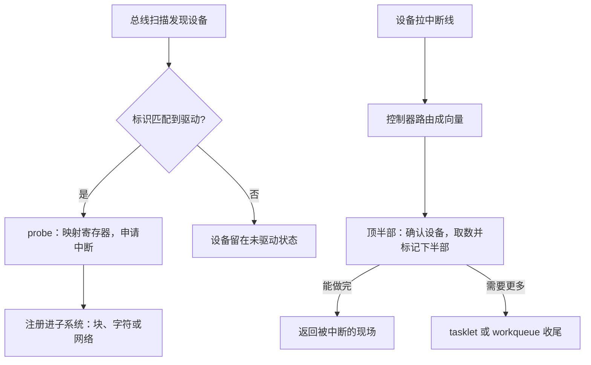

# 中断与驱动的骨架

驱动不是「操作设备的代码」，而是把一个说方言的设备注册成内核已有对象的那段胶水。

<footer>—— 据 Tanenbaum and Bos, Modern Operating Systems；Arpaci-Dusseau, OSTEP 整理</footer>

[上一课](/cs/osk-syscall-path)修好了同步进入内核的路；设备不等调用——异步进入内核的路是本课。[硬中断与软中断](/cs/hardirq-softirq)、[中断下半部](/cs/interrupt-bottom-half)已给上下半部的分工，[APIC 与中断路由](/cs/apic-interrupt-routing)给了硬件侧的路由。缺口是把它们装配成一个能跑的驱动骨架：一条中断线从设备到处理函数走哪些层，probe 到 remove 之间都发生什么。

## 问题

内核里有成百上千种设备。若每种设备自带一套中断、缓冲与注册方式，块、网络、字符这些子系统就没法统一调度它们，写一个新设备就要重造一遍全部接缝。实现要回答三件事：设备的「存在」如何变成内核对象；中断到来时，通用层如何在一微秒内找到正确的处理函数；为什么处理函数里不许睡眠。不这么做会错在哪：在中断上下文里调用一个可能阻塞的函数——调度器不在中断里运行，没有人能把它换下去，那颗 CPU 就挂死在中途，往往表现为偶发的整机卡顿而不是清晰的崩溃。

## 方法

驱动的生命周期是骨架的主体。总线扫描发现设备，按标识匹配到驱动，调用 probe：映射设备的寄存器窗口、申请中断号并注册处理函数、初始化设备，最后把自己注册进某个子系统——块设备交出请求处理入口，字符设备交出文件操作表，网络设备交出收发包接口。remove 按相反顺序拆除。中断半程：设备拉线，控制器路由成向量，通用中断层查表调用驱动注册的顶半部——确认设备、取走数据或推进 DMA 描述符环、标记需要下半部，然后立刻返回。上半程注册、下半程查表，这两张表（设备表与中断表）就是整条异步路的索引。

## 机制

顶半部为什么必须短：它运行在中断上下文，当前中断线被屏蔽，它占多久，同类中断就压多久，实时性直接受损。可睡眠的收尾交给 workqueue——它运行在进程上下文，背后正是第一课讲的普通调度；不可睡眠但可延迟的用 tasklet。选择判据只有一个：这一步要不要睡眠。完成通知是骨架的接缝：驱动提交请求后在等待队列上睡眠，中断到达后完成唤醒——上一课的 read 阻塞语义就落在这条链上，[tasklet 与 workqueue](/cs/tasklet-workqueue) 给的部件在这里咬合。锁的配规则也由此定：可能被中断抢走的共享数据，临界区里要配 [锁与关中断](/cs/lock-irq) 的组合，漏配就产生只在负载高时出现的竞态。

## 边界

具体设备协议是各自课的对象——NVMe 的队列对在 [NVMe 队列与驱动](/cs/nvme-driver)，本课只取它们的公共骨架；中断亲和与线程化中断（[中断亲和](/cs/irq-affinity)、[线程化中断](/cs/irq-thread)）在骨架上叠加策略，不重复；中断虚拟化是主干隔离单元的对象。也别把骨架当成唯一形态：轮询驱动的设备没有中断半程，DMA 完成 CPU 不介入——骨架描述的是中断驱动这一主导形态，其它形态是它的减法。

共享中断线上的每个处理函数都必须先读设备状态寄存器判断「是不是我的中断」，不是就返回未处理——误认邻居的中断会把别人的完成事件偷走，症状是两台设备都偶发卡死，这是共享线上最经典的驱动 bug。

## 小结

- 驱动的本质是 probe 里的一串注册：寄存器窗口、中断处理函数、子系统接口。
- 中断路径是「设备、控制器、通用层、顶半部」；顶半部只做确认与取数。
- 下半部的判据只有一个：要不要睡眠——要就 workqueue，不要才 tasklet。
- 阻塞 I/O 的语义落在等待队列加中断唤醒这条链上；关中断锁保护被抢的临界区。
- 出处：Tanenbaum and Bos, *Modern Operating Systems*；Arpaci-Dusseau, *OSTEP*；Love, *Linux Kernel Development*。
