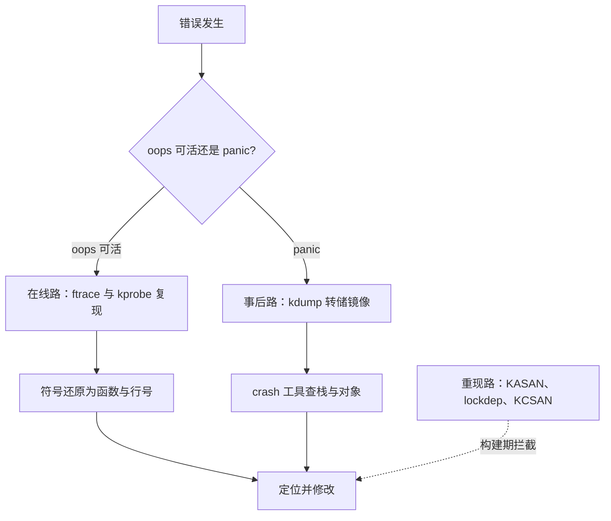
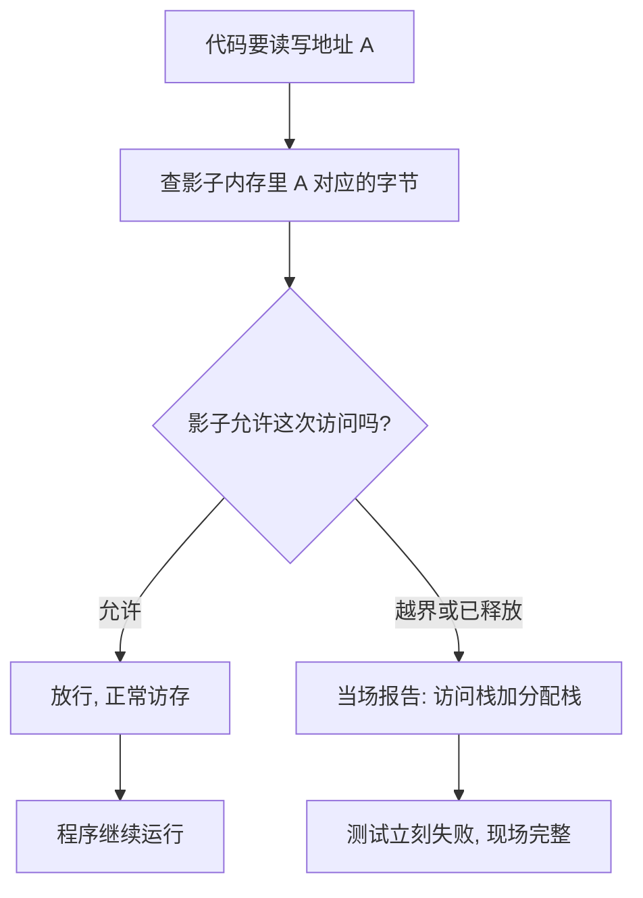

# 内核调试的方法

内核调试的纪律是：证据要在事故之前采集——崩掉的内核不能给自己下断点。

<footer>—— 据 Arpaci-Dusseau, OSTEP；内核 ftrace、kdump、KASAN 文档口径整理</footer>

[上一课](/cs/osk-interrupt-drivers)让你往内核里放进了会碰硬件的代码；写错时的形态是 [oops 与 panic](/cs/oops-panic) 两种死法。本课补实践面：一条栈回溯怎么变成源码行号，在线工具与转储镜像各在哪一步用，为什么开发内核要开着检测器编译。[ftrace 与 tracepoints](/cs/ftrace-tracepoints) 已给工具本体，本课给的是组合使用的次序与各自的边界。

## 问题

内核出错与用户态不同：没有进程可以暂停，现场一旦被覆盖就没了；oops 文本里的寄存器与地址对未入门者是天书；很多 bug 只在特定时序下出现，等加打印再编译装载，问题已经不复现。实现面要回答：哪些证据必须运行时采集、哪些可以事后从镜像里挖、哪些只能靠构建期插桩拦下。不这么做会错在哪：对着发行版内核的十六进制回溯查一下午——没有符号表与调试信息，回溯只是一列地址，什么也说不出来；更糟的是用带排查代码的构建去测时序，插桩本身改变了时序，bug 消失了。

## 方法

分三路。事后路：oops 文本里的出错地址与调用链，用同一次构建的、带调试信息的内核镜像经符号表还原成函数与行号；panic 则靠 kdump——启动时预留一小块内存放第二颗内核，崩溃时它接管并转储内存镜像，事后用 crash 一类工具查当时的进程、栈与对象。在线路：ftrace 的函数跟踪回答「路径走到了哪」，tracepoints 以稳定字段回答「经过了哪个点」，kprobe 在几乎任意指令地址挂回调回答「此刻这里的值是什么」，三者之上可跑脚本做聚合。重现路：开发构建打开 KASAN（越界与释放后使用）、lockdep（锁序反例）、KCSAN（数据竞争），它们把一类 bug 从「偶发崩溃、无法下手」变成「当场报告、带完整现场」。

术语翻译：oops 是内核「摔了一跤但还能爬起来」——杀死闯祸的任务、打印现场后系统继续跑；panic 是「伤及要害直接躺平」——整个内核停摆，只剩打印。oops 的文本是第一现场，panic 之后的事就交给 kdump 接手。

## 机制

各工具能工作，靠的都是提前埋好的结构。符号表留在内核里，回溯才有函数名；影子内存按字节记录可访问性，每次访存前多查一次影子，越界当场暴露；kdump 的第二颗内核不依赖崩溃者——崩掉的内核连自己的内存都不可信，这是它必须预留在启动时的全部理由。tracepoint 与 kprobe 的分工也有结构性原因：前者是开发者显式埋的点，字段有契约、跨版本稳定；后者挂在任意地址，内核一改就漂——所以长期监控用前者，现场挖掘才用后者。为什么插桩改变时序是原则性困难：检测器的每次检查都插入额外执行，海森 bug 的「观测改变被观测」在内核里是物理事实，只能靠「尽量轻的桩」与「关掉桩再验证」来缓解。

直觉类比：kdump 像备用摄像师——主镜（崩溃的内核）摔碎时不能指望它自己拍自己，所以开演前就在后台机位安排好一台独立相机（预留内存里的第二颗内核）；事故瞬间接管机位，把现场（内存镜像）原样拍下来带走。

## 边界

性能问题与功能 bug 工具集不同：火焰图与硬件计数是观测课的对象，本课只管「错在哪」。安全漏洞的利用分析、用户态调试器都有各自去处。版本漂移照旧：工具名与配置项会变，课序钉的是「事后、在线、重现」三路分工与「证据先于事故」这条纪律——拿这条纪律去对任何内核的调试设施，结构都对得上。

常见误区：在开了 KASAN 的构建里跑不出来，就断定「没有这个 bug」。插桩本身改变时序，偶发时序 bug 可能恰好被压住；正确次序是先用检测器抓确定性问题，再关掉桩、贴近生产配置去验证时序类问题。

KASAN 的影子内存约占地址空间的八分之一，运行时代价常见两到三倍——所以它只进开发与测试构建。反过来，未开检测的生产构建里，越界写可能安静地破坏几页之外的对象，症状出现在完全无关的路径上，定位成本反而更高。

## 小结

- 内核调试三路：事后还原（符号与转储镜像）、在线追踪（ftrace 与 kprobe）、构建期检测（KASAN、lockdep、KCSAN）。
- 同版本带调试信息的内核镜像是第一生产力，保存它运维纪律。
- kdump 的第二颗内核不信任崩溃者；影子内存的代价决定了检测器只进测试构建。
- tracepoint 有字段契约、kprobe 没有稳定接口：长期监控用前者，现场挖掘用后者。
- 出处：Arpaci-Dusseau, *OSTEP*；内核 ftrace、kdump、KASAN 文档口径整理。
