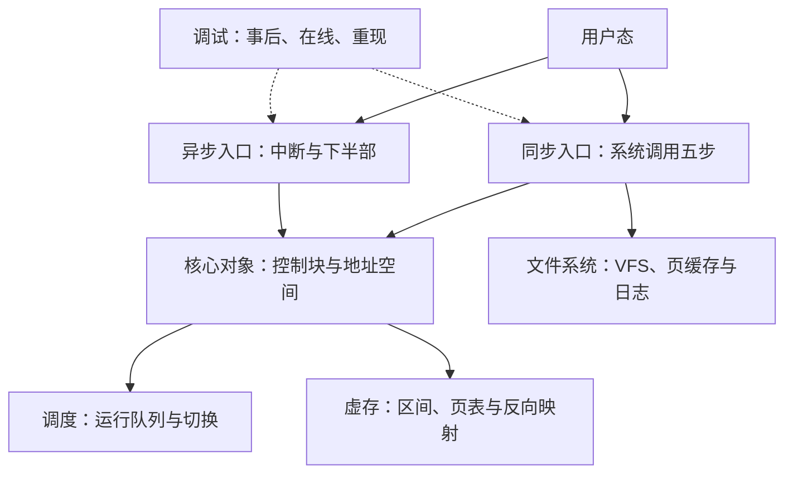

# 内核实践收束

内核的全部复杂度长在同一句承诺上：上层看见的是对象与调用，底下兑现它的是栈、表与队列。

<footer>—— 据 Tanenbaum and Bos, Modern Operating Systems；Arpaci-Dusseau, OSTEP 整理</footer>

[上一课](/cs/osk-kernel-debugging)把出错之后的三条路补齐。本课程到此收束：本课把六课收成一条装配主线与几条不变量，交代哪些部分刻意留给了主干课。本课程回答的始终是实现面——策略与语义在主干课（调度、置换、文件、接口各有专课），本课程给的是把那些零件总装起来的骨架；两者合起来，「操作系统」才从名词变成可读、可改、可查的机器。

## 问题

收束要回答的问题是：六课合起来，你获得了主干课没给的什么？答案不是多认了几个结构体名，而是一张总装图：一次缺页、一个 write、一条中断、一次上下文切换进来，内核里各自发生什么、在哪个对象上留下什么状态、从哪两个入口进来。只会背零件图的人，改动一处就不知道会断在哪里——这不只是初学者的困境，主干课留下的正是这个缺口：零件各有专课，装配无人认领。

## 方法

六课折成一条主线。**进程与调度**立「执行流」：控制块挂一切，切换只换页表基址与内核栈；**虚拟内存**立「地址」：区间声明、页表现挂、反向映射连回物理页；**文件系统**立「数据」：VFS 对象解耦盘上布局，页缓存与日志分守两层一致性；**系统调用**立「同步入口」：五步固定序；**中断与驱动**立「异步入口」：probe 注册一切、顶半部只做最少；**调试**立「失效面」：事后、在线、重现三路。贯穿的不变量四条：进入内核必经两个入口之一；跨边界的数据必须显式拷贝；执行上下文决定能调用什么（能睡的才许调度，顶半部不许睡）；一切注册皆有对称拆除。

## 机制

四条不变量各堵一个已知失效。只认两个入口，堵「绕过校验直进内核」的捷径——任何绕路都意味着绕过五步里的检查；显式拷贝堵内核态裸解引用与检查-使用之间的竞态；上下文定可调用集堵「中断里睡眠」的挂死——它不能被调度出去，因为它不在调度器的任何队列里；对称拆除堵卸载后的悬空注册——还在表里的回调指向已释放的代码，下一次中断就是一次任意跳转。四条合起来是同一件事：让实现错误在装配点当场暴露，而不是埋进时序里等偶发复现。主干与深钻的分界也在此收口：再往下走就是源码本身——本课程给的是读源码时手里那张总装图，不是源码的替代品。

## 边界

本课程刻意不覆盖的三块都在紧邻位置：性能调优与观测体系是观测课的对象；具体设备与总线协议是接口课的对象；虚拟化与容器在主干隔离单元。最后一点要说诚实：总装图不等于可维护性——内核代码库的复杂度大头在并发、历史包袱与跨架构抽象，六课的骨架帮你读得懂路径，读不透全部权衡；把骨架当成「内核就是这么简单」是本课程能造成的最大误读。骨架的价值在方向：知道每段代码在装配图上的位置，才知道去哪查、改哪会断。

自检一题足够：沿一次完整的 write 写出它经过的每一层——陷入、分派、VFS 操作表、页缓存、回写、日志、bio、驱动、中断完成。能在十分钟内不查资料画全这条链，本课程的目的就达到了。

## 小结

- 六课一条装配主线：执行流、地址、数据、同步入口、异步入口、失效面。
- 四条不变量：两个入口、显式拷贝、上下文定可调用集、注册必对称拆除。
- 主干给零件图，本课程给总装图；每条不变量都堵一个已知的装配失效。
- 总装图不等于内核的全部复杂度；它的价值是给源码阅读定位方向。
- 本课程到此收束；出处：Tanenbaum and Bos, *Modern Operating Systems*；Arpaci-Dusseau, *OSTEP*。
