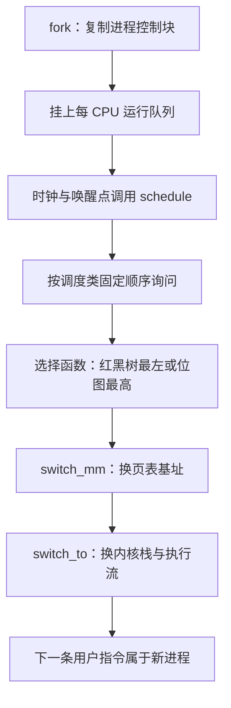

# 进程与调度的实现

策略挑的是下一个该跑的进程；实现兑现这个选择的，只有一次栈指针与指令指针的交换。

<footer>—— 据 Tanenbaum and Bos, Modern Operating Systems；Arpaci-Dusseau, OSTEP 整理</footer>

[上一课](/cs/dbk-map)给「数据库内核实践」收束：执行器、事务、缓冲池、日志、页、提交六个契约连成一条路径、无一处旁路；闩管形状，锁与快照管内容，日志管持久——层间越权是组装的头号事故。数据库的总装图画完了，操作系统的零件图其实也齐了：整个调度课序把「选谁运行」讲成了算法——先有[调度指标](/cs/scheduling-metrics)定尺子，再有 EEVDF、实时与 sched_ext 各自的策略，[进程地址空间一览](/cs/process-addrspace-tour)又把进程画成一张用户地图。两条线都停在实现之外：进程对象长什么样、切换到底切什么、运行队列怎么挂在 CPU 上，主干一律没有给出。本课是「操作系统内核实践」的第一课，从内核源码的骨架补齐这一层；后课默认你已读过这些主干课，只补实现这一层。

## 问题

主干留下的缺口不是「策略好不好」，而是装配：fork 生成的那个进程对象由谁放进哪个队列；schedule 从被调用到下一条用户指令执行，中间经过哪几步；EEVDF 的红黑树、实时位图、deadline 队列同时存在时，选路怎么定。不这么做会错在哪：把上下文切换想成「保存全部寄存器再恢复」，就会在源码里寻找一段不存在的「全量保存」——实际切换只换内核栈与最小寄存器组，其余寄存器靠调用约定在函数边界自然保留，找不到全量代码不是源码缺失，而是理解错了机制。

## 方法

从对象出发读骨架。进程控制块是枢纽：标识、状态、调度信息、地址空间指针、文件表指针全挂在它上面（主干[PCB 与 task_struct](/cs/pcb-task-struct)给过字段清单，本课只看装配）。[fork](/cs/fork) 复制一份并把它挂上运行队列；每 CPU 一个运行队列，队列不是一条队，而是按调度类分层：stop、deadline、rt、fair、idle 各自持有自己的数据结构——公平类的红黑树按虚拟时间排序（[EEVDF](/cs/eevdf)），rt 类用优先级数组。schedule 的选择规则是固定顺序问一遍调度类：谁先声明「我有可跑的」，就用谁的选择函数挑下一个。唤醒、时钟滴答、迁移都汇到同一个 schedule 入口，这条单一入口就是内核敢承诺一致性的原因。

## 机制

上下文切换分两半。switch_mm 换地址空间：装入新进程的页表基址，TLB 的处理留给下一课；switch_to 换执行流：只保存并恢复栈指针与少量寄存器，并偷换返回地址。为什么这样就够：内核里所有局部状态都经由当前栈访问，编译器按调用约定把被调用者保存寄存器压在函数边界，切走时自然留在旧栈上，切回时自然从旧栈恢复。不这么做会错在哪：切换若是普通函数调用链上的一个函数，手工「全量保存」反而破坏约定——调度不是异常入口，它运行在被换下进程的内核栈里，这决定了栈指针本身就是切换的主体。

## 边界

本课钉骨架，不钉字段：具体结构体名随内核版本漂移，课序钉的是机制对象。负载均衡与拓扑是[调度域与拓扑](/cs/sched-domains)的对象，组级带宽是[cgroup CPU 组调度](/cs/cgroup-cpu-sched)的对象，实时准入与期限预算也不在此处。切换的直读成本为什么常被低估到十倍：寄存器与栈只占小头，大头是缓存工作集与 TLB 的冷却——这笔账要用下一课的页表与 TLB 结构才能算清，本课只立下「别按寄存器数估成本」这条规矩。

一次切换的直接开销（寄存器与栈）在亚微秒量级，端到端实测常到 1–5 微秒：差额在缓存与 TLB 冷却。容量规划若按寄存器数估算切换成本，结论会乐观约一个数量级。

## 小结

- 进程控制块是装配枢纽；fork 造出它，每 CPU 运行队列按调度类分层持有它。
- schedule 固定顺序询问调度类，选择函数在各自数据结构上挑选下一个。
- 上下文切换只有两步：换页表基址、换内核栈与执行流，其余靠调用约定。
- 切换成本的大头在缓存与 TLB 冷却，不在寄存器；单入口 schedule 是一致性的来源。
- 出处：Tanenbaum and Bos, *Modern Operating Systems*；Arpaci-Dusseau, *OSTEP*；Linux 调度器源码骨架。
