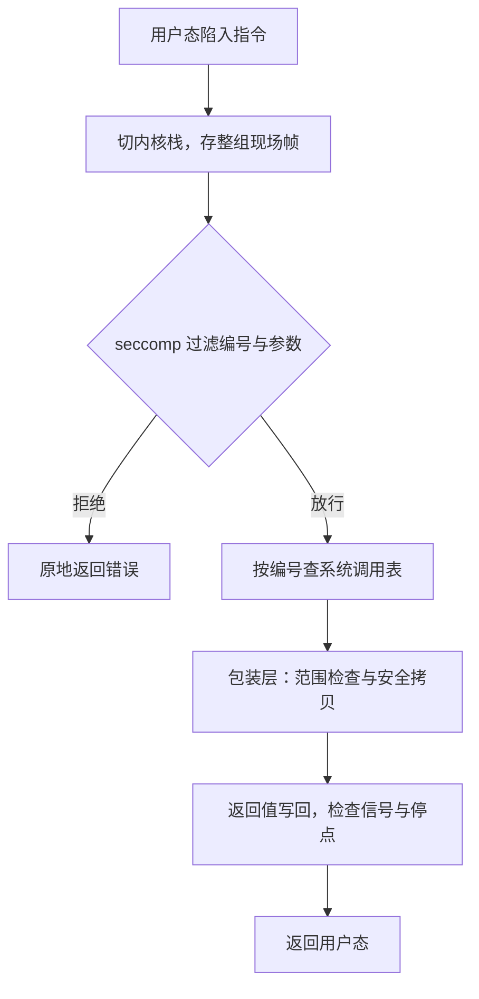

# 系统调用的路径

系统调用不是函数调用：它是一次有编号的越界，路径上每一步都在检查上一步放进来的东西。

<footer>—— 据 Tanenbaum and Bos, Modern Operating Systems；Arpaci-Dusseau, OSTEP 整理</footer>

[上一课](/cs/osk-fs-implementation)的 write 从 VFS 走到了设备；本课补前半程：用户态那条指令如何变成对 write 的内核调用。[系统调用 ABI](/cs/syscall-abi) 已定调用号、参数槽与返回约定，[copy_from_user](/cs/copy-from-user) 给了安全拷贝；缺口是两者之间那条真实路径——进入、分派、校验、返回，以及路径上挂着的每个钩子。

## 问题

一台机器上有几百个系统调用、多种 ABI（64 位与 32 位兼容）并存，还有多个安全机制要在入口表态。实现若让每个调用各自处理保存现场与越界检查，每一处都是一个独立的漏洞源。不这么做会错在哪：把用户指针直接交给内核解引用，坏指针会让内核崩在用户地址上，或被竞态改成指向内核；分派前不检查编号范围，越界编号就是一次任意跳转。主干课把 ABI 与安全拷贝拆开讲过，路径本身——五步在什么顺序里咬合——始终没给，这正是本课的对象。

## 方法

路径固定五步。进入：syscall 一类指令陷入，切到每 CPU 的内核栈，把用户寄存器整组存成现场帧——这是全系统唯一「保存全部」的地方，上一课的上下文切换之所以只换栈，正因为这里已经存了。过滤：seccomp 的 BPF 程序先过一遍编号与参数，拒绝即原地返回，真实现还没开始。分派：以编号为下标查系统调用表，超出表长返回错误码，不存在猜测。执行：每调用的包装层把寄存器槽映射成 C 参数，指针参数先过范围检查，再交给 copy_from_user 与 copy_to_user 拷进拷出。返回：返回值写回现场帧，顺路检查挂起信号与跟踪停点，然后一条指令回到用户态。

## 机制

为什么一条共用路径能撑住整个 ABI：编号是版本化接口，表就是兼容层——32 位调用有独立的表与参数转换，新旧调用并存互不干扰。vDSO 是同一思路的另一半：时间读取、缓存参数这类不需要特权的数据，内核把结果页映射进用户空间，调用根本不进路径——省掉的正是五步里最贵的那两步往返。信号为什么挂在返回路径：内核不能在任意执行点打断自己，只能约定「回到用户态之前」处理挂起信号；这也解释了为什么信号处理总要等到陷入返回，而不是立即执行。校验为什么分两级：范围检查只判「地址落在用户半空间」，映射与否交给 copy_from_user 内部的缺页机制兜底——两级各管一半，合起来才既快又安全。

## 边界

陷入的硬件机制是[内核与用户态](/cs/kernel-user)与异常入口课的对象，本课不写指令编码与时序；[用户/内核分裂](/cs/user-kernel-split)给的是地址侧的界，本课给的是控制流侧的路。不同内核版本的入口实现差异很大——有的架构用纯汇编入口，有的已改写成 C——课序钉的是五步这个不变序，不是某个版本的函数名。虚拟化的陷入-模拟是另一条更长的路径，主干隔离单元的对象，也不在此处。

旧 x86 的 vsyscall 页是 vDSO 的前身：固定地址、可被恶意程序当作可靠跳板，后来被改成陷阱再模拟并在仿真里返回——省一次往返的捷径若不做隔离，最后会被安全问题逼着加回一整层路径。

## 小结

- 五步固定序：存现场帧、安全过滤、查表分派、包装校验、恢复返回。
- 现场帧是唯一整组保存；上下文切换只换栈的便宜，建立在它之上。
- 系统调用表就是 ABI 的版本化实现；vDSO 把无特权需求的部分挪出路径。
- 指针参数两级校验：范围检查管边界，安全拷贝的缺页机制管映射。
- 出处：Tanenbaum and Bos, *Modern Operating Systems*；Arpaci-Dusseau, *OSTEP*；Love, *Linux Kernel Development*。
