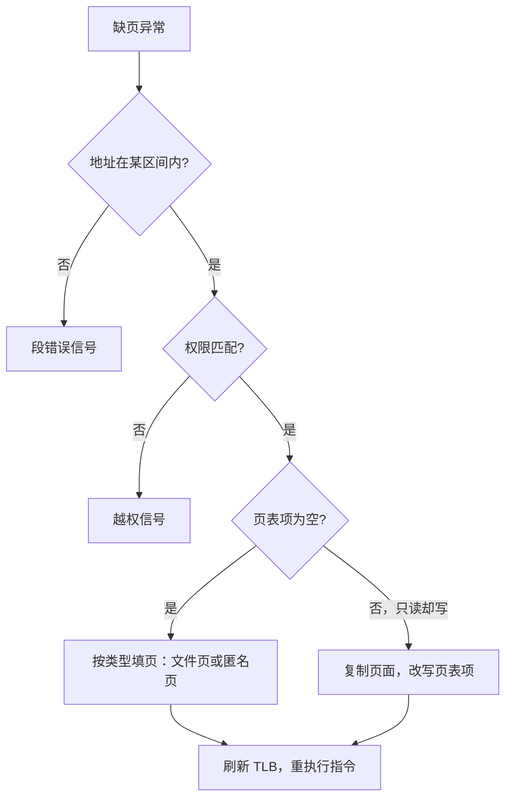

# 虚拟内存的实现

缺页处理程序是内核里最常见的一次现挂现解：每一页的合法性与内容，都拖到第一次触碰才决定。

<footer>—— 据 Arpaci-Dusseau, OSTEP；Tanenbaum and Bos, Modern Operating Systems 整理</footer>

[上一课](/cs/osk-process-scheduler)把切换的执行流接通了，switch_mm 换的正是本课的对象：进程的地址空间。主干已经给过零件——[进程地址空间一览](/cs/process-addrspace-tour)画了用户地图，[缺页路径](/cs/page-fault-path)与[按需调页](/cs/demand-paging)讲了缺页语义，[写时复制](/cs/cow-fork)给了 fork 的偷懒。缺口是把零件装配成内核里真正跑的那组结构：地址空间对象、区间树、页表、反向映射怎么互相咬合。

## 问题

用户地图上的每一段只是「这里可以有什么」的声明，页表才是「现在有什么」。实现要回答两个方向的问题：正向，一个缺页地址进来，内核如何在微秒级判定它是哪种缺页——文件页、匿名页、写时复制还是越界；反向，回收一页时如何找到「谁映射着它」。不这么做会错在哪：把区间当页表用，每次地址翻译都要线性扫描区间表；没有反向映射，回收一页要扫遍所有进程的全部虚拟地址——回收这个功能在工程上根本不成立。

## 方法

地址空间对象挂在上一课的进程控制块上；区间（VMA）按地址组织成有序结构，mmap、brk、栈增长都只是插入与合并区间，一页都不分配。缺页入口按四级分流：地址落在某个区间里吗——不在就是段错误，除非贴近栈指针（那算隐式扩栈）；权限对吗——写只读段转发为信号；页表项为空吗——按区间类型填页，文件页从页缓存读入，匿名页给零页或现分配；页表项在但只读而区间可写吗——复制页面并改写为可写，这就是写时复制的兑现点。填完页表项刷新对应 TLB，重执行触发缺页的那条指令。fork 之所以便宜，也因为装配只在区间层复制加页表复制加写保护，内容零拷贝。

## 机制

反向映射让回收成为可能：物理页的元数据里记录映射计数与归属——匿名页经区间链、文件页经地址空间的页索引——回收时沿它逐个清除页表项。它为什么必须存在：置换策略（[匿名页对文件页](/cs/anon-vs-file-page)、[回收](/cs/memory-reclaim)、[OOM](/cs/oom-killer)）都在物理页面上工作，而映射关系天然长在虚拟侧；没有这座反向桥，候选集合构造不出来。跨 CPU 的一致性也在这层闭合：清了别处的页表项还要做 [TLB shootdown](/cs/tlb-shootdown)，否则旧翻译还会指向已被拿走的页。零页是同一机制的极端用法：几百 MB 的未写内存共享一页只读零页，第一次写才摊开。

## 边界

页表格式与 TLB 层次是体系结构课的对象，本课只管内核侧的组织；swap 设备是 [swap](/cs/swap-device) 的对象，按需错页服务是 [userfaultfd](/cs/userfaultfd) 的对象，都只引用。大页让「一页」的粒度可变，装配逻辑不变但每一级判断都多一条分支。最后别把缺页当异常：fork 之后第一次写、程序首次访问堆与文件，走的都是缺页——它是设计出来的高频路径，缺页处理程序常是内核里被调用最频繁的复杂函数之一，这是按需调页买来的便宜，不是故障。

匿名页第一次读常映射到一张全系统共享的零页：读它永远得零，第一次写才触发复制。没有这张零页，大块 BSS 与刚申请的堆会在映射时刻就消耗等量物理内存，按需调页就名存实亡。

## 小结

- 地址空间对象与区间是声明，页表是现挂现解；mmap 只造声明，不造页。
- 缺页入口按「区间内、权限、页表项空、写时复制」四级分流。
- 反向映射把物理页连回映射它的区间，置换与回收才可构造。
- fork 的便宜来自区间加页表加写保护，内容零拷贝；零页是同一机制的极端。
- 出处：Arpaci-Dusseau, *OSTEP*；Tanenbaum and Bos, *Modern Operating Systems*；Linux MM 子系统骨架。
