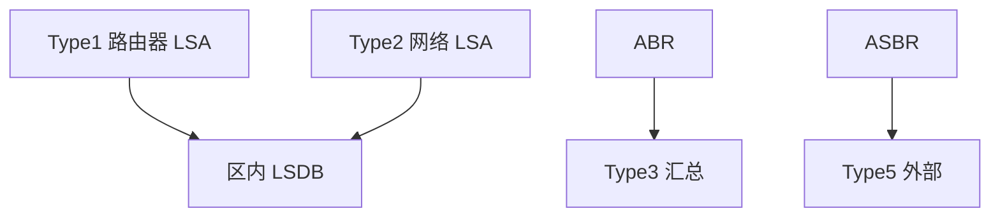

# OSPF 区域与 LSA

区域把 LSDB 洪泛切成块；不同类型的 LSA 分别描述路由器、网络、汇总与外部，骨干区域把块再连起来。

<footer>—— 据 Moy, RFC 2328 OSPF Version 2；RFC 5340 OSPFv3 整理</footer>

主干[Dijkstra 在 OSPF](/cs/ospf-dijkstra) 已会从 LSDB 算下一跳，区域只点名。[上一课](/cs/satellite-latency) 结束无线广域。缺口是**区域与 LSA 类型**：Area 0、stub/NSSA、Type 1–5/7 各描述什么，避免把全网当成一张平坦图。本课不把 IS-IS TLV 写完。

## 问题

单区域洪泛随路由器数涨，SPF 与 LSDB 内存一起涨。分区：区内 Type 1/2 精确，跨区 Type 3 汇总，外部 Type 5 从 ASBR 进，NSSA 用 Type 7 再转 5。骨干必须连续，否则虚链路——那是补丁，不是拓扑目标。代价仍是管理度量，不是卫星 RTT。

不要把区域写成 VLAN：VLAN 是二层广播域；区域是 LSDB 范围。

RFC 2328 第 3、12 章。OSPFv3 把 LSA 改到 IPv6 地址族，对象不变。本课不把每一种 Opaque LSA 列完。

### 区域不是 VLAN

LSDB 范围与广播域是两件事。Type 3 汇总可扩展也可能藏黑洞。虚链路是补丁。度量仍是管理代价，不是卫星 RTT。

## 方法

画：Area 1/2 接 Area 0；ABR 发汇总。对照距离向量：这里仍是链路状态，只是图被切开。ECMP 在等代价多下一跳时仍可用。LACP 逻辑口在 OSPF 里是一条链路。

方法止于选定对象与对照；机制才说它如何嵌入已有分层与主干课。

## 机制

MAC 学习不跨区域；IP 前缀跨区域靠汇总。汇总错会黑洞或次优，这是政策，不是 SPF bug。PFC 与 OSPF 无关。主干 BGP 直觉：外部 Type 5 常来自再分发，环与优先级要用 tag 防，细节留给 BGP 课。

虚链路把 Area 0 的邻接「隧道」过非骨干，增加故障域，能不用则不用。

## 边界

本课不引入 OSPF-TE 的全部子 TLV。IS-IS 是下一课。后课默认：OSPF 可扩展性靠区域与 LSA 分层，SPF 仍在区内精确。

多区域不等于多平面流量工程；TE 后课用不同度量或 MPLS。

上一课留下的缺口在本课收口；「OSPF 区域与 LSA」进入后课词汇表后只引用。文献用来钉对象与边界，不把本课写成该主题的独立综述。下一课[IS-IS](/cs/isis)。

## 小结

- 区域限制洪泛；Area 0 连接各区。
- LSA 类型分工：精确、汇总、外部。
- 汇总是可扩展性，也可能藏黑洞。
- 后课只引用本课钉死的对象，不从该领域总问题重开。
- 出处：RFC 2328；RFC 5340。
