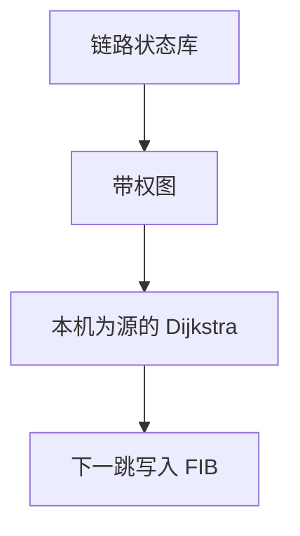
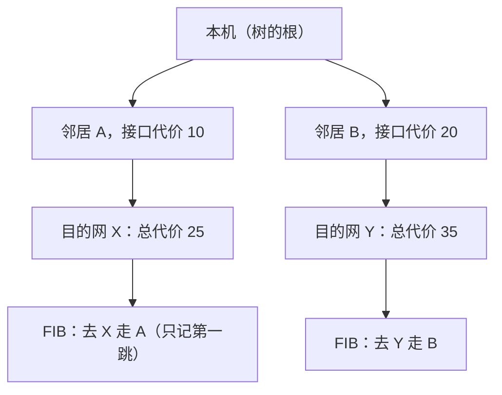

# Dijkstra 在 OSPF

链路状态库是同一张带权图；每台路由器以自己为源跑 Dijkstra，下一跳才写进 FIB。

<footer>—— 据 Dijkstra 最短路；Moy, RFC 2328 OSPF Version 2；Kurose and Ross</footer>

[上一课](/cs/link-state)给出洪泛邻接与「各节点独立计算」。本课不重写 LSA 洪泛可靠性。缺口是计算本身：图课的 [Dijkstra](/cs/dijkstra) 已经会单源最短路；这里要接到 OSPF 的代价、区域直觉和「下一跳是邻居而不是整条路径」。本课不把 BGP 政策提前。

## 问题

链路状态通告描述「我连谁、代价多少」。若只停在「有一张图」，还不会转发。OSPF：从 LSDB 建图，节点是路由器与网络，边权是接口代价。以本机为源跑 Dijkstra，得到到每个前缀的出口邻居。区域把洪泛范围切开，骨干连通各区域，避免全网一张图过大。缺口是**把最短路树写成转发表**。

直觉类比：Dijkstra 像水波从本机往外漫——代价小的方向先淹到，每个节点第一次被淹到时的深度就是它的最短代价；已经淹过的方向不用再看，这保证了「贪心」在这里不出错。

代价常与带宽相关，由管理设定，不是时延测量。ECMP 在多条等代价时分流，仍要求下一跳是邻居。

## 方法

同步 LSDB（可靠洪泛、序号）。算 SPF 树。把叶子网络的前缀安装为「下一跳 = 树上来的第一跳邻居」，再交给 [LPM](/cs/lpm)。区域内与区域间前缀来源不同，但查找规则仍是最长前缀。本课不把全部 LSA 类型表当必背。

```mermaid
flowchart TD
  LSDB["链路状态库"] --> G["带权图"]
  G --> SPF["本机为源的 Dijkstra"]
  SPF --> FIB["下一跳写入 FIB"]
```

## 机制

每台路由器计算自己的树，但仍应得到相容的转发：同一张无向代价图、同一算法。与距离向量对照：坏消息随拓扑洪泛，不必数到无穷。域内 IGP 仍是一个管理域的最短路；跨域政策不是代价最小，下一课 BGP。

树变成 FIB 时只记「第一跳」：目的网挂在树上的哪条枝无所谓，转发只看枝根是哪个邻居。沿路的每一台路由器各自这样记一跳，接力起来就是完整路径——路径不写在任何一张表里，而是分散在沿途各台的树里。

```mermaid
flowchart TD
  ROOT["本机（树的根）"] --> A["邻居 A，接口代价 10"]
  ROOT --> B["邻居 B，接口代价 20"]
  A --> X["目的网 X：总代价 25"]
  B --> Y["目的网 Y：总代价 35"]
  X --> NH1["FIB：去 X 走 A（只记第一跳）"]
  Y --> NH2["FIB：去 Y 走 B"]
```

数字实例：接口代价常按参考带宽除以链路带宽设定，参考带宽 100 Mbps 时，一条 100 Mbps 链路代价 1，一条 10 Mbps 链路代价 10；三条 10 Mbps 串起来代价 30，仍输给一条 100 Mbps 的 1——SPF 自动选后者。

常见误区：初学者容易以为路由表里存着整条路径。实际每台路由器只存「下一跳是哪个邻居」，包每过一跳由那台路由器接着查表——没有任何一台持有全图，路径是接力出来的。

## 边界

本课不引入 IS-IS TLV 细节当第二条主干，不把流量工程的约束最短路写成 OSPF 正文。多区域虚拟链路是例外，不展开。自治系统之间如何交换路径，下一课 BGP 直觉。

后课默认：一个 AS 内部可以用 Dijkstra 填下一跳。互联网的边界路由换政策语言。

## 小结

- OSPF 在同步图上跑 Dijkstra，安装邻居下一跳。
- 区域缩小洪泛，不改变 LPM。
- 跨 AS 不是最短路，下一课 BGP。
- 出处：RFC 2328；Dijkstra；Kurose and Ross。
