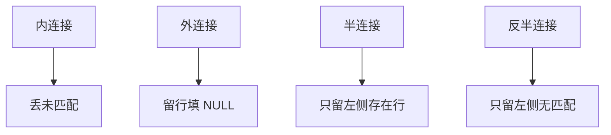

# 外连接与半连接

内连接丢掉未匹配行；外连接把它们留下并填 NULL。半连接只保留左侧中那些在右侧找得到伙伴的行，不展开右侧列。

<footer>—— 据 Date 对外连接；Ramakrishnan and Gehrke 对半连接；Bernstein and Chiu 对半连接归约</footer>

[上一课](/cs/set-ops-exists)用差与 `NOT EXISTS` 表达「没有伙伴」。本课不重写反半连接的三值缝。缺口是连接族里另外两支：**外连接**（保留未匹配并补 NULL）与**半连接**（测试存在但不把右侧列并进结果）。主干 [连接算法](/cs/join-algorithms) 讲内连接三种形状；进阶要把这两种逻辑算子钉进树。

## 问题

「列出所有顾客及其订单，没有订单的顾客也要一行」——内连接会丢掉无单顾客。左外连接保留左表全部，右无匹配则订单列 NULL。全外连接两侧未匹配都留。缺口不是语法 `LEFT JOIN`，而是：NULL 填充使若干代数律失效，[谓词下推](/cs/predicate-pushdown) 必须停在外连接边界，除非谓词拒绝 NULL 的方式与填充后一致。

半连接 $R \ltimes S$：结果模式等于 $R$，行是 $R$ 中至少有一条 $S$ 匹配的那些（包语义下计数规则要写清：通常按 $R$ 的包，不按匹配条数膨胀）。它实现 `EXISTS`/`IN`。反半连接实现 `NOT EXISTS`。分布式后课会用半连接压缩传送列；本课只锁定单机指称。

Bernstein and Chiu 的半连接用于分布式查询：先传键再传匹配元组。逻辑上半连接仍是「存在测试」。外连接不是半连接加 NULL 的随便组合：全外连接要两侧补洞。

## 方法

逻辑树节点：inner / left / right / full / semi / anti-semi。物理上外连接在哈希或归并时多一条「未探测到则吐 NULL 行」的路径；嵌套循环左外连接对外层每行至少吐一次。半连接可在探测成功后对当前左行停止展开右侧。

谓词放在 `ON` 还是外连接之后的 `WHERE`：后者会把外连接补的 NULL 行再滤掉，常把左外连接打回内连接。这是语义，优化器可以识别并改写，但用户写错就是指称变了。

## 机制

改写：内连接上的选择可分到两侧；外连接的 `ON` 谓词不能随意变成连接后过滤。半连接与内连接再投影在无重复匹配时同指称，有重复时内连接膨胀行数、半连接不膨胀——这正是 `EXISTS` 与「连接再 DISTINCT」的差别。

优化器可以把 `IN` 当半连接，把「连接后只取左列」收缩成半连接。代价模型按左表基数而不是积的基数估输出。直方图仍来自主干 [基数](/cs/histogram-card)，本课不重做桶。

## 边界

本课不讲连接顺序枚举里外连接如何限制交换——后课 Selinger 与连接树会碰到外连接不能随便换结合括号。也不把 NULL 填充当成缺失值的统计模型。

后课默认：要保留未匹配用外连接；要存在测试用半连接，不要先 inner join 再去重。约束与触发器下一课：完整性是写路径上的断言，不是连接种类。

外连接改变结果模式里的 NULL 位置；半连接不改变左侧模式。两者都不是「一种更快的内连接」。

## 小结

- 外连接保留未匹配并填 NULL，挡住部分下推。
- 半连接实现存在量化，不膨胀、不带右列。
- `WHERE` 写在外连接之后可能取消外连接。
- 出处：Date；Ramakrishnan and Gehrke；Bernstein and Chiu。
