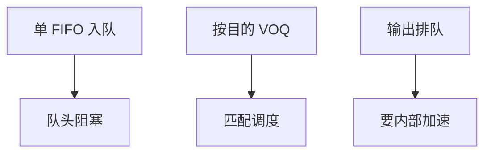

# 输出排队与 HOL

入口 FIFO 里队头帧要去的出口忙，后面去往空闲口的帧也被挡住；虚拟输出排队把目的拆开，结构再调度。

<footer>—— 据 Karol, Hluchyj and Morgan, 1987；McKeown, iSLIP, IEEE/ACM ToN 1999 整理</footer>

[上一课](/cs/switch-fabric)给出交叉开关。缺口是**队头阻塞（HOL）**：单 FIFO 输入排队吞吐理论上限约 58.6%（独立均匀目的）。输出排队理想但要结构 $N$ 倍加速。工程折中：VOQ + 匹配调度。本课结束「信号到以太网」课序；下一课序换无线。

## 问题

输出排队：帧一进结构就进目的口队列，公平、无 HOL，但 $N$ 口同时向同一口发送需要内部 $N$ 倍带宽。输入排队省结构，HOL 严重。VOQ：每个入口为每个出口维护队列，调度器做最大匹配或启发式（iSLIP）。PFC 暂停的是某入口某优先级，可能加重 HOL 若队列未按目的拆开。

这与 HTTP 后课的队头阻塞同名不同层：这里是交换结构，那里是 TCP 字节流。

Karol 等人给出 HOL 吞吐极限。iSLIP 是可实现的迭代匹配。本课不证极限的全部概率推导。

### 结构 HOL 不是 HTTP HOL

入 FIFO 队头挡住去往空闲口的帧。VOQ 拆目的再匹配。输出排队理想但要内部加速。PFC 冻结入口会波及无关 VOQ。

## 方法

画三种排队位置。强调：MAC 学习只选出口，不消除多流争同一出口。LACP 哈希可把流打到不同成员，减轻单口热点，不消除结构 HOL。

方法止于选定对象与对照；机制才说它如何嵌入已有分层与主干课。

## 机制

线速承诺依赖调度器在时隙内完成匹配。小包使调度更频繁。巨帧占时长时隙。数据中心 incast 后课是多发送方打同一出口的应用层版本，根子仍是本课的输出热点。

PAUSE 整口停发，等于冻结该入口所有 VOQ，波及无关出口——PFC 按类缓解，不能从数学上取消 HOL。

## 边界

本课不引入 CIOQ 的精确加速比证明。无线与 OFDM 是下一课序第一课。后课默认：HOL 是输入 FIFO 的结构问题；VOQ 是标准对策。

不要把交换 HOL 用 TCP 窗口「解决」：窗口在端，结构在跳内。

上一课留下的缺口在本课收口；「输出排队与 HOL」进入后课词汇表后只引用。文献用来钉对象与边界，不把本课写成该主题的独立综述。下一课[802.11 帧与 OFDM](/cs/wifi-frames-ofdm)。

## 小结

- 纯输入 FIFO 有 HOL 吞吐上限。
- VOQ + 调度逼近输出排队，免 $N$ 倍加速。
- 链路暂停可能冻结无关 VOQ。
- 后课只引用本课钉死的对象，不从该领域总问题重开。
- 出处：Karol et al., 1987；McKeown, 1999。
