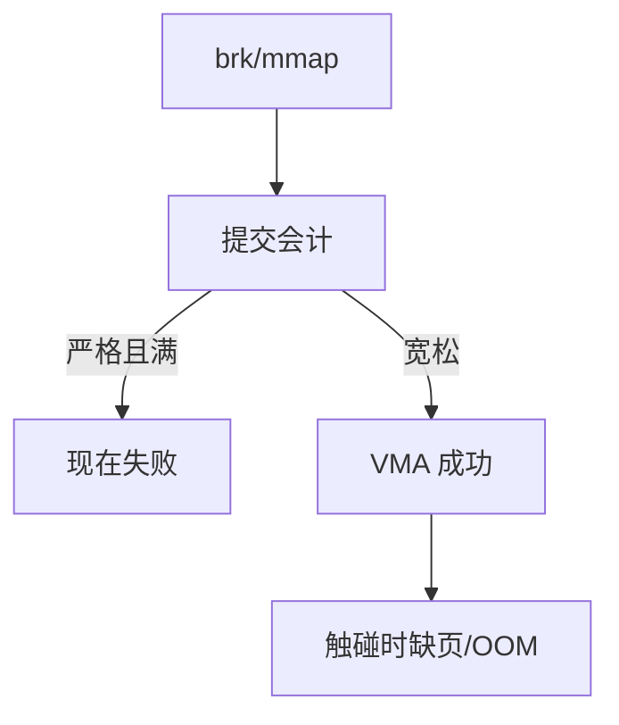

# 过度提交

内核可以允许虚存承诺之和大于 RAM 加 swap：多数页从未被写满；一旦同时触碰，OOM 才出现。

<footer>—— 据 Silberschatz 对分配与提交的区分；Linux overcommit 策略的整理</footer>

[上一课](/cs/oom-killer)在真正缺帧时杀人。[brk 与堆](/cs/brk-heap)升高水位并不立刻占帧。[按需调页](/cs/demand-paging)把占帧推迟到访问。缺口是**承诺会计**：`malloc`/`mmap` 成功只表示 VMA 记下了，是否计入「保证能配到的帧」，由过度提交策略决定。

## 问题

严格提交：每次扩大匿名区都扣减「剩余可保证页」（RAM+swap−已提交）。稀疏堆、巨大稀疏数组会立刻失败，尽管工作集很小。宽松提交：几乎总成功，把风险推到缺页与 OOM。启发式：看空闲与可回收文件页，允许一定倍率。缺口不是 CLOCK，而是用户接口何时返回 ENOMEM，何时把失败藏到稍后的故障。

本课不把 `vm.overcommit_memory` 的三个整数当唯一真理，只作策略对照。

提交的是匿名与私有写潜力；共享只读文件通常不按「每映射一份物理页」记账。fork 的 COW 会把承诺翻倍——下一课用写时复制推迟真拷贝，但会计可能已经加倍。

## 方法

内核维护 committed 计数。策略 A：超过 RAM+swap 则 `mmap`/`brk` 失败。策略 B：允许超过，OOM 兜底。策略 C：按空闲估计。用户要「真保证」可用 mlock 或关闭过度提交，代价是必须现在就有帧。与抖动对照：过度提交提高多道的虚上限，使 ΣW 更容易在运行期爆炸。

## 机制

过度提交把「虚存接口」和「物理保证」拆开，让稀疏数据结构便宜。它解释了为何 OOM 发生在运行很久之后，而不是 malloc 那一行。不要把这写成攻击教程；只说明会计与按需的组合会产生延迟失败。文件页可回收，常不按一对一计入匿名承诺。

[分页](/cs/paging-vm) 仍只在缺页时要帧；会计是 OS 策略层。

## 边界

本课不引入 memcg 的 per-group 提交限额全文。不保证用户态能可移植地查询「还剩多少保证」。下一课 `fork` 若立刻复制全部页，再严格的会计也会在创建进程时爆掉——于是写时复制把复制推迟，同时把承诺问题变得更尖锐。

后课默认：VMA 可以大于物理。`fork` 的副本若立刻占两倍帧则不可接受，下一课写时复制。

## 小结

- 提交会计决定「现在失败」还是「以后 OOM」。
- 按需加上宽松提交，使稀疏堆可行。
- fork 的复制代价是 COW 的缺口。
- 出处：Silberschatz et al., *OSC*；Linux overcommit 文档；Tanenbaum *MOS*。
