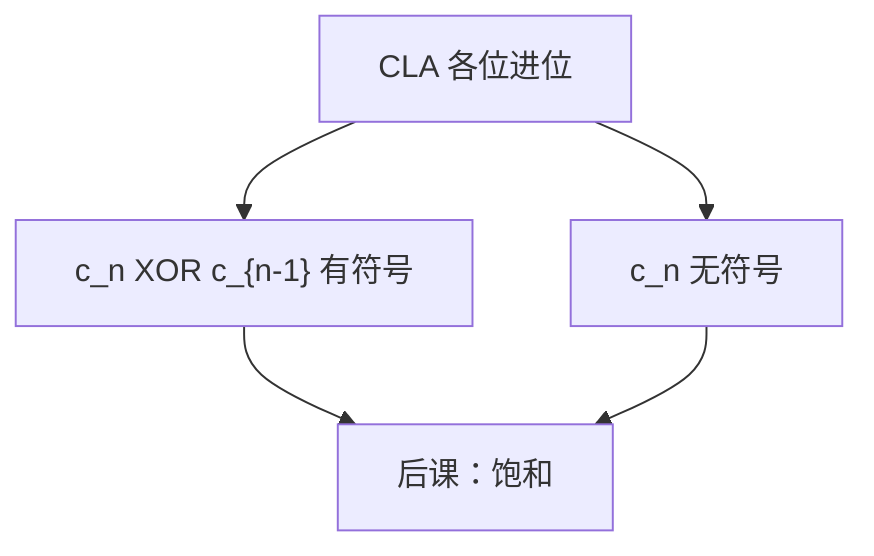

# 整数溢出检测

  
补码加减的溢出不是最高位进位本身，而是进位入与进位出是否一致；无符号则看那一位进位。

  <footer>—— 据 Harris and Harris, Digital Design and Computer Architecture；Patterson and Hennessy, Computer Organization and Design (RISC-V) 整理</footer>

[上一课](/cs/fixed-point-dsp)把定点 MAC 写成宽累加再截位，但没说截位时如何知道「已经不能表示」。组成课的[加法器](/cs/adder-cla)点过溢出接线，ALU 课也留了旗标口。缺口是把检测收成可用的硬件条件：有符号与无符号不同，乘除另算，供下一课饱和与后课 HDL 当控制。

## 问题

$n$ 位补码可表示 $[-2^{n-1},2^{n-1}-1]$。两正数相加得负，或两负数相加得正，即溢出：等价于最高位的进位入 $c_{n-1}$ 与进位出 $c_n$ 异或。无符号溢出就是 $c_n$。减法通过加反码走同一对进位。缺口不是再证补码表示，而是：**旗标从哪根线来**，以及 RISC-V 整数 `add` 默认不陷阱、软件要用 `add`/`sltu` 组合或分支去查。

定点 DSP 的累加器若宽于输出，溢出发生在**截回输出宽度**时，不是发生在宽加本身。

### 进位不是溢出

无符号里进位≈溢出；有符号里 $c_n=1$ 仍可能合法（例如 $(-1)+(-1)$ 得 $-2$，$c_n=1$ 但未溢出）。把 FLAGS 的 Carry 与 Overflow 混用，条件跳会错。x86 的 `OF`/`CF` 分家，后课 ISA 对照会再看见；本课先钉布尔。

Harris 用 $c_n\oplus c_{n-1}$。Patterson/Hennessy 强调 RISC-V 不因溢出陷入。本课不把 C 语言的未定义行为当硬件语义：硬件总给出模 $2^n$ 的比特，检测是额外的位。

## 方法

加法器已有各位进位。引出 `V = c_n XOR c_{n-1}`（有符号），`C = c_n`（无符号）。乘：积的高半是否等于低半的符号扩展（有符号）或全 0（无符号）。除：除零与有符号 `min/-1`。FPU 的 overflow 是指数饱和，不要接到这对进位。

软件：RISC-V 用 `add t0,a0,a1` 再比较符号与操作数关系，或用更宽临时寄存器。硬件可选 `add` 写 `V` 到标志——ISA 选择。

## 机制

下一课饱和运算把 `V`/`C` 变成「钉在最大/最小可表示数」，而不是环绕。浮点[异常](/cs/fp-exceptions)五位与这里的 `V` 分家：一个是 754 状态，一个是整数进位。后课 Verilog 里这两个位只是组合输出，不要用阻塞赋值在时钟边沿「补算」溢出，那是 HDL 课的坑。

## 边界

本课不规定溢出必须陷阱（x86 `INTO` 是另一风格）。不讨论 saturating SIMD 指令表。不把密码学里的恒定时间溢出处理写成安全课。

后课默认：有符号溢出看最高两位进位异或；无符号看进位出；默认递送环绕结果加可选旗标。

## 小结

- 定点截位需要知道是否溢出；检测从加法器进位来。
- 有符号：`V=c_n⊕c_{n-1}`；无符号：`C=c_n`。
- RISC-V `add` 不自动陷入；饱和是下一课的用法。
- 出处：Harris and Harris；Patterson and Hennessy, COD (RISC-V)。
