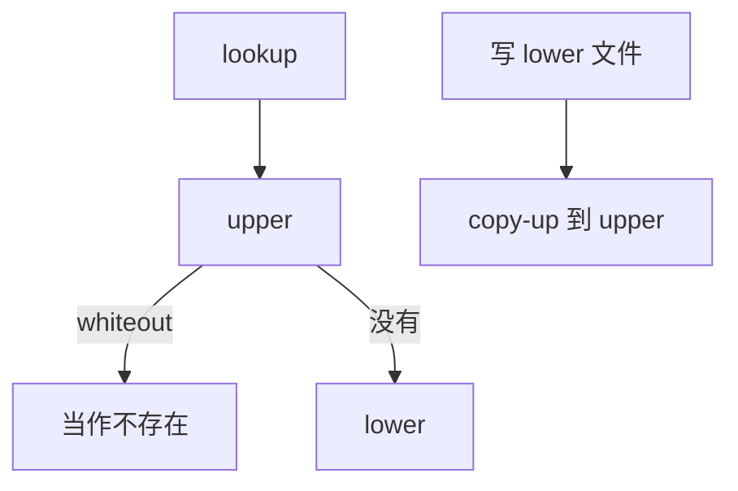

# overlayfs

联合挂载把只读 lower 与可写 upper 叠成一棵树：查找先 upper 后 lower，删除用 whiteout，拷贝上写把修改留在 upper。

<footer>—— 据 Linux overlayfs 文档；OCI 镜像层实践对联合挂载的用法</footer>

[上一课](/cs/fs-quota)收口了单层布局与记账。容器要在同一只读镜像上开许多可写视图，不能每实例拷一份 [ext4](/cs/ext2-block-groups)。缺口是 **overlayfs**：VFS 里的联合挂载，不是新的盘格式。

## 问题

lower 只读，upper 可写，merged 是用户看见的根。同名文件：upper 遮住 lower。删除 lower 里有的名字：upper 放 whiteout 字符设备（或 xattr 标记），查找时当作不存在。改 lower 文件：copy-up 到 upper 再改，lower 不变。缺口不是再讲 [inode](/cs/inode-dir)，而是：两个目录树如何合成 lookup，以及 inode 号在 merged 视图里是否稳定（容器与 `stat` 的痛点）。

多层 lower 是「从左到右」的栈。workdir 是 overlay 内部 scratch，必须与 upper 同文件系统。本课不把存储驱动写成 Docker 百科。

## 方法

`lookup`：在 upper 找，命中则停；若是 whiteout 则负缓存；否则去 lower。`mkdir`/`creat` 落在 upper。对 lower 文件第一次写：从 lower 读进 [页缓存](/cs/page-cache)，在 upper 建文件，拷数据与部分 xattr，再切到 upper inode。目录 copy-up 只造空目录骨架，子项仍可从 lower 透出。

## 机制

overlay 把 [快照](/cs/fs-snapshots) 那种「共享未改块」提升到目录树接口：共享的是 lower 文件，而不是 btrfs 结点。镜像层于是可以是 tar + overlay，而不强迫宿主机用 COW FS。不要把本课写成量化栏的分层订单簿。硬链接跨层、renames 与 whiteout 的边角是实现雷区，课序只要求机制：遮罩、白出、上写。

与配额：upper 上的分配才进可写层配额；lower 只读不记账到容器 uid，除非另做项目配额。

实现上：copy-up 会丢掉 lower 上某些 xattr 或打开的租约语义，数据库文件放 lower 再在容器里写是经典坑。inode 号在 merged 视图里可能随 copy-up 改变，stat 不稳定。 读法上只引用[上一课](/cs/fs-quota)的结论，不把对象换成训练推理或限价簿。

本课在操作系统进阶的「文件系统实现 / 接口进阶」课序里，对象是 **overlayfs**。

- 先修只引用，不重导：上一课的结论当公理，本课只补差。
- 五栏不吞并：不把本课写成大模型训练/推理，也不写成限价簿或权重量化。
- 文献用 OSTEP、McKusick、内核文档与具名会议论文；不发明 arXiv 编号。

## 边界

本课不引入 FUSE 版 unionfs 的全部历史。不保证 NFS 作 lower 时所有缓存语义。下一课把「文件系统不必在内核里」做成协议：FUSE。

版本字段会变，课序钉的是机制对象「overlayfs」，不是某一主线内核的结构体名。
后课默认：联合挂载用 upper/lower/whiteout/copy-up。用户态实现 VFS 操作，下一课 FUSE。

## 小结

- overlay 叠树：遮罩、whiteout、copy-up。
- 它是 VFS 联合，不是新的盘布局。
- 用户态文件系统协议是下一课。
- 出处：Linux `Documentation/filesystems/overlayfs.rst`；OCI 层实践。
