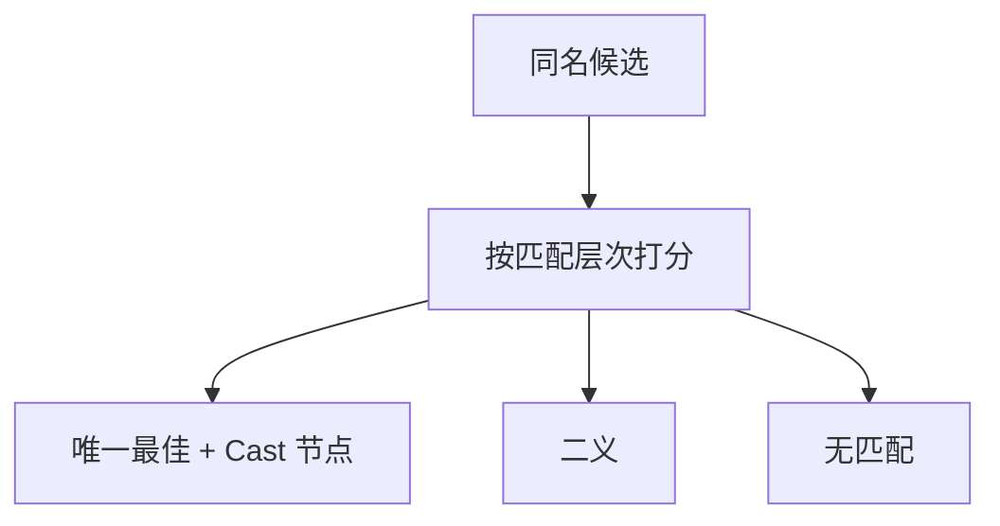

# overload 与强制

同一拼写可对应多套声明；隐式转换把实参送到形参类型。决议必须在翻译前选出唯一候选，否则后端看见的类型宽度没有定义。

<footer>—— 据龙书第 6 章；C++ 标准对重载决议的分层整理</footer>

上一课[类型推导直觉](/cs/type-inference)用合一解出最一般类型，并声明重载不在合一内部。本课不重做 occurs check。缺口是**多名一义**与**拓宽**：`f` 有多条声明、`int` 可送到 `double`。要在已绑定的候选集上按类型选一，并插入转换节点。选出之后宽度已知，下一课才能发三地址。

## 问题

重载：查找返回候选集，不立即报冲突。决议：按实参类型过滤——精确匹配优于拓宽，拓宽优于经用户转换；仍多条则二义错误。运算符 `+` 是函数重载的语法糖。缺口是这份偏序，不是再综合一遍单声明表达式。

强制（coercion）：语言规定的隐式转换，如 `int` 到 `float`。必须写进规则并在 AST 上留下 `Cast` 节点，否则 IR 会用错 opcode。收窄（`double` 到 `int`）通常要求显式，以免悄悄丢精度。字符串与数值之间的「弱类型」强制不在主干。

### 决议不是运行时分派

重载在编译期钉死声明。虚方法按对象动态类型跳表是另一机制，本课点名不写 vtable。不要把 `f(x)` 的重载候选留到运行时。

龙书把类型转换写成语义动作。C++ 重载决议有精确/提升/标准转换/用户定义的层次，本课只借层次直觉，不抄标准附录。Appel 强调插入转换后类型确定。

## 方法

对调用：收集可见的同名函数。用实参类型（上一课已推导或检查）打分。唯一最优则绑定到那条声明，对每个实参插入必要的强制。零候选：无匹配；并列最优：二义。

可变参数、缺省实参是过滤的附加规则，点名即可。模板/泛型实例化不在本课展开。

## 机制

每个表达式节点最终一个类型、一个宽度，[补码与浮点](/cs/fixed-and-float) 的运算种类可在 IR 选定。强制可能改变值（整数提升），副作用顺序仍按源。不要在窥孔里偷偷插转换——那是语义，不是优化。

与合一：候选选定后，若仍有类型变量，再对那一条声明合一；先选后合一，或对每条尝试合一再打分，语言定一种，本课不并行写两种实现。

## 边界

本课不生成三地址、不分配寄存器。不处理 ADL、不写完整 C++。后课默认：能进中端的程序，调用与运算符都已钉死声明并插完 Cast。线性 IR 是下一课把树压成 $x\leftarrow y\,\mathrm{op}\,z$。

## 小结

- 重载在编译期按类型层次选出唯一声明。
- 强制显式成 AST 节点，宽度才能进 IR。
- 动态分派不是重载。
- 出处：Aho et al., 龙书第 6 章。
